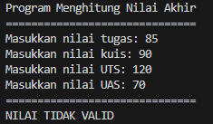
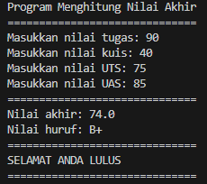
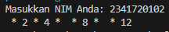
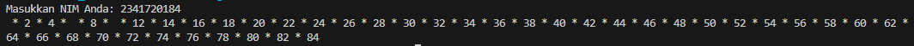
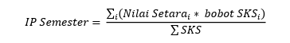
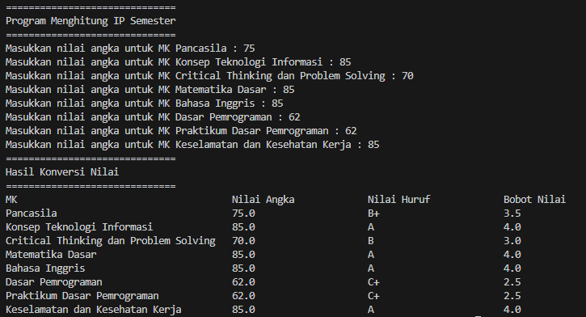
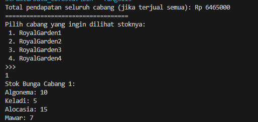
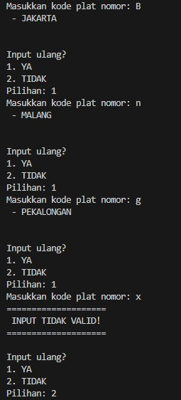
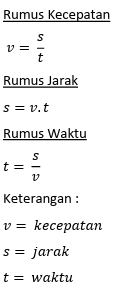
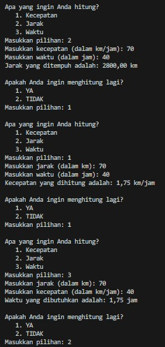

<p align="center">LAPORAN PRAKTIKUM 2</p>
<p align="center">Algoritma dan Struktur Data</p>

<p align="center">  </p>


<p align="center"> Nama : Gabriel Batavia Xaverius </p>
<p align="center"> NIM : 2341720184  </p>
<p align="center">Kelas : TI-1B  </p>
<p align="center">Absen : 13  </p>

### 2.1.1 Pemilihan

Pertanyaan
Buatlah program untuk menghitung nilai akhir dari mahasiswa dengan ketentuan 20% nilai tugas, 20% dari nilai kuis, 30% nilai UTS, dan 40% nilai UAS. Setiap nilai yang dimasukkan mempunyai batas nilai 0 ‐ 100. Ketika pengguna memasukkan diluar rentang tersebut maka akan keluar output “nilai tidak valid”. Ketika nilai akhir sudah didapatkan selanjutnya lakukan konversi nilai dengan ketentuan seperti pada soal yang diberikan.

Jika Nilai Huruf yang didapatkan adalah A,B+,B+C+,C maka LULUS, jika nilai huruf D dan E maka TIDAK LULUS.

Jawab:

```java

import java.util.Scanner;

public class hitungNilai13 {

    public static void main(String[] args) {
        Scanner scan13 = new Scanner(System.in);

        String nilaiHuruf;
        double nilaiAngka;

        // input nilai user
        System.out.println("Program Menghitung Nilai Akhir");
        System.out.println("==============================");
        System.out.print("Masukkan nilai tugas: ");
        int nilaiTugas = scan13.nextInt();
        System.out.print("Masukkan nilai kuis: ");
        int nilaiKuis = scan13.nextInt();
        System.out.print("Masukkan nilai UTS: ");
        int nilaiUts = scan13.nextInt();
        System.out.print("Masukkan nilai UAS: ");
        int nilaiUas = scan13.nextInt();
        System.out.println("==============================");
        
        // Menghitung total nilai keseluruhan
        nilaiAngka = (0.2 * nilaiTugas) + (0.2 * nilaiKuis) + (0.3 * nilaiUts) + (0.3 * nilaiUas);

        // Validasi input dan perhitungan nilai
        if (nilaiTugas > 100 || nilaiKuis > 100 || nilaiUts > 100 || nilaiUas > 100 || 
            nilaiTugas < 0 || nilaiKuis < 0 || nilaiUts < 0 || nilaiUas < 0) {
            System.out.println("NILAI TIDAK VALID");
        } else {
            nilaiAngka = (0.2 * nilaiTugas) + (0.2 * nilaiKuis) + (0.3 * nilaiUts) + (0.3 * nilaiUas);

            // Menentukan nilai huruf
            if (nilaiAngka > 80) {
                nilaiHuruf = "A";
            } else if (nilaiAngka > 73) {
                nilaiHuruf = "B+";
            } else if (nilaiAngka > 65) {
                nilaiHuruf = "B";
            } else if (nilaiAngka > 60) {
                nilaiHuruf = "C+";
            } else if (nilaiAngka > 50) {
                nilaiHuruf = "C";
            } else if (nilaiAngka > 39) {
                nilaiHuruf = "D";
            } else {
                nilaiHuruf = "E";
            }

            System.out.println("Nilai akhir: " + nilaiAngka);
            System.out.println("Nilai huruf: " + nilaiHuruf);

            // Menentukan lulus tidaknya mahasiswa
            if (nilaiHuruf.equals("D") || nilaiHuruf.equals("E")) {
                System.out.println("==============================");
                System.out.println("ANDA TIDAK LULUS");
                System.out.println("==============================");
            } else {
                System.out.println("==============================");
                System.out.println("SELAMAT ANDA LULUS");
                System.out.println("==============================");
            }
        }
    }
}


```

<br>

### 2.1.2 Verifikasi Hasil Program

Hasil Program :



<br>



<br>

### 2.2.1 Perulangan

Pertanyaan
Buatlah program yang dapat menampilkan deretan bilangan dari angka 1 sampai n kecuali angka 6 dan 10, angka ganjil dicetak dengan asterik “*”, angka genap dicetak sesuai bilangan aslinya, dengan n = 2 digit terakhir NIM anda.
Bila n<10 maka tambahkan 10 (n+=10) <br>

Jawab: <br>

```java

import java.util.Scanner;

public class Perulangan13 {
    public static void main(String[] args) {
        Scanner scan13 = new Scanner(System.in);

        System.out.print("Masukkan NIM Anda: ");
        long nimPengguna = scan13.nextLong();

        long duaDigitTerakhirNim = nimPengguna % 100; // Slight change in variable name for readability

        duaDigitTerakhirNim += duaDigitTerakhirNim < 10 ? 10 : 0; // Simplified if statement

        for (int i = 1; i <= duaDigitTerakhirNim; i++) {
            if (i != 6 && i != 10) {
                System.out.print(i % 2 == 1 ? " * " : i); // Simplified if-else inside loop
            }
        }
    }
}


```

<br>

### 2.2.2 Verifikasi Hasil

Hasil Program :<br>



<br>



<br>


### 2.3.1 Array

Buatlah program untuk menghitung IP Semester dari matakuliah yang Anda tempuh 
semester lalu. Formula untuk menghitung IP semester sebagai berikut :  

 Nilai setara didapatkan dari tabel konversi berikut ini :  

 Jawab :

 ```java

import java.util.Scanner;

public class array13 {
    public static void main(String[] args) {
        Scanner scan13 = new Scanner(System.in);
        // Deklarasi variabel
        double[] nilaiAngka = new double[8];
        String[] nilaiHuruf = new String[nilaiAngka.length];
        double[] nilaiSetara = new double[nilaiAngka.length];

        // Pengguna input nilai
        System.out.println("==============================");
        System.out.println("Program Menghitung IP Semester");
        System.out.println("==============================");
        System.out.print("Masukkan nilai angka untuk MK Pancasila : ");
        nilaiAngka[0] = scan13.nextInt();
        System.out.print("Masukkan nilai angka untuk MK Konsep Teknologi Informasi : ");
        nilaiAngka[1] = scan13.nextInt();
        System.out.print("Masukkan nilai angka untuk MK Critical Thinking dan Problem Solving : ");
        nilaiAngka[2] = scan13.nextInt();
        System.out.print("Masukkan nilai angka untuk MK Matematika Dasar : ");
        nilaiAngka[3] = scan13.nextInt();
        System.out.print("Masukkan nilai angka untuk MK Bahasa Inggris : ");
        nilaiAngka[4] = scan13.nextInt();
        System.out.print("Masukkan nilai angka untuk MK Dasar Pemrograman : ");
        nilaiAngka[5] = scan13.nextInt();
        System.out.print("Masukkan nilai angka untuk MK Praktikum Dasar Pemrograman : ");
        nilaiAngka[6] = scan13.nextInt();
        System.out.print("Masukkan nilai angka untuk MK Keselamatan dan Kesehatan Kerja : ");
        nilaiAngka[7] = scan13.nextInt();


        // Proses konversi nilai
        for (int i = 0; i < nilaiAngka.length; i++) {
            if (nilaiAngka[i] > 80) {
                nilaiHuruf[i] = "A";
                nilaiSetara[i] = 4;
            } else if (nilaiAngka[i] > 73) {
                nilaiHuruf[i] = "B+";
                nilaiSetara[i] = 3.5;
            } else if (nilaiAngka[i] > 65) {
                nilaiHuruf[i] = "B";
                nilaiSetara[i] = 3;
            } else if (nilaiAngka[i] > 60) {
                nilaiHuruf[i] = "C+";
                nilaiSetara[i] = 2.5;
            } else if (nilaiAngka[i] > 50) {
                nilaiHuruf[i] = "C";
                nilaiSetara[i] = 2;
            } else if (nilaiAngka[i] > 39) {
                nilaiHuruf[i] = "D";
                nilaiSetara[i] = 1;
            } else {
                nilaiHuruf[i] = "E";
                nilaiSetara[i] = 0;
            }
        }


        System.out.println("==============================");
        System.out.println("Hasil Konversi Nilai");
        System.out.println("==============================");
        System.out.println("MK\t\t\t\t\tNilai Angka\t\tNilai Huruf\t\tBobot Nilai");
        System.out.println("Pancasila\t\t\t\t"+nilaiAngka[0]+"\t\t\t"+nilaiHuruf[0]+"\t\t\t"+nilaiSetara[0]);
        System.out.println("Konsep Teknologi Informasi\t\t"+nilaiAngka[1]+"\t\t\t"+nilaiHuruf[1]+"\t\t\t"+nilaiSetara[1]);
        System.out.println("Critical Thinking dan Problem Solving\t"+nilaiAngka[2]+"\t\t\t"+nilaiHuruf[2]+"\t\t\t"+nilaiSetara[2]);
        System.out.println("Matematika Dasar\t\t\t"+nilaiAngka[3]+"\t\t\t"+nilaiHuruf[3]+"\t\t\t"+nilaiSetara[3]);
        System.out.println("Bahasa Inggris\t\t\t\t"+nilaiAngka[4]+"\t\t\t"+nilaiHuruf[4]+"\t\t\t"+nilaiSetara[4]);
        System.out.println("Dasar Pemrograman\t\t\t"+nilaiAngka[5]+"\t\t\t"+nilaiHuruf[5]+"\t\t\t"+nilaiSetara[5]);
        System.out.println("Praktikum Dasar Pemrograman\t\t"+nilaiAngka[6]+"\t\t\t"+nilaiHuruf[6]+"\t\t\t"+nilaiSetara[6]);
        System.out.println("Keselamatan dan Kesehatan Kerja\t\t"+nilaiAngka[7]+"\t\t\t"+nilaiHuruf[7]+"\t\t\t"+nilaiSetara[7]);
    }

}

 ```
<br>

### 2.3.2 Verifikasi Hasil

 Hasil Program :<br>




 <br>


 ### 2.4.1 Fungsi

Pertanyaan<br>
RoyalGarden adalah toko bunga yang memiliki banyak cabang. Setiap hari Stock Bunga dan bunga bunga yang dijual selalu dicatat.

Buatlah fungsi untuk menampilkan pendapatan setiap cabang jika semua bunga habis terjual!
Buatlah fungsi untuk mengetahui jumlah stok setiap jenis bunga pada cabang RoyalGarden 4. Jika terdapat informasi tambahan berupa pengurangan stock karena bunga tersbut mati. Dengan rincian Aglonema -1, Keladi -2, Alocasia -0, Mawar -5!<br>

Jawab:

```java

import java.util.Scanner;

public class fungsi13 {
    static int[] stokBrg1 = new int[4];
    static int[] stokBrg2 = new int[4];
    static int[] stokBrg3 = new int[4];
    static int[] stokBrg4 = new int[4];

    private static int hitungPendapatan() {
        int totalPendapatan = 0;
        for (int i = 0; i < stokBrg1.length; i++) {
            int jumlahStok = stokBrg1[i] + stokBrg2[i] + stokBrg3[i] + stokBrg4[i];
            switch (i) {
                case 0:
                    totalPendapatan += 75_000 * jumlahStok;
                    break;
                case 1:
                    totalPendapatan += 50_000 * jumlahStok;
                    break;
                case 2:
                    totalPendapatan += 60_000 * jumlahStok;
                    break;
                case 3:
                    totalPendapatan += 10_000 * jumlahStok;
                    break;
                default:
            }
        }
        return totalPendapatan;
    }

    private static void tampilStokBunga(int cabang) {
        System.out.println(String.format("Stok Bunga Cabang %d:", cabang));
        int[] stokBrg = switch (cabang) {
            case 1 -> stokBrg1;
            case 2 -> stokBrg2;
            case 3 -> stokBrg3;
            case 4 -> stokBrg4;
            default -> new int[0]; 
        };
        System.out.println("Algonema: " + stokBrg[0]);
        System.out.println("Keladi: " + stokBrg[1]);
        System.out.println("Alocasia: " + stokBrg[2]);
        System.out.println("Mawar: " + stokBrg[3]);
    }

    public static void main(String[] args) {
        Scanner scanner = new Scanner(System.in);

        // Inisialisasi stok bunga di setiap cabang
        stokBrg1[0] = 10; stokBrg1[1] = 5; stokBrg1[2] = 15; stokBrg1[3] = 7;
        stokBrg2[0] = 6;  stokBrg2[1] = 11; stokBrg2[2] = 9;  stokBrg2[3] = 12;
        stokBrg3[0] = 2;  stokBrg3[1] = 10; stokBrg3[2] = 10; stokBrg3[3] = 5;
        stokBrg4[0] = 5;  stokBrg4[1] = 7;  stokBrg4[2] = 12; stokBrg4[3] = 9;

        System.out.println("Total pendapatan seluruh cabang (jika terjual semua): Rp " + hitungPendapatan());
        System.out.println("===================================");

        // Update stok untuk cabang 4
        stokBrg4[0] -= 1;
        stokBrg4[1] -= 2;
        stokBrg4[3] -= 5;

        // Menampilkan stok bunga
        System.out.println(
            "Pilih cabang yang ingin dilihat stoknya:\n" +
            " 1. RoyalGarden1\n" +
            " 2. RoyalGarden2\n" +
            " 3. RoyalGarden3\n" +
            " 4. RoyalGarden4\n" +
            ">>> ");
        int cabangDipilih = scanner.nextInt();

        tampilStokBunga(cabangDipilih);
    }
}


```

<br>

### 2.4.2 Verifikasi Hasil

Hasil Program :<br>



<br>


### 3.1 Tugas

Susun program untuk membuat dua buah array berikut isinya sebagai berikut. Array pertama adalah array satu dimensi char KODE[10], berisi kode plat mobil. Array kedua, array dua dimensi char KOTA[10][12] berisi nama kota yang berpasangan dengan kode plat mobil.<br>

Jawab:<br>

```java

import java.util.Scanner;

public class tugas1 {
    private static final Scanner scanner = new Scanner(System.in);
    private static final char[] KODE_PLAT = {'A', 'B', 'D', 'E', 'F', 'G', 'H', 'L', 'N', 'T'};
    private static final char[][] NAMA_KOTA = new char[10][12];

    public static void main(String[] args) {
        inisialisasiKota();
        prosesInputPlatNomor();
    }

    private static void inisialisasiKota() {
        // Isi nama-nama kota sesuai dengan kode plat
        String[] namaKota = {
            "BANTEN", "JAKARTA", "BANDUNG", "CIREBON", "BOGOR", 
            "PEKALONGAN", "SEMARANG", "SURABAYA", "MALANG", "TEGAL"
        };

        for (int i = 0; i < namaKota.length; i++) {
            for (int j = 0; j < namaKota[i].length(); j++) {
                NAMA_KOTA[i][j] = namaKota[i].charAt(j);
            }
        }
    }

    private static void prosesInputPlatNomor() {
        int ulangi = 1;
        do {
            System.out.print("Masukkan kode plat nomor: ");
            String input = scanner.next().toUpperCase();

            if (input.length() > 0 && new String(KODE_PLAT).indexOf(input.charAt(0)) != -1) {
                tampilkanNamaKota(input.charAt(0));
            } else {
                System.out.println("====================\n INPUT TIDAK VALID!\n====================");
            }

            System.out.print("\nInput ulang?\n1. YA\n2. TIDAK\nPilihan: ");
            if (scanner.hasNextInt()) {
                ulangi = scanner.nextInt();
            } else {
                scanner.next(); // Mengonsumsi input yang tidak valid
                ulangi = 0; // Menghentikan loop
            }
        } while (ulangi == 1);
    }

    private static void tampilkanNamaKota(char kodePlat) {
        int index = new String(KODE_PLAT).indexOf(kodePlat);
        if (index != -1) {
            System.out.print(" - ");
            for (char huruf : NAMA_KOTA[index]) {
                System.out.print(huruf);
            }
            System.out.println("\n");
        }
    }
}


```

<br>

Output : <br>



<br>

 ### 3.2 Tugas

Buat program untuk menghitung rumus kecepatan, jarak, dan waktu Berikut adalah persamaan untuk menghitung rumus tersebut:



Keterangan:

Program yang dibuat memiliki fungsi sebagai berikut:

a. Menu Untuk memilih rumus yang akan dihitung (kecepatan/jarak/waktu)

b. Menghitung hasil perhitungan Kecepatan

c. Menghitung hasil perhitungan Jarak

d. Menghitung hasil perhitungan Waktu

Panggil fungsi-fungsi tersebut pada fungsi main!

Jawab:<br>

```java

import java.util.Scanner;

public class tugas2 {
    private static final Scanner input = new Scanner(System.in);
    private static float kecepatan, jarak, waktu;
    private static int pilihanUlang;

    public static void main(String[] args) {
        tampilkanMenuPerhitungan();
    }

    private static void tampilkanMenuPerhitungan() {
        do {
            System.out.println("\nApa yang ingin Anda hitung?");
            System.out.println("   1. Kecepatan");
            System.out.println("   2. Jarak");
            System.out.println("   3. Waktu");
            System.out.print("Masukkan pilihan: ");

            int pilihanMenu = input.nextInt();
    
            switch (pilihanMenu) {
                case 1:
                    hitungKecepatan();
                    break;
                case 2:
                    hitungJarak();
                    break;
                case 3:
                    hitungWaktu();
                    break;
                default:
                    tampilkanPesanInputTidakValid();
                    break;
            }

            System.out.println("\nApakah Anda ingin menghitung lagi?");
            System.out.println("   1. YA");
            System.out.println("   2. TIDAK");
            System.out.print("Masukkan pilihan: ");
            pilihanUlang = input.nextInt();
        } while (pilihanUlang == 1);
    }

    private static void hitungKecepatan() {
        System.out.print("Masukkan jarak (dalam km): ");
        jarak = input.nextFloat();
        System.out.print("Masukkan waktu (dalam jam): ");
        waktu = input.nextFloat();

        kecepatan = jarak / waktu;
        System.out.printf("Kecepatan yang dihitung adalah: %.2f km/jam%n", kecepatan);
    }

    private static void hitungJarak() {
        System.out.print("Masukkan kecepatan (dalam km/jam): ");
        kecepatan = input.nextFloat();
        System.out.print("Masukkan waktu (dalam jam): ");
        waktu = input.nextFloat();

        jarak = kecepatan * waktu;
        System.out.printf("Jarak yang ditempuh adalah: %.2f km%n", jarak);
    }

    private static void hitungWaktu() {
        System.out.print("Masukkan jarak (dalam km): ");
        jarak = input.nextFloat();
        System.out.print("Masukkan kecepatan (dalam km/jam): ");
        kecepatan = input.nextFloat();

        waktu = jarak / kecepatan;
        System.out.printf("Waktu yang dibutuhkan adalah: %.2f jam%n", waktu);
    }

    private static void tampilkanPesanInputTidakValid() {
        System.out.println("Input tidak valid!");
    }
}


```

<Br>

Output :<br>

