### Praktikum 1

Code :

```java

package Praktikum1;
/**
 * Queue13
 */
public class Queue13 {

    int[] data;
    int front;
    int rear;
    int size;
    int max;

    public Queue13(int n) {
        max = n;
        data = new int [max];
        size = 0;
        front = rear = -1;
    }

    public boolean IsEmpty() {
        if (size == 0) {
            return true;
        } else {
            return false;
        }
    }

    public boolean IsFull() {
        if (size == max) {
            return true;
        } else {
            return false;
        }
    }

    public void peek() {
        if (!IsEmpty()) {
            System.out.println("Elemen terdepan: " + data[front]);
        } else {
            System.out.println("Queue masih kosong");
        }
    }

    public void print() {
        if (IsEmpty()) {
            System.out.println("Queue masih kosong");
        } else {
            int i = front;
            while (i != rear) {
                System.out.println(data[i] + " ");
                i = (i + 1) % max;
            }
            System.out.println(data[i] + " ");
            System.out.println("Jumlah elemen = " + size);
        }
    }

    public void clear() {
        if (!IsEmpty()) {
            front = rear = -1;
            size = 0;
            System.out.println("Queue berhasil dikosongkan");
        } else {
            System.out.println("Queue masih kosong");
        }
    }

    public void Enqueue(int dt) {
        if (IsFull()) {
            System.out.println("Queu sudah penuh");
        } else {
            if (IsEmpty()) {
                front = rear = 0;
            } else {
                if (rear == max -1) {
                    rear = 0;
                } else {
                    rear++;
                }
            }
            data[rear] = dt;
            size++;
        }
    }

    public int Dequeue() {
        int dt = 0;
        if (IsEmpty()) {
            System.out.println("Queue masih kosong");
        } else {
            dt = data[front];
            size--;

            if (IsEmpty()) {
                front = rear = -1;
            } else {
                if (front == max -1) {
                    front = 0;
                } else {
                    front++;
                }
            }
        }
        return dt;
    }

}

```

<br>

```java

package Praktikum1;
import java.util.Scanner;

public class QueueMain13 {

    public static void menu() {
        System.out.println("Masukkan operasi yang diinginkan:");
        System.out.println("1. Engueue");
        System.out.println("2. Dequeue");
        System.out.println("3. Print");
        System.out.println("4. Peek");
        System.out.println("5. Clear");
        System.out.println("-----------------");
    }

    public static void main(String[] args) {

        Scanner sc13 = new Scanner(System.in);

        System.out.print("Masukkan kapasitas queue: ");
        int n = sc13.nextInt();

        Queue13 Q = new Queue13(n);
        int pilih;

        do {
            menu();
            pilih = sc13.nextInt();
            switch (pilih) {
                case 1:
                    System.out.print("Masukkan data baru: ");
                    int dataMasuk = sc13.nextInt();
                    Q.Enqueue(dataMasuk);
                    break;
                case 2:
                    int datakeluar = Q.Dequeue();
                    if (datakeluar != 0) {
                        System.out.println("Data yang dikeluarkan: " + datakeluar);
                    }
                    break;
                case 3:
                    Q.print();
                    break;
                case 4:
                    Q.peek();
                    break;
                case 5:
                    Q.clear();
                    break;
            }
        } while (pilih == 1 || pilih == 2 || pilih == 3 || pilih == 4 || pilih == 5);


    }

}


```

<br>

#### Verifikasi Hasil

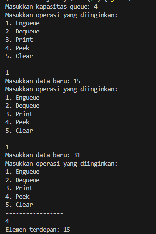

<br>

#### Pertanyaan

1. Pada konstruktor, mengapa nilai awal atribut front dan rear bernilai -1, sementara atribut size
   bernilai 0?
2. Pada method Enqueue, jelaskan maksud dan kegunaan dari potongan kode berikut!
3. Pada method Dequeue, jelaskan maksud dan kegunaan dari potongan kode berikut!
4. Pada method print, mengapa pada proses perulangan variabel i tidak dimulai dari 0 (int i=0),
   melainkan int i=front?
5. Perhatikan kembali method print, jelaskan maksud dari potongan kode berikut!
6. Tunjukkan potongan kode program yang merupakan queue overflow!
7. Pada saat terjadi queue overflow dan queue underflow, program tersebut tetap dapat berjalan
   dan hanya menampilkan teks informasi. Lakukan modifikasi program sehingga pada saat terjadi
   queue overflow dan queue underflow, program dihentikan!

#### Jawaban Pertanyaan

1. front dan rear bernilai -1 menandakan bahwa queue sedang kosong. Index -1 adalah nilai non-valid untuk index array, jadi ini digunakan untuk menunjukkan bahwa belum ada elemen yang masuk atau keluar dari queue.
   sedangkan size ber nilai 0 karena belum ada elemen dalam queue. size digunakan untuk melacak jumlah elemen yang saat ini ada di queue.

<br>

2. Potongan kode ini mengatur indeks rear untuk menyimpan elemen baru. Jika rear sudah mencapai akhir array (indeks terakhir), maka rear di-set ke 0, mengimplementasikan queue sebagai struktur data circular.

```java
if (rear == max - 1) {
    rear = 0;
}
```

<br>

3. Potongan kode ini mengatur indeks front ketika elemen dikeluarkan dari queue. Jika front sudah mencapai akhir array, maka front di-set ke 0, mempertahankan sifat circular dari queue.

```java

if (front == max - 1) {
    front = 0;
}

```

<br>

4. Alasan i diinisialisasi dengan front bukan 0 adalah karena elemen pertama dalam queue mungkin tidak berada di awal array fisik jika queue diperlakukan sebagai circular. Maka, iterasi harus dimulai dari elemen terdepan aktual, yaitu front.

<br>

5. Ini adalah operasi untuk melanjutkan iterasi elemen queue. % max memastikan bahwa jika i mencapai akhir array, akan kembali ke awal array, mengikuti sifat circular dari queue.

```java

i = (i + 1) % max;

```

<br>

6. Potongan kode yang menunjukkan kondisi overflow :

```java

if (size == max) {
    return true;
}

```

<br>

7. Untuk menghentikan program ketika overflow atau underflow terjadi, tambahkan System.exit(1); setelah pesan error ditampilkan. Contohnya, dalam method Enqueue:

```java

if (IsFull()) {
    System.out.println("Queue sudah penuh");
    System.exit(1);
}

```

Dan dalam Dequeue:

```java

if (IsEmpty()) {
    System.out.println("Queue masih kosong");
    System.exit(1);
}

```

<br>
<br>

### Praktikum 2

```java

public class Nasabah13 {
    String nama, norek, alamat;
    int umur;
    double saldo;

    public Nasabah13() {

    }

    public Nasabah13(String nama, String norek, String alamat, int umur, double saldo) {
        this.nama = nama;
        this.norek = norek;
        this.alamat = alamat;
        this.umur = umur;
        this.saldo = saldo;
    }

    public static class Queue13 {
        Nasabah13[] data;
        int front;
        int rear;
        int size;
        int max;

        public Queue13(int n) {
            max = n;
            data = new Nasabah13[max];
            size = 0;
            front = rear = -1;
        }

        public boolean isEmpty() {
            if (size == 0) {
                return true;
            } else {
                return false;
            }
        }

        public boolean isFull() {
            if (size == max) {
                return true;
            } else {
                return false;
            }
        }

        public void peek() {
            if (!isEmpty()) {
                System.out.println("Elemen terdepan : " + data[front].norek + " " + data[front].nama + " "
                        + data[front].alamat + " " + data[front].umur + data[front].saldo);
            } else {
                System.out.println("Queue masih kosong");
            }
        }

        public void print() {
            if (isEmpty()) {
                System.out.println("Queue masih kosong");
            } else {
                int i = front;
                while (i != rear) {
                    System.out
                            .println(data[i].norek + " " + data[i].nama + " " + data[i].alamat + " " + data[i].umur
                                    + data[i].saldo);
                    i = (i + 1) % max;
                }
                System.out.println(
                        data[i].norek + " " + data[i].nama + " " + data[i].alamat + " " + data[i].umur
                                + data[i].saldo);
                System.out.println("Jumlah elemen = " + size);
            }
        }

        public void clear() {
            if (!isEmpty()) {
                front = rear = -1;
                size = 0;
                System.out.println("Queue berhasil dikosongkan");
            } else {
                System.out.println("Queue masih kosong");
            }
        }

        public void enqueue(Nasabah13 dt) {
            if (isFull()) {
                System.out.println("Queue sudah penuh");
                System.exit(0);
            } else {
                if (isEmpty()) {
                    front = rear = 0;
                } else {
                    if (rear == max - 1) {
                        rear = 0;
                    } else {
                        rear++;
                    }
                }
                data[rear] = dt;
                size++;
            }
        }

        public Nasabah13 dequeue() {
            Nasabah13 dt = new Nasabah13();
            if (isEmpty()) {
                System.out.println("Queue masih kosong");
                System.exit(0);
            } else {
                dt = data[front];
                size--;
                if (isEmpty()) {
                    front = rear = -1;
                } else {
                    if (front == max - 1) {
                        front = 0;
                    } else {
                        front++;
                    }
                }
            }
            return dt;
        }
    }

}


```

```java

import java.util.Scanner;

public class QueueMain13 {
    public static void main(String[] args) {
        Scanner sc13 = new Scanner(System.in);

        System.out.print("Masukkan kapasitas queue: ");
        int jumlah = sc13.nextInt();
        Nasabah13.Queue13 antri = new Nasabah13.Queue13(jumlah);  // Correct instantiation

        int pilih;
        do {
            menu();
            pilih = sc13.nextInt();  // Corrected variable name
            sc13.nextLine();
            switch (pilih) {
                case 1:
                    System.out.print("No rekening: ");
                    String norek = sc13.nextLine();
                    System.out.print("Nama: ");
                    String nama = sc13.nextLine();
                    System.out.print("Alamat: ");
                    String alamat = sc13.nextLine();
                    System.out.print("Umur: ");
                    int umur = sc13.nextInt();
                    System.out.print("Saldo: ");
                    double saldo = sc13.nextDouble();
                    sc13.nextLine();
                    Nasabah13 nb = new Nasabah13(nama, norek, alamat, umur, saldo);
                    antri.enqueue(nb);
                    break;
                case 2:
                    Nasabah13 data = antri.dequeue();
                    if (data != null && !"".equals(data.norek) && !"".equals(data.nama) && !"".equals(data.alamat) &&
                        data.umur != 0 && data.saldo != 0) {
                        System.out.println("Antrian terakhir: " + data.norek + " " + data.nama + " "
                            + data.alamat + " " + data.umur + " " + data.saldo);
                    }
                    break;
                case 3:
                    antri.peek();
                    break;
                case 4:
                    antri.print();
                    break;
                default:
                    System.out.println("Masukkan nomor pilihan yang sudah tersedia di menu!");
                    break;
            }
        } while (pilih == 1 || pilih == 2 || pilih == 3 || pilih == 4);
    }

    public static void menu() {
        System.out.print(
            "\n\nPilihan menu: \n" +
            "   1. Antrian baru\n" +
            "   2. Antrian keluar\n" +
            "   3. Cek antrian terdepan\n" +
            "   4. Cek semua antrian\n" +
            "=====================================\n" +
            "Pilihan : "
        );
    }
}


```

<br>

#### Verifikasi Hasil

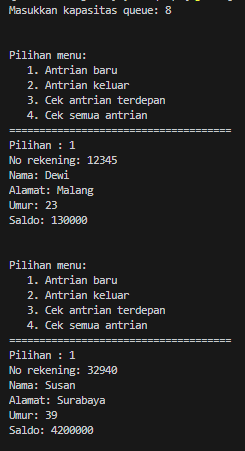

<br>

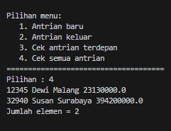

<br>

##### Pertanyaan

1. Pada class QueueMain, jelaskan fungsi IF pada potongan kode program berikut!

```java


```

Jawab :

fungsi if adalah untuk memeriksa apakah data nasabah yang akan dikeluarkan dari antrian (queue) memiliki informasi yang valid. Ini dilakukan dengan mengecek apakah nomor rekening (norek), nama, dan alamat tidak kosong (dengan kata lain, tidak sama dengan string kosong ""), serta memastikan bahwa umur (umur) dan saldo (saldo) bukan nol. Hanya jika semua kondisi ini terpenuhi, informasi nasabah akan dicetak ke konsol dengan menggunakan System.out.println, dan pernyataan break akan menghentikan loop.

2. Lakukan modifikasi program dengan menambahkan method baru bernama peekRear pada class
   Queue yang digunakan untuk mengecek antrian yang berada di posisi belakang! Tambahkan pula
   daftar menu 5. Cek Antrian paling belakang pada class QueueMain sehingga method peekRear
   dapat dipanggil!

jawab :

Tambahkan Method peekRear ke Class Queue:

```java
public void peekRear() {
    if (!isEmpty()) {
        System.out.println("Elemen paling belakang: " + data[rear].norek + " " + data[rear].nama + " "
                + data[rear].alamat + " " + data[rear].umur + " " + data[rear].saldo);
    } else {
        System.out.println("Queue masih kosong");
    }
}

```

Method ini akan menampilkan informasi nasabah yang berada di posisi paling belakang dalam queue.

Tambahkan Opsi Menu Baru di Class QueueMain, dan memperbarui metode menu() untuk memasukkan pilihan baru:

```java

    public static void menu() {
        System.out.print(
            "\n\nPilihan menu: \n" +
            "   1. Antrian baru\n" +
            "   2. Antrian keluar\n" +
            "   3. Cek antrian terdepan\n" +
            "   4. Cek semua antrian\n" +
            "5. Peek Rear (Cek antrian paling belakang\n" +
            "=====================================\n" +
            "Pilihan : "
        );
    }


```

Tambahkan case baru untuk pilihan 5 di dalam switch statement pada method main:

```java

switch (pilih) {

    case 5:
        antri.peekRear();
        break;
}

```

Hasil :

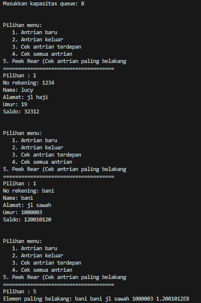

<br>
<br>

### Tugas

```java


public class Pembeli13 {
    private String nama;
    private String noHP;

    public Pembeli13(String nama, String noHP) {
        this.nama = nama;
        this.noHP = noHP;
    }

    // Method untuk mendapatkan nama pembeli
    public String getNama() {
        return nama;
    }

    // Method untuk mendapatkan nomor HP pembeli
    public String getNoHP() {
        return noHP;
    }

    // Method untuk mengatur nama pembeli
    public void setNama(String nama) {
        this.nama = nama;
    }

    // Method untuk mengatur nomor HP pembeli
    public void setNoHP(String noHP) {
        this.noHP = noHP;
    }

}

```

<br>

```java


public class Queue13 {

    private Pembeli13[] antrian;
    private int front;
    private int rear;
    private int size;
    private int max;

    public Queue13(int max) {
        this.max = max;
        antrian = new Pembeli13[this.max];
        front = 0;
        rear = -1;
        size = 0;
    }

    public boolean isEmpty() {
        if (size == 0) {
            return true;
        } else {
            return false;
        }
    }

    public boolean isFull() {
        if (size == max) {
            return true;
        } else {
            return false;
        }
    }

    public void enqueue(Pembeli13 item) {
        if (!isFull()) {
            rear = (rear + 1) % max;
            antrian[rear] = item;
            size++;
        } else {
            System.out.println("Antrian penuh!");
        }
    }

    public Pembeli13 dequeue() {
        if (!isEmpty()) {
            Pembeli13 item = antrian[front];
            front = (front + 1) % max;
            size--;
            return item;
        } else {
            System.out.println("Antrian kosong!");
            return null;
        }
    }

    public void print() {
        for (int i = front; i != rear + 1; i = (i + 1) % max) {
            if (antrian[i] != null) {
                System.out.println(antrian[i].getNama() + " - " + antrian[i].getNoHP());
            }
        }
    }

    public void peek() {
        if (!isEmpty()) {
            System.out.println(antrian[front].getNama());
        } else {
            System.out.println("Antrian kosong!");
        }
    }

    public void peekRear() {
        if (!isEmpty()) {
            System.out.println(antrian[rear].getNama());
        } else {
            System.out.println("Antrian kosong!");
        }
    }

    public void peekPosition(String nama) {
        for (int i = front; i != rear + 1; i = (i + 1) % max) {
            if (antrian[i] != null && antrian[i].getNama().equalsIgnoreCase(nama)) {
                System.out.println("Posisi " + nama + " adalah: " + ((i - front + max) % max + 1));
                return;
            }
        }
        System.out.println(nama + " tidak ada dalam antrian.");
    }

    public void daftarPembeli() {
        for (int i = front; i != rear + 1; i = (i + 1) % max) {
            if (antrian[i] != null) {
                System.out.println((i - front + max) % max + 1 + ". " + antrian[i].getNama() + " - " + antrian[i].getNoHP());
            }
        }
    }
}


```

<br>

```java

import java.util.Scanner;

public class Main13 {

    public static void main(String[] args) {
        Scanner scanner13 = new Scanner(System.in);

        System.out.print("Masukkan kapasitas maksimal antrian: ");
        int maxCapacity = scanner13.nextInt();
        Queue13 queue = new Queue13(maxCapacity);  // Kapasitas antrian sesuai input pengguna

        while (true) {

            System.out.println("\n\n==================================================");
            System.out.println("                       MENU                       ");
            System.out.println("==================================================");

            System.out.println("\n\n==========================================");
            System.out.println("   1. Tambahkan antrian");
            System.out.println("   2. Selesaikan antrian");
            System.out.println("   3. Tampilkan keseluruhan antrian");
            System.out.println("   4. Tampilkan antrian terdepan");
            System.out.println("   5. Tampilkan antrian paling belakang");
            System.out.println("   6. Cari data dari antrian");
            System.out.println("   7. KELUAR");
            System.out.print(" >>> ");
            int pilihan = scanner13.nextInt();
            scanner13.nextLine();  // Consume newline left-over

            switch (pilihan) {
                case 1:
                    if (queue.isFull()) {
                        System.out.println("Maaf, antrian sudah penuh!");
                    } else {
                        System.out.print("Masukkan nama: ");
                        String nama = scanner13.nextLine();
                        System.out.print("Masukkan nomor HP: ");
                        String noHP = scanner13.nextLine();
                        Pembeli13 pembeli = new Pembeli13(nama, noHP);
                        queue.enqueue(pembeli);
                    }
                    break;
                case 2:
                    Pembeli13 dihapus = queue.dequeue();
                    if (dihapus != null) {
                        System.out.println(dihapus.getNama() + " telah selesai dilayani.");
                    }
                    break;
                case 3:
                    queue.print();
                    break;
                case 4:
                    queue.peek();
                    break;
                case 5:
                    queue.peekRear();
                    break;
                case 6:
                    System.out.print("Masukkan nama yang dicari: ");
                    String nama = scanner13.nextLine();
                    queue.peekPosition(nama);
                    break;
                case 7:
                    System.out.println("Terima kasih telah menggunakan aplikasi ini.");
                    scanner13.close();
                    System.exit(0);
                default:
                    System.out.println("Pilihan tidak valid. Silakan coba lagi.");
            }
        }
    }
}


```

#### Hasil Tugas

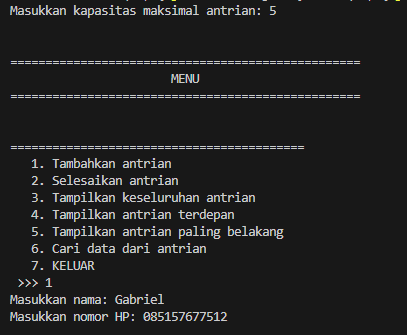

<br>

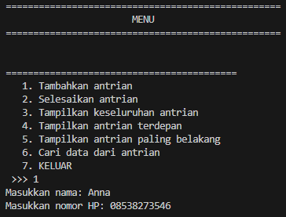

<br>

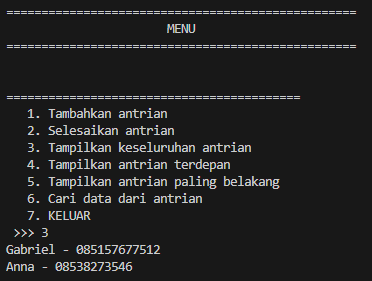

<br>

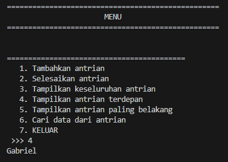

<br>

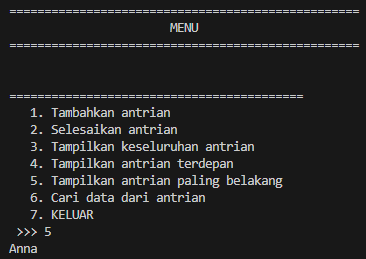

<br>

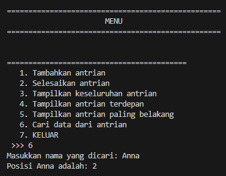

<br>


<br>

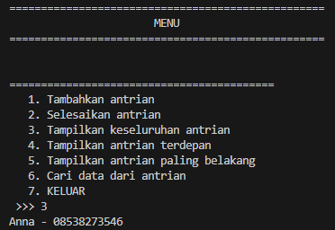
