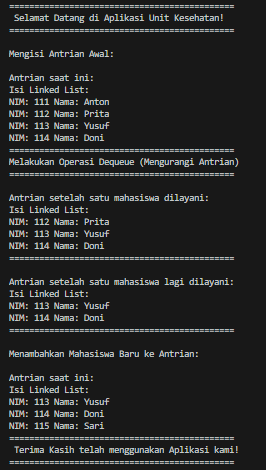

<p align="center">LAPORAN PRAKTIKUM 11</p>
<p align="center">Algoritma dan Struktur Data</p>

<p align="center">  </p>

<p align="center"> Nama : Gabriel Batavia Xaverius </p>
<p align="center"> NIM : 2341720184  </p>
<p align="center">Kelas : TI-1B  </p>
<p align="center">Absen : 13  </p>

### 2.1.1 Pembuatan Single Linked List

Membuat File Node13 :

```java

public class Node13 {
    int data;
    Node13 next;

    Node13(int nilai, Node13 berikutnya) {
        data = nilai;
        next = berikutnya;
    }
}


```

<br>

Membuat File SingleLinkedList13 :

```java

public class SingleLinkedList13 {
    Node13 head, tail;

    public boolean isEmpty() {
        return head == null;
    }


    void print() {
        if (isEmpty()) {
            System.out.println("Linked List kosong");
        } else {
            Node13 tmp = head;
            System.out.println("Isi Linked List : \t");
            while (tmp != null) {
                System.out.print(tmp.data + " ");
                tmp = tmp.next;
            }
            System.out.println("");
        }
    }


    void addFirst(int input) {
        Node13 ndInput = new Node13(input, null);

        if (isEmpty()) {
            head = ndInput;
            tail = ndInput;
        } else {
            ndInput.next = head;
            head = ndInput;
        }
    }


    void addLast(int input) {
        Node13 ndInput = new Node13(input, null);

        if (isEmpty()) {
            head = ndInput;
            tail = ndInput;
        } else {
            tail.next = ndInput;
            tail = ndInput;
        }
    }


    public void insertAfter(int key, int input) {
        Node13 temp = head;
        while(temp != null) {
            if(temp.data == key) {
                Node13 ndInput = new Node13(input, temp.next);
                temp.next = ndInput;
                if(temp == tail) {
                    tail = ndInput;
                }
                break;
            }
            temp = temp.next;
        }
    }


    public void insertAt(int index, int input) {
        if(index < 0) {
            System.out.println("Index tidak valid!");
        } else if (index == 0) {
            addFirst(input);
        } else {
            Node13 temp = head;
            for(int i = 0; i < index - 1; i++) {
                if(temp.next == null) {
                    System.out.println("Indeks di luar batas!");
                    return;
                }
                temp = temp.next;
            }
            Node13 ndInput = new Node13(input, temp.next);
            temp.next = ndInput;
            if(ndInput.next == null) {
                tail = ndInput;
            }
        }
    }

}


```

<br>

Membuat file SLLmain :

```java

public class SLLmain {

        public static void main(String[] args) {
            SingleLinkedList13 singLL = new SingleLinkedList13();
            singLL.print();

            singLL.addFirst(890);
            singLL.print();

            singLL.addLast(760);
            singLL.print();

            singLL.addFirst(700);
            singLL.print();

            singLL.insertAfter(700, 999);
            singLL.print();

            singLL.insertAt(3, 833);
            singLL.print();

        }

}


```

### 2.1.2 Output


<br>

### Pertanyaan

1. Mengapa hasil compile kode program di baris pertama menghasilkan “Linked List Kosong”?

Jawab : Karena pada pemanggilan print fucntion yang pertama, belum ada elemen yang ditambahkan ke Linked List (head masih null), maka kondisi isEmpty() terpenuhi dan output yang dihasilkan adalah "Linked List kosong".

2. Jelaskan kegunaan variable temp secara umum pada setiap method!

Jawab : Variabel temp digunakan secara umum dalam kelas SingleLinkedList13 sebagai pointer sementara untuk menelusuri elemen-elemen dalam Linked List.

3. Perhatikan class SingleLinkedList, pada method insertAt Jelaskan kegunaan kode berikut

```java

if(temp.next.next==null) tail=temp.next;

```

Jawab : memeriksa apakah node yang baru ditambahkan (melalui operasi seperti insertAfter atau insertAt) berada di posisi terakhir dalam Linked List. Jika kondisi ini benar, maka tail harus diperbarui untuk menunjuk ke node baru tersebut, menandakan bahwa node tersebut adalah elemen terakhir dalam list. Ini penting untuk memastikan bahwa pointer tail selalu menunjuk ke elemen terakhir sehingga operasi yang bergantung pada tail (seperti addLast) akan berfungsi dengan benar.

<br>
<br>

### 2.2.1 Modifikasi Pembuatan Single Linked List

Memodifikasi File SingleLinkedList13 :

```java

    int getData(int index) {
        Node13 tmp = head;
        for (int i = 0; i < index && tmp != null; i++) {
            tmp = tmp.next;
        }
        if (tmp == null) {
            System.out.println("Index out of bounds.");
            return -1;
        }
        return tmp.data;
    }

    int indexOf(int key){

        Node13 tmp = head;
        int index = 0;
        while(tmp != null && tmp.data != key){
            tmp = tmp.next;
            index++;
        }
        if(tmp == null){
            return -1;
        } else {
            return index;
        }
    }

    void removeFirst(){
        if(isEmpty()){
            System.out.println("Linked List masih kosong, tidak dapat dihapus");
        } else {
            if(head == tail){
                head = tail = null;
            } else {
                head = head.next;
            }
        }
    }

    void removeLast() {
        if (isEmpty()) {
            System.out.println("Linked list masih kosong, tidak dapat dihapus");
        } else if (head == tail) {
            head = tail = null;
        } else {
            Node13 temp = head;
            while (temp.next != tail) {
                temp = temp.next;
            }
            temp.next = null;
            tail = temp;
        }
    }


    void remove(int key){
        if(isEmpty()){
            System.out.println("Linked list masih kosong, tidak dapat dihapus");
        } else {
            Node13 temp = head;
            while(temp != null){
                if(temp.data == key && temp == head){
                    removeFirst();
                    break;
                } else if(temp.next.data == key){
                    temp.next = temp.next.next;
                    if(temp.next == null){
                        tail = temp;
                    }
                    break;
                }
                temp = temp.next;
            }
        }
    }

    public void removeAt(int index){
        if(index == 0){
            removeFirst();
        } else {
            Node13 temp = head;
            for(int i = 0; i < index - 1; i++){
                temp = temp.next;
            }
            temp.next = temp.next.next;
            if(temp.next == null){
                tail = temp;
            }
        }
    }


```

<br>

Memodifikasi File SLLmain :

```java

public class SLLmain {

        public static void main(String[] args) {
            SingleLinkedList13 singLL = new SingleLinkedList13();
            singLL.print();

            singLL.addFirst(890);
            singLL.print();

            singLL.addLast(760);
            singLL.print();

            singLL.addFirst(700);
            singLL.print();

            singLL.insertAfter(700, 999);
            singLL.print();

            singLL.insertAt(3, 833);
            singLL.print();

            System.out.println();
            System.out.println("Data padaa indeks ke-i = " + singLL.getData(1));
            System.out.println("Data 3 berada pada indeks ke- " + singLL.indexOf(760));

            singLL.remove(999);
            singLL.print();
            singLL.removeAt(0);
            singLL.print();
            singLL.removeFirst();
            singLL.print();
            singLL.removeLast();
            singLL.print();

        }


}


```

<br>

### 2.2.2 Output


<br>

### 2.2.3 Pertanyaan

1. Mengapa digunakan keyword break pada fungsi remove? Jelaskan!

Jawab : untuk menghentikan iterasi setelah operasi penghapusan dilakukan.

2. Jelaskan kegunaan kode dibawah pada method remove

```java

                } else if(temp.next.data == key){
                    temp.next = temp.next.next;

```

<br>

Jawab : digunakan untuk menghapus node yang mengandung data yang sama dengan key setelah node yang sedang dicek.

<br>
<br>
<br>

### 3.1 Tugas 1

Berikut beberapa file yang dibuat untuk mengimplementasikan ilustrasi tugas 1 :

```java

package Tugas1;
public class Mahasiswa13 {
    int nim;
    String nama;

    public Mahasiswa13(int nim, String nama) {
        this.nim = nim;
        this.nama = nama;
    }
}


```

<br>

```java

package Tugas1;

public class Node13 {
    Mahasiswa13 data;
    Node13 next;

    public Node13(Mahasiswa13 data, Node13 next) {
        this.data = data;
        this.next = next;
    }
}

```

<br>

```java

package Tugas1;
public class LinkedList13 {
    Node13 head, tail;

    public boolean isEmpty() {
        return head == null;
    }

    void print() {
        if (!isEmpty()) {
            Node13 tmp = head;
            System.out.println("Isi Linked List:");
            while (tmp != null) {
                System.out.println("NIM: " + tmp.data.nim + " Nama: " + tmp.data.nama);
                tmp = tmp.next;
            }
        } else {
            System.out.println("Linked List Kosong");
        }
    }

    void addFirst(Mahasiswa13 data) {
        Node13 ndInput = new Node13(data, null);
        if (isEmpty()) {
            head = ndInput;
            tail = ndInput;
        } else {
            ndInput.next = head;
            head = ndInput;
        }
    }

    void addLast(Mahasiswa13 data) {
        Node13 ndInput = new Node13(data, null);
        if (isEmpty()) {
            head = ndInput;
            tail = ndInput;
        } else {
            tail.next = ndInput;
            tail = ndInput;
        }
    }

    void insertAfter(int NIMKey, Mahasiswa13 data) {
        Node13 ndInput = new Node13(data, null);
        Node13 temp = head;
        boolean keyFound = false;

        while (temp != null) {
            if (temp.data.nim == NIMKey) {
                keyFound = true;
                ndInput.next = temp.next;
                temp.next = ndInput;
                if (ndInput.next == null) {
                    tail = ndInput;
                }
                break;
            }
            temp = temp.next;
        }

        if (!keyFound) {
            System.out.println("NIM tidak ditemukan");
        }
    }

    void insertAt(int index, Mahasiswa13 data) {
        Node13 ndInput = new Node13(data, null);
        if (index < 0) {
            System.out.println("Index Tidak Valid");
            return;
        } else if (index == 0) {
            addFirst(data);
            return;
        }

        Node13 temp = head;
        for (int i = 0; i < index - 1; i++) {
            if (temp.next == null) {
                System.out.println("Index di luar batas");
                return;
            }
            temp = temp.next;
        }
        ndInput.next = temp.next;
        temp.next = ndInput;
        if (temp.next.next == null) {
            tail = temp.next;
        }
    }
}


```

<br>

```java


package Tugas1;

public class LinkedListMain13 {
    public static void main(String[] args) {
        LinkedList13 list13 = new LinkedList13();


        list13.print();
        list13.addFirst(new Mahasiswa13(111, "Anton"));
        list13.print();

        list13.addLast(new Mahasiswa13(112, "Prita"));
        list13.print();

        list13.insertAfter(112, new Mahasiswa13(113, "Yusuf"));
        list13.print();

        list13.insertAfter(113, new Mahasiswa13(114, "Doni"));
        list13.print();

        list13.insertAt(4, new Mahasiswa13(115, "Sari"));
        list13.print();
    }
}


```

<br>

### Verifikasi Hasil Tugas 1


<br>
<br>

### 3.2 Tugas 2

Berikut adalah file kode untuk membuat program antrian layanan unit kemahasiswaan :

```java


public class Mahasiswa13 {
    int nim;
    String nama;

    public Mahasiswa13(int nim, String nama) {
        this.nim = nim;
        this.nama = nama;
    }
}


```

```java

public class Node13 {
    Mahasiswa13 data;
    Node13 next;

    public Node13(Mahasiswa13 data, Node13 next) {
        this.data = data;
        this.next = next;
    }
}


```

```java


public class LinkedList13 {
    Node13 head, tail;

    public boolean isEmpty() {
        return head == null;
    }

    void print() {
        if (!isEmpty()) {
            Node13 tmp = head;
            System.out.println("Isi Linked List:");
            while (tmp != null) {
                System.out.println("NIM: " + tmp.data.nim + " Nama: " + tmp.data.nama);
                tmp = tmp.next;
            }
        } else {
            System.out.println("Linked List Kosong");
        }
    }

    void enqueue(Mahasiswa13 data) {
        Node13 ndInput = new Node13(data, null);
        if (isEmpty()) {
            head = ndInput;
            tail = ndInput;
        } else {
            tail.next = ndInput;
            tail = ndInput;
        }
    }

    Mahasiswa13 dequeue() {
        if (isEmpty()) {
            System.out.println("Queue kosong, tidak bisa dequeue");
            return null;
        }
        Mahasiswa13 data = head.data;
        head = head.next;
        if (head == null) {
            tail = null;
        }
        return data;
    }
}


```

```java

public class LinkedListMain13 {
    public static void main(String[] args) {
        LinkedList13 linkedList = new LinkedList13();

        System.out.println("=============================================");
        System.out.println(" Selamat Datang di Aplikasi Unit Kesehatan!");
        System.out.println("=============================================");
        System.out.println("\nMengisi Antrian Awal:");

        linkedList.enqueue(new Mahasiswa13(111, "Anton"));
        linkedList.enqueue(new Mahasiswa13(112, "Prita"));
        linkedList.enqueue(new Mahasiswa13(113, "Yusuf"));
        linkedList.enqueue(new Mahasiswa13(114, "Doni"));

        System.out.println("\nAntrian saat ini:");
        linkedList.print();

        System.out.println("=============================================");
        System.out.println("Melakukan Operasi Dequeue (Mengurangi Antrian)");
        System.out.println("=============================================");
        linkedList.dequeue();
        System.out.println("\nAntrian setelah satu mahasiswa dilayani:");
        linkedList.print();

        System.out.println("=============================================");
        linkedList.dequeue();
        System.out.println("\nAntrian setelah satu mahasiswa lagi dilayani:");
        linkedList.print();

        System.out.println("=============================================");
        System.out.println("\nMenambahkan Mahasiswa Baru ke Antrian:");
        linkedList.enqueue(new Mahasiswa13(115, "Sari"));
        System.out.println("\nAntrian saat ini:");
        linkedList.print();

        System.out.println("=============================================");
        System.out.println(" Terima Kasih telah menggunakan Aplikasi kami!");
        System.out.println("=============================================");
    }
}


```

<br>

### Verifikasi Hasil Tugas 2


