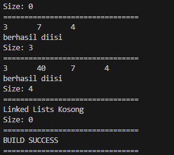
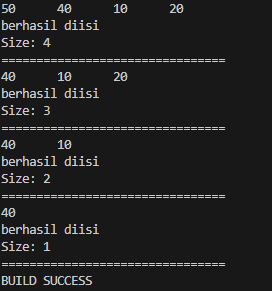

## Praktikun 1

```java

package doublelinkedlists;


public class Node {
    int data;
    Node prev;
    Node next;

    public Node(Node prev, int data, Node next) {
        this.prev = prev;
        this.data = data;
        this.next = next;
    }
}


```

<br>

```java

public class DoubleLinkedLists {
    Node head;
    int size;

    // Constructor untuk inisialisasi list
    public DoubleLinkedLists() {
        head = null;
        size = 0;
    }

    // Memeriksa apakah list kosong
    public boolean isEmpty() {
        return head == null;
    }

    // Menambahkan elemen di awal list
    public void addFirst(int item) {
        if (isEmpty()) {
            head = new Node(null, item, null);
        } else {
            Node newNode = new Node(null, item, head);
            head.prev = newNode;
            head = newNode;
        }
        size++;
    }

    // Menambahkan elemen di akhir list
    public void addLast(int item) {
        if (isEmpty()) {
            addFirst(item);
        } else {
            Node current = head;
            while (current.next != null) {
                current = current.next;
            }
            Node newNode = new Node(current, item, null);
            current.next = newNode;
            size++;
        }
    }

    // Menambahkan elemen pada posisi tertentu
    public void add(int item, int index) throws Exception {
        if (index < 0 || index > size) {
            throw new Exception("Nilai indeks di luar batas");
        } else if (isEmpty() || index == 0) {
            addFirst(item);
        } else {
            Node current = head;
            int i = 0;
            while (i < index && current.next != null) {
                current = current.next;
                i++;
            }
            if (i == index) {
                Node newNode = new Node(current.prev, item, current);
                if (current.prev != null) {
                    current.prev.next = newNode;
                }
                current.prev = newNode;
                if (index == 0) {
                    head = newNode;
                }
                size++;
            } else {
                addLast(item);
            }
        }
    }

    // Mengembalikan ukuran list
    public int size() {
        return size;
    }

    // Menghapus semua elemen dalam list
    public void clear() {
        head = null;
        size = 0;
    }

    // Mencetak elemen-elemen dalam list
    public void print() {
        if (!isEmpty()) {
            Node tmp = head;
            while (tmp != null) {
                System.out.print(tmp.data + "\t");
                tmp = tmp.next;
            }
            System.out.println("\nberhasil diisi");
        } else {
            System.out.println("Linked Lists Kosong");
        }
    }
}


```

<br>

```java

public class DoubleLinkedListsMain {
    public static void main(String[] args){
        DoubleLinkedLists dll = new DoubleLinkedLists();

        // Print empty list
        System.out.println("================================");
        dll.print();
        System.out.println("Size: " + dll.size());

        // Tambah elemen
        try {
            dll.addFirst(3);
            dll.addLast(4);
            dll.add(7, 1);

            // Print list setelah menambah elemen
            System.out.println("================================");
            dll.print();
            System.out.println("Size: " + dll.size());

            dll.add(40, 1);

            System.out.println("================================");
            dll.print();
            System.out.println("Size: " + dll.size());
        } catch (Exception e) {
            System.out.println(e.getMessage());
        }

        // Clear
        dll.clear();

        System.out.println("================================");
        dll.print();
        System.out.println("Size: " + dll.size());
        System.out.println("================================");
        System.out.println("BUILD SUCCESS");
        System.out.println("================================");
    }
}

```

<br>

### Hasil



<br>
<br>

## Praktikun 2

```java

    // Menghapus elemen pertama dalam list
    public void removeFirst() throws Exception {
        if (isEmpty()) {
            throw new Exception("Linked List masih kosong, tidak dapat dihapus!");
        } else if (size == 1) {
            head = null;
            size--;
        } else {
            head = head.next;
            head.prev = null;
            size--;
        }
    }

    // Menghapus elemen terakhir dalam list
    public void removeLast() throws Exception {
        if (isEmpty()) {
            throw new Exception("Linked List masih kosong, tidak dapat dihapus!");
        } else if (head.next == null) {
            head = null;
            size--;
        } else {
            Node current = head;
            while (current.next.next != null) {
                current = current.next;
            }
            current.next = null;
            size--;
        }
    }

    // Menghapus elemen pada indeks tertentu
    public void remove(int index) throws Exception {
        if (isEmpty() || index >= size) {
            throw new Exception("Nilai indeks di luar batas");
        } else if (index == 0) {
            removeFirst();
        } else {
            Node current = head;
            int i = 0;
            while (i < index) {
                current = current.next;
                i++;
            }
            if (current.next == null) {
                current.prev.next = null;
            } else if (current.prev == null) {
                current.next.prev = null;
                head = current.next;
            } else {
                current.prev.next = current.next;
                current.next.prev = current.prev;
            }
            size--;
        }
    }

```

<br>

```java

public class DoubleLinkedListsMain {
    public static void main(String[] args){
        DoubleLinkedLists dll = new DoubleLinkedLists();

        // Tambah elemen
        try {
            dll.addLast(50);
            dll.addLast(40);
            dll.addLast(10);
            dll.addLast(20);

            dll.print();
            System.out.println("Size: " + dll.size());
            System.out.println("================================");

            dll.removeFirst();
            dll.print();
            System.out.println("Size: " + dll.size());
            System.out.println("================================");

            dll.removeLast();
            dll.print();
            System.out.println("Size: " + dll.size());
            System.out.println("================================");

            dll.remove(1);
            dll.print();
            System.out.println("Size: " + dll.size());
            System.out.println("================================");

            System.out.println("BUILD SUCCESS");
        } catch (Exception e) {
            System.out.println(e.getMessage());
        }
    }
}


```

<br>

### Hasil


