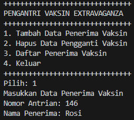

# Praktikum

## Praktikun 1

```java

package doublelinkedlists;


public class Node {
    int data;
    Node prev;
    Node next;

    public Node(Node prev, int data, Node next) {
        this.prev = prev;
        this.data = data;
        this.next = next;
    }
}


```

<br>

```java

public class DoubleLinkedLists {
    Node head;
    int size;

    // Constructor untuk inisialisasi list
    public DoubleLinkedLists() {
        head = null;
        size = 0;
    }

    // Memeriksa apakah list kosong
    public boolean isEmpty() {
        return head == null;
    }

    // Menambahkan elemen di awal list
    public void addFirst(int item) {
        if (isEmpty()) {
            head = new Node(null, item, null);
        } else {
            Node newNode = new Node(null, item, head);
            head.prev = newNode;
            head = newNode;
        }
        size++;
    }

    // Menambahkan elemen di akhir list
    public void addLast(int item) {
        if (isEmpty()) {
            addFirst(item);
        } else {
            Node current = head;
            while (current.next != null) {
                current = current.next;
            }
            Node newNode = new Node(current, item, null);
            current.next = newNode;
            size++;
        }
    }

    // Menambahkan elemen pada posisi tertentu
    public void add(int item, int index) throws Exception {
        if (index < 0 || index > size) {
            throw new Exception("Nilai indeks di luar batas");
        } else if (isEmpty() || index == 0) {
            addFirst(item);
        } else {
            Node current = head;
            int i = 0;
            while (i < index && current.next != null) {
                current = current.next;
                i++;
            }
            if (i == index) {
                Node newNode = new Node(current.prev, item, current);
                if (current.prev != null) {
                    current.prev.next = newNode;
                }
                current.prev = newNode;
                if (index == 0) {
                    head = newNode;
                }
                size++;
            } else {
                addLast(item);
            }
        }
    }

    // Mengembalikan ukuran list
    public int size() {
        return size;
    }

    // Menghapus semua elemen dalam list
    public void clear() {
        head = null;
        size = 0;
    }

    // Mencetak elemen-elemen dalam list
    public void print() {
        if (!isEmpty()) {
            Node tmp = head;
            while (tmp != null) {
                System.out.print(tmp.data + "\t");
                tmp = tmp.next;
            }
            System.out.println("\nberhasil diisi");
        } else {
            System.out.println("Linked Lists Kosong");
        }
    }
}


```

<br>

```java

public class DoubleLinkedListsMain {
    public static void main(String[] args){
        DoubleLinkedLists dll = new DoubleLinkedLists();

        // Print empty list
        System.out.println("================================");
        dll.print();
        System.out.println("Size: " + dll.size());

        // Tambah elemen
        try {
            dll.addFirst(3);
            dll.addLast(4);
            dll.add(7, 1);

            // Print list setelah menambah elemen
            System.out.println("================================");
            dll.print();
            System.out.println("Size: " + dll.size());

            dll.add(40, 1);

            System.out.println("================================");
            dll.print();
            System.out.println("Size: " + dll.size());
        } catch (Exception e) {
            System.out.println(e.getMessage());
        }

        // Clear
        dll.clear();

        System.out.println("================================");
        dll.print();
        System.out.println("Size: " + dll.size());
        System.out.println("================================");
        System.out.println("BUILD SUCCESS");
        System.out.println("================================");
    }
}

```

<br>

### Hasil


<br>

### Pertanyaan

1. Jelaskan perbedaan antara single linked list dengan double linked list!

Jawaban:
Single linked list hanya memiliki referensi ke node berikutnya (next) pada setiap node, sedangkan double linked list memiliki referensi ke node berikutnya (next) dan node sebelumnya (prev) pada setiap node. Double linked list memungkinkan traversal dua arah, baik maju maupun mundur, sedangkan single linked list hanya memungkinkan traversal satu arah (maju).

2. Perhatikan class Node, di dalamnya terdapat atribut next dan prev. Untuk apakah atribut tersebut?

Jawaban:
Atribut next digunakan untuk menunjuk ke node berikutnya dalam linked list, sementara atribut prev digunakan untuk menunjuk ke node sebelumnya dalam linked list. Ini memungkinkan navigasi dua arah dalam double linked list.

3. Perhatikan konstruktor pada class DoubleLinkedLists. Apa kegunaan inisialisasi atribut head dan size seperti pada gambar berikut ini?

```java
public DoubleLinkedLists() {
    head = null;
    size = 0;
}
```

<br>

Jawaban:
Inisialisasi atribut head dengan null menunjukkan bahwa linked list awalnya kosong, karena tidak ada node yang mengarah ke data apapun. Inisialisasi atribut size dengan 0 menunjukkan bahwa jumlah elemen dalam linked list awalnya adalah nol.

4. Pada method addFirst(), kenapa dalam pembuatan object dari konstruktor class Node prev diassign sama dengan null?

```java
Node newNode = new Node(null, item, head);
```

<br>

Jawaban:
Dalam metode addFirst(), prev diassign null karena node yang ditambahkan di awal list tidak memiliki node sebelumnya, sehingga referensi prev harus menunjuk ke null.

5. Perhatikan pada method addFirst(). Apakah arti statement head.prev = newNode?

Jawaban:
Statement head.prev = newNode digunakan untuk menghubungkan node yang saat ini menjadi head dengan node baru yang ditambahkan di depan, dengan cara mengatur referensi prev dari node lama ke node baru.

6. Perhatikan isi method addLast(). Apa arti dari pembuatan object Node dengan mengisikan parameter prev dengan current, dan next dengan null?

```java
Node newNode = new Node(current, item, null);
```

<br>

Jawaban:
Dalam metode addLast(), pembuatan object Node dengan prev diisi dengan current dan next diisi dengan null berarti node baru ditambahkan di akhir list. prev menunjuk ke node terakhir saat ini (current), dan next menunjuk ke null karena node baru ini akan menjadi node terakhir dalam list.

7. Pada method add(), terdapat potongan kode program sebagai berikut:

```java
if (current.prev == null) {
    Node newNode = new Node(null, item, current);
    current.prev = newNode;
    head = newNode;
} else {
    Node newNode = new Node(current.prev, item, current);
    current.prev.next = newNode;
    current.prev = newNode;
}
```

<br>

Jelaskan maksud dari bagian yang ditandai dengan kotak kuning.

Jawaban:

Maksud dari bagian kode ini adalah untuk menambahkan node baru pada posisi tertentu dalam double linked list:

Jika current.prev == null:
Ini berarti current adalah node pertama dalam list. Node baru (newNode) akan menjadi node pertama (head) yang baru. prev dari newNode diatur menjadi null, next diatur ke current, current.prev diatur ke newNode, dan head diatur ke newNode.

Jika current.prev != null:
Ini berarti current bukan node pertama dalam list. Node baru (newNode) akan disisipkan di antara current.prev dan current. prev dari newNode diatur ke current.prev, next diatur ke current, current.prev.next diatur ke newNode, dan current.prev diatur ke newNode.

<br>
<br>

## Praktikun 2

```java

    // Menghapus elemen pertama dalam list
    public void removeFirst() throws Exception {
        if (isEmpty()) {
            throw new Exception("Linked List masih kosong, tidak dapat dihapus!");
        } else if (size == 1) {
            head = null;
            size--;
        } else {
            head = head.next;
            head.prev = null;
            size--;
        }
    }

    // Menghapus elemen terakhir dalam list
    public void removeLast() throws Exception {
        if (isEmpty()) {
            throw new Exception("Linked List masih kosong, tidak dapat dihapus!");
        } else if (head.next == null) {
            head = null;
            size--;
        } else {
            Node current = head;
            while (current.next.next != null) {
                current = current.next;
            }
            current.next = null;
            size--;
        }
    }

    // Menghapus elemen pada indeks tertentu
    public void remove(int index) throws Exception {
        if (isEmpty() || index >= size) {
            throw new Exception("Nilai indeks di luar batas");
        } else if (index == 0) {
            removeFirst();
        } else {
            Node current = head;
            int i = 0;
            while (i < index) {
                current = current.next;
                i++;
            }
            if (current.next == null) {
                current.prev.next = null;
            } else if (current.prev == null) {
                current.next.prev = null;
                head = current.next;
            } else {
                current.prev.next = current.next;
                current.next.prev = current.prev;
            }
            size--;
        }
    }

```

<br>

```java

public class DoubleLinkedListsMain {
    public static void main(String[] args){
        DoubleLinkedLists dll = new DoubleLinkedLists();

        // Tambah elemen
        try {
            dll.addLast(50);
            dll.addLast(40);
            dll.addLast(10);
            dll.addLast(20);

            dll.print();
            System.out.println("Size: " + dll.size());
            System.out.println("================================");

            dll.removeFirst();
            dll.print();
            System.out.println("Size: " + dll.size());
            System.out.println("================================");

            dll.removeLast();
            dll.print();
            System.out.println("Size: " + dll.size());
            System.out.println("================================");

            dll.remove(1);
            dll.print();
            System.out.println("Size: " + dll.size());
            System.out.println("================================");

            System.out.println("BUILD SUCCESS");
        } catch (Exception e) {
            System.out.println(e.getMessage());
        }
    }
}


```

<br>

### Hasil


### Pertanyaan

1. Apakah maksud statement berikut pada method removeFirst()?

```java
head = head.next;
head.prev = null;
```

<br>

Jawaban:
Maksud dari statement tersebut adalah untuk menghapus node pertama dalam linked list. head = head.next mengarahkan head ke node kedua dalam list, menjadikannya node pertama yang baru. head.prev = null menghapus referensi ke node sebelumnya dari node yang baru menjadi head, memastikan bahwa node pertama tidak memiliki node sebelumnya.

2. Bagaimana cara mendeteksi posisi data ada pada bagian akhir pada method removeLast()?

Jawaban:
Cara mendeteksi posisi data ada pada bagian akhir pada method removeLast() adalah dengan memeriksa node yang memiliki next bernilai null. Jika head.next adalah null, ini berarti hanya ada satu node dalam list. Jika tidak, kita dapat menggunakan loop untuk melintasi list sampai menemukan node di mana next dari node tersebut adalah null, yang menandakan bahwa node tersebut adalah node terakhir.

3. Jelaskan alasan potongan kode program di bawah ini tidak cocok untuk perintah remove!

```java
Node tmp = head.next;
head.next=tmp.next;
tmp.next.prev=head;
```

<br>

Jawaban:
Potongan kode program di atas tidak cocok untuk perintah remove karena tidak mempertimbangkan semua kemungkinan posisi node yang akan dihapus. Kode tersebut hanya bekerja untuk menghapus node kedua dalam list, bukan untuk node dengan indeks tertentu. Untuk menghapus node dengan indeks tertentu, perlu traversal ke posisi yang tepat dan mengatur ulang referensi prev dan next dari node tetangga, bukan hanya node pertama dan kedua.

4. Jelaskan fungsi kode program berikut ini pada fungsi remove!

```java
current.prev.next = current.next;
current.next.prev = current.prev;
```

<br>

Jawaban:
Fungsi kode program tersebut adalah untuk menghapus node yang terletak di posisi current dari linked list.

current.prev.next = current.next menghubungkan node sebelumnya (prev) dari current ke node berikutnya (next) dari current, melewati node current.
current.next.prev = current.prev menghubungkan node berikutnya (next) dari current ke node sebelumnya (prev) dari current, juga melewati node current.

<br>
<br>

## Praktikum 3

```java

    // Mengambil elemen pertama dalam list
    public int getFirst() throws Exception {
        if (isEmpty()) {
            throw new Exception("Linked List kosong");
        }
        return head.data;
    }

    // Mengambil elemen terakhir dalam list
    public int getLast() throws Exception {
        if (isEmpty()) {
            throw new Exception("Linked List kosong");
        }
        Node tmp = head;
        while (tmp.next != null) {
            tmp = tmp.next;
        }
        return tmp.data;
    }

    // Mengambil elemen pada indeks tertentu dalam list
    public int get(int index) throws Exception {
        if (isEmpty() || index >= size) {
            throw new Exception("Nilai indeks di luar batas");
        }
        Node tmp = head;
        for (int i = 0; i < index; i++) {
            tmp = tmp.next;
        }
        return tmp.data;
    }

```

<br>

```java


public class DoubleLinkedListsMain {
    public static void main(String[] args){
        DoubleLinkedLists dll = new DoubleLinkedLists();

        // Tambah elemen
        try {
            dll.addLast(7);
            dll.addLast(3);
            dll.addLast(4);

            dll.print();
            System.out.println("Size: " + dll.size());
            System.out.println("================================");

            dll.add(40, 1);

            dll.print();
            System.out.println("Size: " + dll.size());
            System.out.println("================================");

            System.out.println("Data awal pada Linked Lists adalah: " + dll.getFirst());
            System.out.println("Data akhir pada Linked Lists adalah: " + dll.getLast());
            System.out.println("Data indeks ke-1 pada Linked Lists adalah: " + dll.get(1));
            System.out.println("================================");

            System.out.println("BUILD SUCCESS");
        } catch (Exception e) {
            System.out.println(e.getMessage());
        }
    }
}


```

<br>

### Hasil


### Pertanyaan

1. Jelaskan method size() pada class DoubleLinkedLists!

Jawaban:
Method size() pada class DoubleLinkedLists digunakan untuk mengembalikan jumlah elemen (node) yang ada dalam linked list. Method ini mengakses atribut size yang diperbarui setiap kali node ditambahkan atau dihapus dari linked list.

2. Jelaskan cara mengatur indeks pada double linked lists supaya dapat dimulai dari indeks ke-1!

Jawaban:
Untuk mengatur indeks pada double linked lists supaya dapat dimulai dari indeks ke-1, kita dapat menyesuaikan indeks yang digunakan dalam operasi penambahan, penghapusan, dan pengambilan elemen. Biasanya, indeks dalam linked list dimulai dari 0, tetapi kita bisa membuat penyesuaian internal pada method untuk mengabaikan atau mengubah indeks yang diberikan pengguna menjadi dimulai dari 1. Misalnya, jika pengguna memberikan indeks 1, kita bisa menguranginya dengan 1 untuk disesuaikan dengan indeks internal yang dimulai dari 0.

3. Jelaskan perbedaan karakteristik fungsi Add pada Double Linked Lists dan Single Linked Lists!

Jawaban:

Double Linked Lists:
Pada double linked lists, setiap node memiliki referensi ke node berikutnya (next) dan node sebelumnya (prev). Fungsi add harus memperbarui kedua referensi ini.
Ketika menambahkan node di awal atau di akhir list, referensi prev dan next dari node yang baru dan node yang ada perlu diperbarui untuk mempertahankan integritas list.
Single Linked Lists:
Pada single linked lists, setiap node hanya memiliki referensi ke node berikutnya (next). Fungsi add hanya perlu memperbarui referensi next.
Menambahkan node di awal atau di akhir list hanya memerlukan pembaruan referensi next dari node yang baru dan node yang ada.

4. Jelaskan perbedaan logika dari kedua kode program di bawah ini!

Kode Program:

(a)

```java
public boolean isEmpty() {
if (size == 0) {
return true;
} else {
return false;
}
}
```

<br>

(b)

```java
public boolean isEmpty() {
return head == null;
}
```

<br>

Jawaban:

Kode Program (a):
Kode ini menentukan apakah linked list kosong dengan memeriksa nilai atribut size. Jika size bernilai 0, maka list dianggap kosong dan method mengembalikan true. Jika size bukan 0, maka list dianggap tidak kosong dan method mengembalikan false.

Kode Program (b):
Kode ini menentukan apakah linked list kosong dengan memeriksa apakah head adalah null. Jika head bernilai null, maka list dianggap kosong dan method mengembalikan true. Jika head tidak null, maka list dianggap tidak kosong dan method mengembalikan false.

Perbedaan Logika:

Kode (a) bergantung pada nilai atribut size untuk menentukan apakah list kosong atau tidak.
Kode (b) bergantung pada apakah head menunjuk ke node atau tidak untuk menentukan apakah list kosong atau tidak.

<br>
<br>
<br>

# Tugas

## Tugas 1

```java

package Tugas.Tugas1;
public class Node13 {
    Node13 prev;
    int data;
    String name;
    Node13 next;

    public Node13(Node13 prev, int data, String name, Node13 next) {
        this.prev = prev;
        this.data = data;
        this.name = name;
        this.next = next;
    }
}


```

<br>

```java

package Tugas.Tugas1;
public class DoubleLinkedLists13 {
    Node13 head;
    int size;

    public DoubleLinkedLists13() {
        head = null;
        size = 0;
    }

    public boolean isEmpty() {
        return head == null;
    }

    public void addLast(int data, String name) {
        if (isEmpty()) {
            head = new Node13(null, data, name, null);
        } else {
            Node13 current = head;
            while (current.next != null) {
                current = current.next;
            }
            Node13 newNode = new Node13(current, data, name, null);
            current.next = newNode;
        }
        size++;
    }

    public void removeFirst() throws Exception {
        if (isEmpty()) {
            throw new Exception("Linked List masih kosong, tidak dapat dihapus!");
        } else if (size == 1) {
            System.out.println(head.name + " telah selesai divaksinasi.");
            head = null;
            size--;
        } else {
            System.out.println(head.name + " telah selesai divaksinasi.");
            head = head.next;
            head.prev = null;
            size--;
        }
    }

    public void print() {
        if (!isEmpty()) {
            Node13 tmp = head;
            System.out.println("+----------------------+");
            System.out.println("Daftar Pengganti Vaksin");
            System.out.println("+----------------------+");
            System.out.println("|No.\t|Nama");
            System.out.println("+----------------------+");
            while (tmp != null) {
                System.out.println("|" + tmp.data + "\t|" + tmp.name);
                tmp = tmp.next;
            }
            System.out.println("+----------------------+");
            System.out.println("Sisa Antrian: " + size);
        } else {
            System.out.println("Linked Lists Kosong");
        }
    }
}


```

<br>

```java

package Tugas.Tugas1;
import java.util.Scanner;

public class AntrianVaksin13 {
    public static void main(String[] args) {
        Scanner sc13 = new Scanner(System.in);
        DoubleLinkedLists13 dll = new DoubleLinkedLists13();

        while (true) {
            System.out.println("+++++++++++++++++++++++++++++++");
            System.out.println("PENGANTRI VAKSIN EXTRAVAGANZA");
            System.out.println("+++++++++++++++++++++++++++++++");
            System.out.println("1. Tambah Data Penerima Vaksin");
            System.out.println("2. Hapus Data Pengganti Vaksin");
            System.out.println("3. Daftar Penerima Vaksin");
            System.out.println("4. Keluar");
            System.out.println("+++++++++++++++++++++++++++++++");
            System.out.print("Pilih: ");
            int choice = sc13.nextInt();
            sc13.nextLine();

            switch (choice) {
                case 1:
                    System.out.print("Masukkan Data Penerima Vaksin\n");
                    System.out.print("Nomor Antrian: ");
                    int number = sc13.nextInt();
                    sc13.nextLine();
                    System.out.print("Nama Penerima: ");
                    String name = sc13.nextLine();
                    dll.addLast(number, name);
                    break;

                case 2:
                    try {
                        dll.removeFirst();
                    } catch (Exception e) {
                        System.out.println(e.getMessage());
                    }
                    break;

                case 3:
                    dll.print();
                    break;

                case 4:
                    System.out.println("Terima kasih telah menggunakan layanan ini.");
                    System.exit(0);

                default:
                    System.out.println("Pilihan tidak valid. Silakan coba lagi.");
            }
        }
    }
}


```

<br>

### Hasil





<br>
