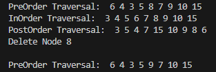
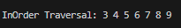
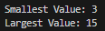
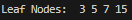
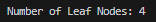

## Praktikum 1

### Kode

```java
package Praktikum;

public class Node13 {
    int data;
    Node13 left, right;

    public Node13() {
        this.left = null;
        this.right = null;
    }

    // Parameterized constructor
    public Node13(int data) {
        this.data = data;
        this.left = null;
        this.right = null;
    }
}


```

<br>

```java

package Praktikum;

public class BinaryTree13 {
    Node13 root;

    public BinaryTree13() {
        this.root = null;
    }

    public boolean isEmpty() {
        return root == null;
    }

    public void add(int data) {
        if (isEmpty()) {
            root = new Node13(data);
        } else {
            Node13 current = root;
            while (true) {
                if (data < current.data) {
                    if (current.left == null) {
                        current.left = new Node13(data);
                        break;
                    } else {
                        current = current.left;
                    }
                } else if (data > current.data) {
                    if (current.right == null) {
                        current.right = new Node13(data);
                        break;
                    } else {
                        current = current.right;
                    }
                } else {
                    // Data already exists
                    break;
                }
            }
        }
    }

    public boolean find(int data) {
        boolean result = false;
        Node13 current = root;
        while (current != null) {
            if (current.data == data) {
                result = true;
                break;
            } else if (data < current.data) {
                current = current.left;
            } else {
                current = current.right;
            }
        }
        return result;
    }

    // Pre-order traversal
    public void traversePreOrder(Node13 node) {
        if (node != null) {
            System.out.print(" " + node.data);
            traversePreOrder(node.left);
            traversePreOrder(node.right);
        }
    }

    // In-order traversal
    public void traverseInOrder(Node13 node) {
        if (node != null) {
            traverseInOrder(node.left);
            System.out.print(" " + node.data);
            traverseInOrder(node.right);
        }
    }

    // Post-order traversal
    public void traversePostOrder(Node13 node) {
        if (node != null) {
            traversePostOrder(node.left);
            traversePostOrder(node.right);
            System.out.print(" " + node.data);
        }
    }

    public Node13 getSuccessor(Node13 del) {
        Node13 successor = del.right;
        Node13 successorParent = del;
        while (successor.left != null) {
            successorParent = successor;
            successor = successor.left;
        }
        if (successor != del.right) {
            successorParent.left = successor.right;
            successor.right = del.right;
        }
        return successor;
    }

    public void delete(int data) {
        if (isEmpty()) {
            System.out.println("Tree is empty!");
            return;
        }

        Node13 parent = root;
        Node13 current = root;
        boolean isLeftChild = false;
        while (current != null && current.data != data) {
            parent = current;
            if (data < current.data) {
                isLeftChild = true;
                current = current.left;
            } else {
                isLeftChild = false;
                current = current.right;
            }
        }

        if (current == null) {
            System.out.println("Couldn't find data!");
            return;
        }

        // Case 1: Node to be deleted has no children
        if (current.left == null && current.right == null) {
            if (current == root) {
                root = null;
            } else if (isLeftChild) {
                parent.left = null;
            } else {
                parent.right = null;
            }
        }
        // Case 2: Node to be deleted has one child (right)
        else if (current.left == null) {
            if (current == root) {
                root = current.right;
            } else if (isLeftChild) {
                parent.left = current.right;
            } else {
                parent.right = current.right;
            }
        }
        // Case 3: Node to be deleted has one child (left)
        else if (current.right == null) {
            if (current == root) {
                root = current.left;
            } else if (isLeftChild) {
                parent.left = current.left;
            } else {
                parent.right = current.left;
            }
        }
        // Case 4: Node to be deleted has two children
        else {
            Node13 successor = getSuccessor(current);
            if (current == root) {
                root = successor;
            } else if (isLeftChild) {
                parent.left = successor;
            } else {
                parent.right = successor;
            }
            successor.left = current.left;
        }
    }
}


```

<br>

```java

package Praktikum;
// BinaryTreeMain13.java

public class BinaryTreeMain13 {
    public static void main(String[] args) {
        BinaryTree13 bt = new BinaryTree13();
        bt.add(6);
        bt.add(4);
        bt.add(8);
        bt.add(3);
        bt.add(5);
        bt.add(7);
        bt.add(9);
        bt.add(10);
        bt.add(15);

        System.out.print("PreOrder Traversal: ");
        bt.traversePreOrder(bt.root);
        System.out.println();

        System.out.print("InOrder Traversal: ");
        bt.traverseInOrder(bt.root);
        System.out.println();

        System.out.print("PostOrder Traversal: ");
        bt.traversePostOrder(bt.root);
        System.out.println();

        System.out.println("Find Node 5: " + bt.find(5));
        System.out.println("Delete Node 8");
        bt.delete(8);

        System.out.println();
        System.out.print("PreOrder Traversal: ");
        bt.traversePreOrder(bt.root);
        System.out.println();
    }
}


```

<br>

### Hasil



<br>

### Pertanyaan

1. Mengapa dalam binary search tree proses pencarian data bisa lebih efektif dilakukan dibanding binary tree biasa?

Jawab :

Binary Search Tree (BST) memiliki sifat di mana setiap node memiliki semua nilai di subtree kiri lebih kecil dan semua nilai di subtree kanan lebih besar. Sifat ini memungkinkan proses pencarian data lebih efektif karena memungkinkan pencarian secara biner, mengurangi setengah ruang pencarian pada setiap langkah. Dalam binary tree biasa, tidak ada aturan spesifik mengenai penempatan node, sehingga pencarian bisa menjadi linear dalam kasus terburuk.

2. Untuk apakah di class Node, kegunaan dari atribut left dan right?

Jawab :

Atribut left dan right di class Node digunakan untuk menunjuk ke anak kiri dan anak kanan dari node tersebut. Ini memungkinkan pembentukan struktur pohon biner di mana setiap node bisa memiliki maksimal dua anak.

3.

a. Untuk apakah kegunaan dari atribut root di dalam class BinaryTree?

Jawab :

Atribut root di dalam class BinaryTree digunakan untuk menyimpan referensi ke node akar dari pohon. Atribut ini adalah titik masuk utama untuk semua operasi yang dilakukan pada pohon, seperti penambahan, pencarian, dan penghapusan node.

b. Ketika objek tree pertama kali dibuat, apakah nilai dari root?

Jawab :
Ketika objek tree pertama kali dibuat, nilai dari root adalah null karena pohon masih kosong dan belum memiliki node.

4. Ketika tree masih kosong, dan akan ditambahkan sebuah node baru, proses apa yang akan terjadi?

Jawab :
Ketika tree masih kosong dan akan ditambahkan sebuah node baru, proses yang akan terjadi adalah node baru tersebut akan menjadi root dari tree. Node baru ini akan diinisialisasi dan atribut root dari tree akan menunjuk ke node baru ini.

5. Perhatikan method add(), di dalamnya terdapat baris program seperti di bawah ini. Jelaskan secara detil untuk apa baris program tersebut?

```java
   if(data < current.data) {
   if(current.left != null) {
   current = current.left;
   } else {
   current.left = new Node13(data);
   break;
   }
   }
```

Baris program tersebut digunakan untuk menambahkan node baru ke dalam binary search tree. Berikut penjelasan detailnya:

if(data < current.data): Mengecek apakah data yang akan ditambahkan lebih kecil daripada data di node saat ini (current). Jika iya, maka node baru harus ditempatkan di subtree kiri.
if(current.left != null): Mengecek apakah anak kiri dari node saat ini (current) tidak null. Jika tidak null, maka proses pencarian tempat yang tepat untuk node baru dilanjutkan dengan menggeser current ke node anak kiri (current = current.left).
else: Jika anak kiri dari node saat ini (current) adalah null, ini berarti tempat yang tepat untuk node baru telah ditemukan.
current.left = new Node13(data): Membuat node baru dengan data yang diberikan dan menetapkannya sebagai anak kiri dari node saat ini (current).
break: Menghentikan loop karena node baru telah berhasil ditambahkan ke tree.

<br>
<br>

## Praktikum 2

### Kode

```java

package Praktikum.Praktikum2;
public class BinaryTreeArray13 {
    int[] data;
    int idxLast;

    public BinaryTreeArray13() {
        data = new int[10];
    }

    void populateData(int[] data, int idxLast) {
        this.data = data;
        this.idxLast = idxLast;
    }

    void traverseInOrder(int idxStart) {
        if (idxStart <= idxLast && data[idxStart] != 0) {
            traverseInOrder(2 * idxStart + 1);
            System.out.print(data[idxStart] + " ");
            traverseInOrder(2 * idxStart + 2);
        }
    }
}


```

<br>

```java

package Praktikum.Praktikum2;
public class BinaryTreeArrayMain13 {
    public static void main(String[] args) {
        BinaryTreeArray13 bta = new BinaryTreeArray13();
        int[] data = {6, 4, 8, 3, 5, 7, 9, 0, 0, 0};
        int idxLast = 6;

        bta.populateData(data, idxLast);
        System.out.print("\nInOrder Traversal: ");
        bta.traverseInOrder(0);
        System.out.println("\n");
    }
}


```

### Hasil



<br>

### Pertanyaan

1. Apakah kegunaan dari atribut data dan idxLast yang ada di class BinaryTreeArray?

Jawab :

- data: Menyimpan elemen-elemen binary tree dalam array.
- idxLast: Menyimpan indeks terakhir dari elemen valid dalam array.

2. Apakah kegunaan dari method populateData()?

Jawab :

Mengisi array data dengan elemen-elemen tree dan menetapkan idxLast untuk menentukan batas akhir elemen valid.

3. Apakah kegunaan dari method traverseInOrder()?

Jawab :

Melakukan traversal in-order (left-root-right) pada binary tree yang disimpan dalam array dan mem-print elemen-elemen tree.

4. Jika suatu node binary tree disimpan dalam array indeks 2, maka di indeks berapakah posisi
   left child dan rigth child masin-masing?

Jawab :

- Left child: Indeks 5 (2 \* 2 + 1).
- Right child: Indeks 6 (2 \* 2 + 2).

5. Apa kegunaan statement int idxLast = 6 pada praktikum 2 percobaan nomor 4?

Jawab :

Menetapkan indeks terakhir elemen valid dalam array data untuk memastikan traversal hanya mengunjungi elemen-elemen yang valid.

<br>
<br>

## Tugas

1. Buat method di dalam class BinaryTree yang akan menambahkan node dengan cara
   rekursif.

Jawab :

```java

public void addRecursive(int data) {
    root = addRecursive(root, data);
}

private Node13 addRecursive(Node13 current, int data) {
    if (current == null) {
        return new Node13(data);
    }

    if (data < current.data) {
        current.left = addRecursive(current.left, data);
    } else if (data > current.data) {
        current.right = addRecursive(current.right, data);
    } else {
        // Data sudah ada
        return current;
    }

    return current;
}


```

<br>

2. Buat method di dalam class BinaryTree untuk menampilkan nilai paling kecil dan yang
   paling besar yang ada di dalam tree.

Jawab :

```java

// Method untuk menampilkan nilai paling kecil
public int findMinValue() {
    return findMinValue(root);
}

private int findMinValue(Node13 current) {
    return current.left == null ? current.data : findMinValue(current.left);
}

// Method untuk menampilkan nilai paling besar
public int findMaxValue() {
    return findMaxValue(root);
}

private int findMaxValue(Node13 current) {
    return current.right == null ? current.data : findMaxValue(current.right);
}

```

<br>

Contoh hasil program :



<br>

3. Buat method di dalam class BinaryTree untuk menampilkan data yang ada di leaf.

Jawab :

```java

public void displayLeafNodes() {
    displayLeafNodes(root);
}

private void displayLeafNodes(Node13 node) {
    if (node == null) {
        return;
    }
    if (node.left == null && node.right == null) {
        System.out.print(" " + node.data);
    }
    displayLeafNodes(node.left);
    displayLeafNodes(node.right);
}

```

<br>

Contoh Hasil :



<br>

4. Buat method di dalam class BinaryTree untuk menampilkan berapa jumlah leaf yang ada
   di dalam tree.

jawab :

```java

public int countLeafNodes() {
    return countLeafNodes(root);
}

private int countLeafNodes(Node13 node) {
    if (node == null) {
        return 0;
    }
    if (node.left == null && node.right == null) {
        return 1;
    } else {
        return countLeafNodes(node.left) + countLeafNodes(node.right);
    }
}

```

<br>

Contoh Hasil :



<br>

5. Modifikasi class BinaryTreeArray, dan tambahkan :  
   • method add(int data) untuk memasukan data ke dalam tree

   Jawab :

   ```java

    // Method to add data to the tree
    void add(int data) {
        if (idxLast < this.data.length - 1) {
            this.data[++idxLast] = data;
        } else {
            System.out.println("Tree is full!");
        }
    }

   ```

   <br>

   • method traversePreOrder() dan traversePostOrder()

   Jawab :

   ```java

    // Pre-order traversal
    void traversePreOrder(int idxStart) {
        if (idxStart <= idxLast && data[idxStart] != 0) {
            System.out.print(data[idxStart] + " ");
            traversePreOrder(2 * idxStart + 1);
            traversePreOrder(2 * idxStart + 2);
        }
    }

   ```

   <br>

   ```java

    // Post-order traversal
    void traversePostOrder(int idxStart) {
        if (idxStart <= idxLast && data[idxStart] != 0) {
            traversePostOrder(2 * idxStart + 1);
            traversePostOrder(2 * idxStart + 2);
            System.out.print(data[idxStart] + " ");
        }
    }

   ```
