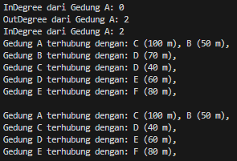
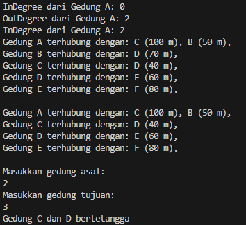
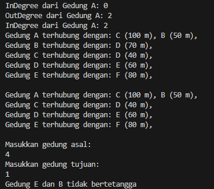
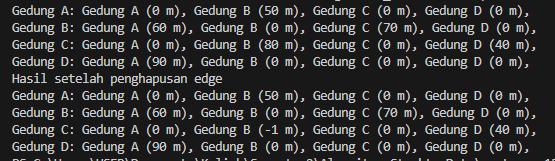

<p align="center">LAPORAN PRAKTIKUM 15</p>
<p align="center">Algoritma dan Struktur Data</p>

<p align="center">  </p>

<p align="center"> Nama : Gabriel Batavia Xaverius </p>
<p align="center"> NIM : 2341720184  </p>
<p align="center">Kelas : TI-1B  </p>
<p align="center">Absen : 13  </p>

## Praktikum 1

```java

package Praktikum1;

public class Node13 {
    int data;
    Node13 prev, next;
    int jarak;

    public Node13(Node13 prev, int data, int jarak, Node13 next) {
        this.prev = prev;
        this.data = data;
        this.jarak = jarak;
        this.next = next;
    }
}


```

<br>

```java

package Praktikum1;
public class DoubleLinkedList13 {
    Node13 head;
    int size;

    public DoubleLinkedList13() {
        head = null;
        size = 0;
    }

    public boolean isEmpty() {
        return head == null;
    }

    public void addFirst(int item, int jarak) {
        if (isEmpty()) {
            head = new Node13(null, item, jarak, null);
        } else {
            Node13 newNode = new Node13(null, item, jarak, head);
            head.prev = newNode;
            head = newNode;
        }
        size++;
    }

    public int getJarak(int index) throws Exception {
        if (isEmpty() || index >= size) {
            throw new Exception("Nilai indeks diluar batas");
        }
        Node13 tmp = head;
        for (int i = 0; i < index; i++) {
            tmp = tmp.next;
        }
        return tmp.jarak;
    }

    public void remove(int tujuan) {
        Node13 current = head;
        while (current != null) {
            if (current.data == tujuan) {
                if (current.prev != null) {
                    current.prev.next = current.next;
                } else {
                    head = current.next;
                }
                if (current.next != null) {
                    current.next.prev = current.prev;
                }
                size--;
                return;
            }
            current = current.next;
        }
    }

    public int size() {
        return size;
    }

    public int get(int index) throws Exception {
        if (isEmpty() || index >= size) {
            throw new Exception("Nilai indeks diluar batas");
        }
        Node13 tmp = head;
        for (int i = 0; i < index; i++) {
            tmp = tmp.next;
        }
        return tmp.data;
    }

    public void clear() {
        head = null;
        size = 0;
    }
}

```

<br>

```java

package Praktikum1;
public class Graph13 {
    int vertex;
    DoubleLinkedList13 list[];

    public Graph13(int v) {
        vertex = v;
        list = new DoubleLinkedList13[v];
        for (int i = 0; i < v; i++) {
            list[i] = new DoubleLinkedList13();
        }
    }

    public void addEdge(int asal, int tujuan, int jarak) {
        list[asal].addFirst(tujuan, jarak);
    }

    public void degree(int asal) throws Exception {
        int k, totalIn = 0, totalOut = 0;
        for (int i = 0; i < vertex; i++) {
            for (int j = 0; j < list[i].size(); j++) {
                if (list[i].get(j) == asal) {
                    ++totalIn;
                }
            }
            for (k = 0; k < list[asal].size(); k++) {
                list[asal].get(k);
            }
            totalOut = k;
        }
        System.out.println("InDegree dari Gedung " + (char) ('A' + asal) + ": " + totalIn);
        System.out.println("OutDegree dari Gedung " + (char) ('A' + asal) + ": " + totalOut);
        System.out.println("InDegree dari Gedung " + (char) ('A' + asal) + ": " + (totalIn + totalOut));
    }

    public void removeEdge(int asal, int tujuan) throws Exception {
        for (int i = 0; i < vertex; i++) {
            if (i == tujuan) {
                list[asal].remove(tujuan);
            }
        }
    }

    public void removeAllEdges(){
        for (int i = 0; i < vertex; i++) {
            list[i].clear();
        }
        System.out.println("Graf berhasil dikosongkan");
    }

    public void printGraph() throws Exception {
        for (int i = 0; i < vertex; i++) {
            if (list[i].size() > 0) {
                System.out.print("Gedung " + (char) ('A' + i) + " terhubung dengan: ");
                for (int j = 0; j < list[i].size(); j++) {
                    System.out.print((char) ('A' + list[i].get(j)) + " (" + list[i].getJarak(j) + " m), ");
                }
                System.out.println("");
            }
        }
        System.out.println("");
    }
}

```

<br>

```java

package Praktikum1;
public class GraphMain13 {
    public static void main(String[] args) throws Exception {
        Graph13 gedung = new Graph13(6);
        gedung.addEdge(0, 1, 50);
        gedung.addEdge(0, 2, 100);
        gedung.addEdge(1, 3, 70);
        gedung.addEdge(2, 3, 40);
        gedung.addEdge(3, 4, 60);
        gedung.addEdge(4, 5, 80);

        gedung.degree(0);
        gedung.printGraph();

        gedung.removeEdge(1, 3);
        gedung.printGraph();
    }
}


```

<br>

### Hasil



### Pertanyaan

1. Perbaiki kode program Anda apabila terdapat error atau hasil kompilasi kode tidak sesuai!

2. Pada class Graph, terdapat atribut list[] bertipe DoubleLinkedList. Sebutkan tujuan pembuatan
   variabel tersebut!

Jawab : Variabel list[] digunakan untuk menyimpan daftar terhubung (adjacency list) dari setiap vertex dalam graf. Setiap elemen dalam array list[] adalah sebuah DoubleLinkedList13 yang menyimpan node-node tetangga dari vertex tersebut beserta jarak antar node.

3. Jelaskan alur kerja dari method removeEdge!

Jawab : Jika indeks vertex sama dengan tujuan, maka method remove dari DoubleLinkedList13 dipanggil untuk menghapus edge dari vertex asal ke vertex tujuan

4. Apakah alasan pemanggilan method addFirst() untuk menambahkan data, bukan method add
   jenis lain saat digunakan pada method addEdge pada class Graph?

Jawab : digunakan untuk menambahkan elemen baru di awal linked list. Hal ini dilakukan agar elemen baru tersebut langsung menjadi head dari linked list, yang artinya proses penambahan data menjadi lebih efisien (O(1)) dibandingkan jika menggunakan method addLast() atau method lain yang memerlukan iterasi sampai akhir linked list.

5. Modifikasi kode program sehingga dapat dilakukan pengecekan apakah terdapat jalur antara
   suatu node dengan node lainnya, seperti contoh berikut (Anda dapat memanfaatkan Scanner).

Jawab :

```java

    public boolean isConnected(int asal, int tujuan) throws Exception {
        for (int i = 0; i < list[asal].size(); i++) {
            if (list[asal].get(i) == tujuan) {
                return true;
            }
        }
        return false;
    }

```

<br>

```java

import java.util.Scanner;

public class GraphMain13 {
    public static void main(String[] args) throws Exception {
        Scanner scanner = new Scanner(System.in);
        Graph13 gedung = new Graph13(6);
        gedung.addEdge(0, 1, 50);
        gedung.addEdge(0, 2, 100);
        gedung.addEdge(1, 3, 70);
        gedung.addEdge(2, 3, 40);
        gedung.addEdge(3, 4, 60);
        gedung.addEdge(4, 5, 80);

        gedung.degree(0);
        gedung.printGraph();

        gedung.removeEdge(1, 3);
        gedung.printGraph();

        System.out.println("Masukkan gedung asal: ");
        int asal = scanner.nextInt();
        System.out.println("Masukkan gedung tujuan: ");
        int tujuan = scanner.nextInt();
        if (gedung.isConnected(asal, tujuan)) {
            System.out.println("Gedung " + (char)('A' + asal) + " dan " + (char)('A' + tujuan) + " bertetangga");
        } else {
            System.out.println("Gedung " + (char)('A' + asal) + " dan " + (char)('A' + tujuan) + " tidak bertetangga");
        }
        scanner.close();
    }
}


```

<br>





## Praktikum 2

### Hasil



<br>
<br>

## Tugas

1. Modifikasi kode program pada class GraphMain sehingga terdapat menu program yang bersifat
   dinamis, setidaknya terdiri dari:
   a) Add Edge
   b) Remove Edge
   c) Degree
   d) Print Graph
   e) Cek Edge
   Pengguna dapat memilih menu program melalui input Scanner

Jawab :

```java

import java.util.Scanner;

public class GraphMain13 {
    public static void main(String[] args) throws Exception {
        Scanner scanner = new Scanner(System.in);
        GraphMatriks13 gedung = new GraphMatriks13(6);
        gedung.makeEdge(0, 1, 50);
        gedung.makeEdge(0, 2, 100);
        gedung.makeEdge(1, 3, 70);
        gedung.makeEdge(2, 3, 40);
        gedung.makeEdge(3, 4, 60);
        gedung.makeEdge(4, 5, 80);

        boolean running = true;
        while (running) {
            System.out.println("Menu:");
            System.out.println("1. Add Edge");
            System.out.println("2. Remove Edge");
            System.out.println("3. Degree");
            System.out.println("4. Print Graph");
            System.out.println("5. Cek Edge");
            System.out.println("6. Exit");
            System.out.print("Pilih menu: ");
            int menu = scanner.nextInt();

            switch (menu) {
                case 1:
                    System.out.print("Masukkan gedung asal: ");
                    int asal = scanner.nextInt();
                    System.out.print("Masukkan gedung tujuan: ");
                    int tujuan = scanner.nextInt();
                    System.out.print("Masukkan jarak: ");
                    int jarak = scanner.nextInt();
                    gedung.makeEdge(asal, tujuan, jarak);
                    break;
                case 2:
                    System.out.print("Masukkan gedung asal: ");
                    asal = scanner.nextInt();
                    System.out.print("Masukkan gedung tujuan: ");
                    tujuan = scanner.nextInt();
                    gedung.removeEdge(asal, tujuan);
                    break;
                case 3:
                    System.out.print("Masukkan gedung yang ingin dicek derajatnya: ");
                    asal = scanner.nextInt();
                    gedung.degree(asal);
                    break;
                case 4:
                    gedung.printGraph();
                    break;
                case 5:
                    System.out.print("Masukkan gedung asal: ");
                    asal = scanner.nextInt();
                    System.out.print("Masukkan gedung tujuan: ");
                    tujuan = scanner.nextInt();
                    if (gedung.isConnected(asal, tujuan)) {
                        System.out.println("Gedung " + (char) ('A' + asal) + " dan " + (char) ('A' + tujuan) + " bertetangga");
                    } else {
                        System.out.println("Gedung " + (char) ('A' + asal) + " dan " + (char) ('A' + tujuan) + " tidak bertetangga");
                    }
                    break;
                case 6:
                    running = false;
                    break;
                default:
                    System.out.println("Menu tidak valid!");
                    break;
            }
        }
        scanner.close();
    }
}


```

<br>

2. Tambahkan method updateJarak pada Percobaan 1 yang digunakan untuk mengubah jarak
   antara dua node asal dan tujuan!

Jawab :

```java

    public void updateJarak(int asal, int tujuan, int jarakBaru) {
        for (int i = 0; i < list[asal].size(); i++) {
            if (list[asal].get(i) == tujuan) {
                Node13 current = list[asal].head;
                while (current != null) {
                    if (current.data == tujuan) {
                        current.jarak = jarakBaru;
                        return;
                    }
                    current = current.next;
                }
            }
        }
    }

```

<br>

3. Tambahkan method hitungEdge untuk menghitung banyaknya edge yang terdapat di dalam graf!

Jawab :

```java

    public int hitungEdge() {
        int count = 0;
        for (int i = 0; i < vertex; i++) {
            count += list[i].size();
        }
        return count;
    }

```
