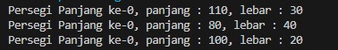
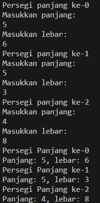
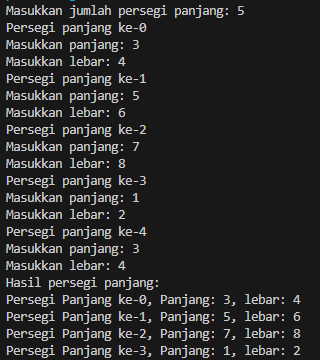
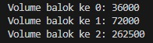
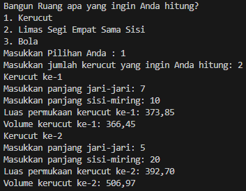
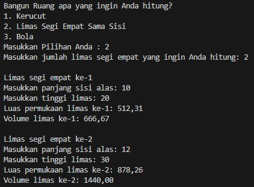
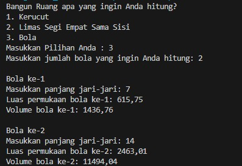
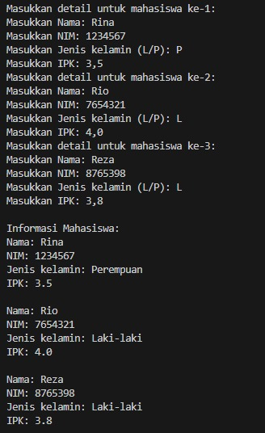
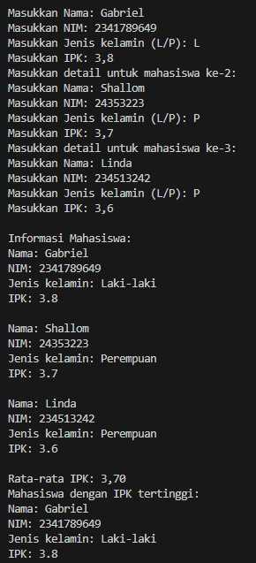

<p align="center">LAPORAN PRAKTIKUM 3</p>
<p align="center">Algoritma dan Struktur Data</p>

<p align="center">  </p>


<p align="center"> Nama : Gabriel Batavia Xaverius </p>
<p align="center"> NIM : 2341720184  </p>
<p align="center">Kelas : TI-1B  </p>
<p align="center">Absen : 13  </p>

<br>

### 3.2.1 : Percobaan 1

```java

package pertemuanke3.praktikum;

public class persegiPanjang13 {
    public int panjang;
    public int lebar;

    public static void main(String[] args) {
        
        persegiPanjang13[] ppArray = new persegiPanjang13[3];

        ppArray[0] = new persegiPanjang13();
        ppArray[0].panjang = 110;
        ppArray [0].lebar = 30;

        ppArray [1] = new persegiPanjang13();
        ppArray [1].panjang = 80;
        ppArray [1].lebar = 40;

        ppArray [2] = new persegiPanjang13();
        ppArray [2].panjang = 100;
        ppArray [2].lebar = 20;

        System.out.println("Persegi Panjang ke-0, panjang : " + ppArray[0].panjang + ", lebar : " + ppArray[0].lebar);
        System.out.println("Persegi Panjang ke-0, panjang : " + ppArray[1].panjang + ", lebar : " + ppArray[1].lebar);
        System.out.println("Persegi Panjang ke-0, panjang : " + ppArray[2].panjang + ", lebar : " + ppArray[2].lebar);


    }
}


```

<br>

### 3.2.2 : Verifikasi Hasil Percobaan 

Output :<br>



<br>

### 3.2.3 : Pertanyaan

1. Berdasarkan uji coba 3.2, apakah class yang akan dibuat array of object harus selalu memiliki 
atribut dan sekaligus method?Jelaskan!<br> 
2. Apakah class PersegiPanjang memiliki konstruktor?Jika tidak, kenapa dilakukan pemanggilan konstruktur pada baris program berikut : <br>
```java
ppArray[1] = new PersegiPanjang();
```
3. Apa yang dimaksud dengan kode berikut ini:<br>
```java
PersegiPanjang[] ppArray = new PersegiPanjang[3];
```
4. Apa yang dimaksud dengan kode berikut ini: <br>
```java
ppArray[1] = new PersegiPanjang();
ppArray[1].panjang = 80;
ppArray[1].lebar = 40;
```
5. Mengapa class main dan juga class PersegiPanjang dipisahkan pada uji coba 3.2? <br>

Jawaban :

1. Dalam pembuatan array of object, kita tidak harus selalu memiliki atribut dan method seacra bersamaan didalam class. Karena Array of object menggunakan class sebagai struktur yang menampung informasi sedangkan metode dan atribut hanyalah perilaku yang bisa disimpan class. <b3>

2. Konstruktor dalam Class PersegiPanjang: Meskipun tidak ada konstruktor yang eksplisit didefinisikan dalam class PersegiPanjang13, Java menyediakan konstruktor default yang memungkinkan pembuatan objek baru dengan new PersegiPanjang13(). <br>

3. Deklarasi Array of Object: Kode PersegiPanjang[] ppArray = new PersegiPanjang[3]; mendefinisikan array yang dapat menampung tiga objek PersegiPanjang, mengalokasikan ruang untuk referensi objek tanpa menginisialisasi objek tersebut. <br>

4. Inisialisasi dan Pengisian Array of Object: Kode ppArray[1] = new PersegiPanjang(); ppArray[1].panjang = 80; ppArray[1].lebar = 40; menginisialisasi objek PersegiPanjang pada indeks 1 array, dan mengatur nilai atribut panjang dan lebar. <br>

5. Pemisahan Class main dan Class PersegiPanjang: Pemisahan ini dilakukan untuk modularitas dan pengorganisasian kode yang lebih baik. Class PersegiPanjang mendefinisikan struktur data, sementara class dengan main method bertanggung jawab untuk eksekusi aplikasi dan manipulasi objek, memudahkan pengembangan dan pemeliharaan. <br>

<br>


### 3.3.1 : Percobaan 2

```java

package pertemuanke3.praktikum;

import java.util.Scanner;

public class persegiPanjang13 {
    public int panjang;
    public int lebar;

    public static void main(String[] args) {
        
        persegiPanjang13[] ppArray = new persegiPanjang13[3];

        Scanner sc13 = new Scanner(System.in);

        for(int i = 0; i < 3; i++) {
    
            ppArray[i] = new persegiPanjang13();
            System.out.println("Persegi panjang ke-" + i);
            System.out.println("Masukkan panjang: ");
            ppArray[i].panjang = sc13.nextInt();
            System.out.println("Masukkan lebar: ");
            ppArray[i].lebar = sc13.nextInt();
    
        }


        for (int i = 0; i < 3; i++) {
            System.out.println("Persegi Panjang ke-" + i);
            System.out.println("Panjang: " + ppArray[i].panjang + ", lebar: " + ppArray[i].lebar);
        }

    }
}


```
<br>

### 3.3.2 : : Verifikasi Hasil Percobaan 


Output : <br>



<br>


### 3.3.3 : Pertanyaan

1. Apakah array of object dapat diimplementasikan pada array 2 Dimensi?<br>
2. Jika jawaban soal no satu iya, berikan contohnya! Jika tidak, jelaskan!<br>
3. Jika diketahui terdapat class Persegi yang memiliki atribut sisi bertipe integer, maka kode 
dibawah ini akan memunculkan error saat dijalankan. Mengapa? <br>

```java
Persegi[] pgArray = new Persegi[100];
pgArray[5].sisi = 20;

```

4. Modifikasi kode program pada praktikum 3.3 agar length array menjadi inputan dengan Scanner! <br>
5. Apakah boleh Jika terjadi duplikasi instansiasi array of objek, misalkan saja instansiasi dilakukan 
pada ppArray[i] sekaligus ppArray[0]?Jelaskan ! <br>


Jawaban : <br>

1.  Ya, bisa. Array of object dapat diorganisir dalam struktur 2 dimensi, memungkinkan pengelompokan objek dalam format yang mirip tabel.<br>

2. Contoh Array of Object 2 Dimensi:<br>

```java
class PersegiPanjang {
    int panjang, lebar;
}

PersegiPanjang[][] ppArray = new PersegiPanjang[2][3]; // Deklarasi array 2D

```
Dalam contoh ini, setiap elemen array bisa diinstansiasi dan diakses menggunakan dua indeks, i dan j.<br>

3. Error pada Kode Persegi[] pgArray = new Persegi[100];: Kode ini error karena objek Persegi pada indeks ke-5 belum diinstansiasi. Mengakses pgArray[5].sisi sebelum instansiasi menyebabkan NullPointerException.<br>

4. Modifikasi untuk Input Length Array:<br>

```java

package pertemuanke3.praktikum;
import java.util.Scanner;

public class persegiPanjang13 {
    public int panjang;
    public int lebar;

    public static void main(String[] args) {
        Scanner sc13 = new Scanner(System.in);
        System.out.print("Masukkan jumlah persegi panjang: ");
        int jumlah = sc13.nextInt();

        persegiPanjang13[] ppArray = new persegiPanjang13[jumlah];

        for(int i = 0; i < jumlah; i++) {
            ppArray[i] = new persegiPanjang13();
            System.out.println("Persegi panjang ke-" + i);
            System.out.print("Masukkan panjang: ");
            ppArray[i].panjang = sc13.nextInt();
            System.out.print("Masukkan lebar: ");
            ppArray[i].lebar = sc13.nextInt();
        }

        System.out.println("Hasil persegi panjang:");
        for (int i = 0; i < jumlah; i++) {
            System.out.println("Persegi Panjang ke-" + i + ", Panjang: " + ppArray[i].panjang + ", lebar: " + ppArray[i].lebar);
        }

        sc13.close();
    }
}


```

Output : <br>


5. Duplikasi instansiasi objek pada indeks array yang sama tidak dianjurkan karena akan menggantikan referensi objek sebelumnya, yang dapat menyebabkan hilangnya akses ke objek tersebut dan potensi pemborosan memori.<br>

<br>

### 3.4.1 : Percobaan 3

```java

public class Balok13 {
    
    public int panjang;
    public int lebar;
    public int tinggi;

    public Balok13(int p, int l, int t) {
        panjang = p;
        lebar = l;
        tinggi = t;
    }

    public int hitungVolume() {
        return panjang * lebar * tinggi;
    }

    public static void main(String[] args) {
        Balok13[] blArray = new Balok13[3];

        blArray[0] = new Balok13(100, 30, 12);
        blArray[1] = new Balok13(120, 40, 15);
        blArray[2] = new Balok13(210, 50, 25);

        for (int i = 0; i < 3; i++) {
            System.out.println("Volume balok ke " + i + ": " + blArray[i].hitungVolume());
        }

    }

    
}


```

<br>

### 3.4.2 : Verifikasi 

Output :



<br>

### 3.4.3 : Pertanyaan

1. Dapatkah konstruktor berjumlah lebih dalam satu kelas? Jelaskan dengan contoh! <br>

2. Jika diketahui terdapat class Segitiga seperti berikut ini: <br>
```java
public class Segita {
    public int alas;
    public int tinggi;
}
```
Tambahkan konstruktor pada class Segitiga tersebut yang berisi parameter int a, int t 
yang masing-masing digunakan untuk mengisikan atribut alas dan tinggi. <br>

3. Tambahkan method hitungLuas() dan hitungKeliling() pada class Segitiga 
tersebut. Asumsi segitiga adalah segitiga siku-siku. (Hint: Anda dapat menggunakan bantuan 
library Math pada Java untuk mengkalkulasi sisi miring)<br>

4. Pada fungsi main, buat array Segitiga sgArray yang berisi 4 elemen, isikan masing-masing 
atributnya sebagai berikut: <br>

sgArray ke-0    alas: 10, tinggi: 4  <br>
sgArray ke-1    alas: 20, tinggi: 10 <br>
sgArray ke-2    alas: 15, tinggi: 6 <br>
sgArray ke-3    alas: 25, tinggi: 10 <br>

5. Kemudian menggunakan looping, cetak luas dan keliling dengan cara memanggil method 
hitungLuas() dan hitungKeliling().<br>

Jawaban : <br>

1. Ya, sebuah kelas dapat memiliki lebih dari satu konstruktor, yang dikenal sebagai konstruktor overloading. Ini memungkinkan instansiasi objek dengan cara yang berbeda.<br>

Contoh : <br>

```java
public class Kotak {
    public int panjang, lebar;

    // Konstruktor tanpa parameter
    public Kotak() {
        panjang = 0;
        lebar = 0;
    }

    // Konstruktor dengan parameter
    public Kotak(int p, int l) {
        panjang = p;
        lebar = l;
    }
}

```

2. Kita bisa menambahkan Konstruktor pada Class Segitiga dengan cara berikut :<br>
```java
public class Segitiga {
    public int alas;
    public int tinggi;

    public Segitiga(int a, int t) {
        alas = a;
        tinggi = t;
    }
}

```

3. Sekarang kita menambahkan Method pada Class segitiga seperti sebagai berikut :<br>

```java

public class Segitiga {
    public int alas;
    public int tinggi;

    // Konstruktor
    public Segitiga(int a, int t) {
        alas = a;
        tinggi = t;
    }

    public double hitungLuas() {
        return (alas * tinggi) / 2.0;
    }

    public double hitungKeliling() {
        double sisiMiring = Math.sqrt((alas * alas) + (tinggi * tinggi));
        return alas + tinggi + sisiMiring;
    }
}


```

4. berikut cara kita menambahkan nya :<br>
```java

public static void main(String[] args) {
    Segitiga[] sgArray = new Segitiga[4];
    sgArray[0] = new Segitiga(10, 4);
    sgArray[1] = new Segitiga(20, 10);
    sgArray[2] = new Segitiga(15, 6);
    sgArray[3] = new Segitiga(25, 10);
}

```

5. Menambahkan looping seperti berikut :<br>

```java

public static void main(String[] args) {
    Segitiga[] sgArray = new Segitiga[4];
    // ... (inisialisasi sgArray seperti pada poin 4)

    for (int i = 0; i < sgArray.length; i++) {
        System.out.println("Segitiga ke-" + i);
        System.out.println("Luas: " + sgArray[i].hitungLuas());
        System.out.println("Keliling: " + sgArray[i].hitungKeliling());
        System.out.println();
    }
}

```

<br>
<br>

# 3.5 Latihan Praktikum 

<br>

### 3.5.1 Latihan 1 Praktikum

<br>

#### Kerucut

```java

public class latihan1_kerucut {
    private final double r;
    private final int sisiMiring;

    public latihan1_kerucut(double r, int sisiMiring) {
        this.r = r;
        this.sisiMiring = sisiMiring;
    } 

    public double hitungTinggi() {
        return Math.sqrt(Math.pow(sisiMiring, 2) - Math.pow(r, 2));
    }

    public double hitungLuasPermukaan() {
        return Math.PI * r * (sisiMiring + r);
    }

    public double hitungVolume() {
        return (1.0 / 3.0) * Math.PI * Math.pow(r, 2) * hitungTinggi();
    }
}


```


<br>

#### Limas Segi Empat Sama Sisi

```java

public class latihan1_limasSegiEmpatSamaSisi {
    private final int panjangSisiAlas;
    private final int tinggi;

    public latihan1_limasSegiEmpatSamaSisi(int panjangSisiAlas, int tinggi) {
        this.panjangSisiAlas = panjangSisiAlas;
        this.tinggi = tinggi;
    }

    public double hitungVolume() {
        return (1.0 / 3.0) * luasAlas() * tinggi;
    }

    public double hitungLuasPermukaan() {
        return luasAlas() + hitungLuasSisiTegak();
    }

    private int luasAlas() {
        return panjangSisiAlas * panjangSisiAlas;
    }

    private double hitungLuasSisiTegak() {
        double panjangSisiMiring = Math.sqrt(Math.pow(0.5 * panjangSisiAlas, 2) + Math.pow(tinggi, 2));
        return 4 * panjangSisiAlas * panjangSisiMiring / 2;
    }
}


```

<br>


#### Bola

```java

public class latihan1_bola {
    private final double r;

    public latihan1_bola(double r) {
        this.r = r;
    }

    public double hitungVolume() {
        return (4.0 / 3.0) * Math.PI * Math.pow(r, 3);
    }

    public double hitungLuasPermukaan() {
        return 4 * Math.PI * Math.pow(r, 2);
    }
}


```


<br>


#### Main.java

```java

import java.util.Scanner;

public class latihan1_main {
    static Scanner sc13 = new Scanner(System.in);

    public static void main(String[] args) {

        System.out.println("Bangun Ruang apa yang ingin Anda hitung?");
        System.out.println("1. Kerucut");
        System.out.println("2. Limas Segi Empat Sama Sisi");
        System.out.println("3. Bola");
        System.out.print("Masukkan Pilihan Anda : ");
        int Menu = sc13.nextInt();

        switch (Menu) {
            case 1 -> perhitunganKerucut();
            case 2 -> perhitunganLimasSegiEmpat();
            case 3 -> perhitunganBola();
            default -> System.out.println("Input yang anda masukkan tidak valid!!");
        }
    }

    private static void perhitunganKerucut() {
        System.out.print("Masukkan jumlah kerucut yang ingin Anda hitung: ");
        int jmlKerucut = sc13.nextInt();

        latihan1_kerucut[] kerucut13 = new latihan1_kerucut[jmlKerucut];
        for (int i = 0; i < kerucut13.length; i++) {
            System.out.printf("Kerucut ke-%d\n", i + 1);
            System.out.print("Masukkan panjang jari-jari: ");
            double r = sc13.nextDouble();
            System.out.print("Masukkan panjang sisi-miring: ");
            int sisiMiring = sc13.nextInt();
            kerucut13[i] = new latihan1_kerucut(r, sisiMiring);

            System.out.printf("Luas permukaan kerucut ke-%d: %.2f\n", i + 1, kerucut13[i].hitungLuasPermukaan());
            System.out.printf("Volume kerucut ke-%d: %.2f\n", i + 1, kerucut13[i].hitungVolume());
        }
    }

    private static void perhitunganLimasSegiEmpat() {
        System.out.print("Masukkan jumlah limas segi empat yang ingin Anda hitung: ");
        int jmlLimas = sc13.nextInt();

        latihan1_limasSegiEmpatSamaSisi[] limas13 = new latihan1_limasSegiEmpatSamaSisi[jmlLimas];
        for (int i = 0; i < limas13.length; i++) {
            System.out.printf("\nLimas segi empat ke-%d\n", i + 1);
            System.out.print("Masukkan panjang sisi alas: ");
            int panjangSisiAlas = sc13.nextInt();
            System.out.print("Masukkan tinggi limas: ");
            int tinggi = sc13.nextInt();
            limas13[i] = new latihan1_limasSegiEmpatSamaSisi(panjangSisiAlas, tinggi);

            System.out.printf("Luas permukaan limas ke-%d: %.2f\n", i + 1, limas13[i].hitungLuasPermukaan());
            System.out.printf("Volume limas ke-%d: %.2f\n", i + 1, limas13[i].hitungVolume());
        }
    }

    private static void perhitunganBola() {
        System.out.print("Masukkan jumlah bola yang ingin Anda hitung: ");
        int jmlBola = sc13.nextInt();

        latihan1_bola[] bola13 = new latihan1_bola[jmlBola];
        for (int i = 0; i < bola13.length; i++) {
            System.out.printf("\nBola ke-%d\n", i + 1);
            System.out.print("Masukkan panjang jari-jari: ");
            double r = sc13.nextDouble();
            bola13[i] = new latihan1_bola(r);

            System.out.printf("Luas permukaan bola ke-%d: %.2f\n", i + 1, bola13[i].hitungLuasPermukaan());
            System.out.printf("Volume bola ke-%d: %.2f\n", i + 1, bola13[i].hitungVolume());
        }
    }
}


```

Output :<br>



<br>



<br>



<br>


### 3.5.2 Latihan 2 Praktikum

```java

import java.util.Scanner;

public class latihan2_mahasiswa {
    public static void main(String[] args) {
        Scanner scanner = new Scanner(System.in);
        Mahasiswa[] daftarMahasiswa = new Mahasiswa[3]; //kita memiliki 3 mahasiswa
        
        for (int i = 0; i < daftarMahasiswa.length; i++) {
            System.out.println("Masukkan detail untuk mahasiswa ke-" + (i + 1) + ":");
            System.out.print("Masukkan Nama: ");
            String nama = scanner.nextLine();
            System.out.print("Masukkan NIM: ");
            String nim = scanner.nextLine();
            System.out.print("Masukkan Jenis kelamin (L/P): ");
            char jenisKelamin = scanner.nextLine().charAt(0);
            System.out.print("Masukkan IPK: ");
            double ipk = scanner.nextDouble();
            scanner.nextLine(); 
            
            daftarMahasiswa[i] = new Mahasiswa(nama, nim, jenisKelamin, ipk);
        }

        System.out.println("\nInformasi Mahasiswa:");
        for (Mahasiswa mahasiswa : daftarMahasiswa) {
            System.out.println(mahasiswa.dapatkanInformasi());
        }
        
        scanner.close();
    }
}

class Mahasiswa {
    private String nama;
    private String nim;
    private char jenisKelamin;
    private double ipk;

    public Mahasiswa(String nama, String nim, char jenisKelamin, double ipk) {
        this.nama = nama;
        this.nim = nim;
        this.jenisKelamin = jenisKelamin;
        this.ipk = ipk;
    }

    public String dapatkanInformasi() {
        return "Nama: " + nama + "\nNIM: " + nim + "\nJenis kelamin: " + (jenisKelamin == 'L' ? "Laki-laki" : "Perempuan") + "\nIPK: " + ipk + "\n";
    }
}


```

Output :



<br>


### 3.5.3 

```java

import java.util.Scanner;

public class latihan2_mahasiswa {
    public static void main(String[] args) {
        Scanner scanner = new Scanner(System.in);
        Mahasiswa[] daftarMahasiswa = new Mahasiswa[3]; // kita memiliki 3 mahasiswa
        
        for (int i = 0; i < daftarMahasiswa.length; i++) {
            System.out.println("Masukkan detail untuk mahasiswa ke-" + (i + 1) + ":");
            System.out.print("Masukkan Nama: ");
            String nama = scanner.nextLine();
            System.out.print("Masukkan NIM: ");
            String nim = scanner.nextLine();
            System.out.print("Masukkan Jenis kelamin (L/P): ");
            char jenisKelamin = scanner.nextLine().charAt(0);
            System.out.print("Masukkan IPK: ");
            double ipk = scanner.nextDouble();
            scanner.nextLine(); 
            
            daftarMahasiswa[i] = new Mahasiswa(nama, nim, jenisKelamin, ipk);
        }

        // Menampilkan informasi mahasiswa
        System.out.println("\nInformasi Mahasiswa:");
        for (Mahasiswa mahasiswa : daftarMahasiswa) {
            System.out.println(mahasiswa.dapatkanInformasi());
        }
        
        // Menghitung dan menampilkan rata-rata IPK
        double rataRataIPK = Mahasiswa.hitungRataRataIPK(daftarMahasiswa);
        System.out.printf("Rata-rata IPK: %.2f\n", rataRataIPK);
        
        // Menampilkan mahasiswa dengan IPK tertinggi
        Mahasiswa mahasiswaIPKTertinggi = Mahasiswa.cariIPKTertinggi(daftarMahasiswa);
        System.out.println("Mahasiswa dengan IPK tertinggi:");
        System.out.println(mahasiswaIPKTertinggi.dapatkanInformasi());
        
        scanner.close();
    }
}

class Mahasiswa {
    private String nama;
    private String nim;
    private char jenisKelamin;
    private double ipk;

    public Mahasiswa(String nama, String nim, char jenisKelamin, double ipk) {
        this.nama = nama;
        this.nim = nim;
        this.jenisKelamin = jenisKelamin;
        this.ipk = ipk;
    }

    public String dapatkanInformasi() {
        return "Nama: " + nama + "\nNIM: " + nim + "\nJenis kelamin: " + (jenisKelamin == 'L' ? "Laki-laki" : "Perempuan") + "\nIPK: " + ipk + "\n";
    }
    
    public static double hitungRataRataIPK(Mahasiswa[] daftarMahasiswa) {
        double total = 0;
        for (Mahasiswa mahasiswa : daftarMahasiswa) {
            total += mahasiswa.ipk;
        }
        return total / daftarMahasiswa.length;
    }
    
    public static Mahasiswa cariIPKTertinggi(Mahasiswa[] daftarMahasiswa) {
        Mahasiswa terbesar = daftarMahasiswa[0];
        for (int i = 1; i < daftarMahasiswa.length; i++) {
            if (daftarMahasiswa[i].ipk > terbesar.ipk) {
                terbesar = daftarMahasiswa[i];
            }
        }
        return terbesar;
    }
}


```

Output : 




