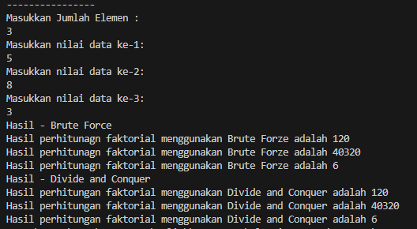

### 4.2.1 Program

```java

import java.util.Scanner;

public class Faktorial13 {

    public int nilai;
 
    int faktorialBF(int n){
        int fakto = 1;
        for (int i = 1; i <= n; i++) {
            fakto = fakto * i;
        }
        return fakto;
    }

    int faktorialDC(int n) {
        if(n==1) {
            return 1;
        } else {
            int fakto = n * faktorialDC(n-1);
            return fakto;
        }
    }

```

```java

    public static void main(String[] args) {
        
        Scanner sc13 = new Scanner(System.in);
        System.out.println("----------------");
        System.out.println("Masukkan Jumlah Elemen : ");
        int iJml = sc13.nextInt();

        Faktorial13[] fk13 = new Faktorial13[10];
        for (int i = 0; i < iJml; i++) {
            fk13[i] = new Faktorial13();
            System.out.println("Masukkan nilai data ke-" + (i+1)+ ":");
            fk13[i].nilai = sc13.nextInt();
        }

        System.out.println("Hasil - Brute Force");
        for (int i = 0; i < iJml; i++) {
            System.out.println("Hasil perhitunagn faktorial menggunakan Brute Forze adalah " + fk13[i].faktorialBF(fk13[i].nilai));
        }
        System.out.println("Hasil - Divide and Conquer");
        for (int i = 0; i < iJml; i++) {
            System.out.println("Hasil perhitungan faktorial menggunakan Divide and Conquer adalah " + fk13[i].faktorialDC(fk13[i].nilai));
        }

    }
    
}

```

<br>

### 4.2.2 Hasil



<br>

### 4.2.3 Pertanyaan

1. Pada base line Algoritma Divide Conquer untuk melakukan pencarian nilai faktorial, jelaskan 
perbedaan bagian kode pada penggunaan if dan else! <br>
2. Apakah memungkinkan perulangan pada method faktorialBF() dirubah selain menggunakan 
for?Buktikan! <br>
3. Jelaskan perbedaan antara fakto *= i; dan int fakto = n * faktorialDC(n-1); !

<br>

#### Jawab :

1. Pada metode faktorialDC(int n), penggunaan if dan else digunakan untuk menentukan kondisi dasar (base case) dan kasus rekursif. Kondisi if(n==1) adalah base case yang menentukan bahwa jika nilai n adalah 1, maka faktorial dari n adalah 1. Ini merupakan kondisi penghentian rekursi dan menghindari rekursi tak terbatas. Bagian else mengandung logika rekursif, di mana int fakto = n * faktorialDC(n-1); merupakan langkah rekursif yang menghitung faktorial dari n dengan mengalikan n dengan faktorial dari n-1. Ini mencerminkan sifat faktorial, di mana faktorial dari n (n!) adalah hasil kali n dengan faktorial dari n-1 ((n-1)!).<br>

2. Ya, memungkinkan. Perulangan pada method faktorialBF() dapat menggunakan struktur perulangan lain seperti while atau do-while. Berikut adalah contoh penggunaan while untuk menghitung faktorial:<br>
```java
int faktorialBF(int n) {
    int fakto = 1;
    int i = 1;
    while(i <= n) {
        fakto = fakto * i;
        i++;
    }
    return fakto;
}

```

3. Perbedaan antara fakto *= i; dan int fakto = n * faktorialDC(n-1);:<br>

fakto *= i; adalah operasi penugasan yang digunakan dalam metode iteratif (faktorialBF()), yang secara efektif sama dengan fakto = fakto * i;. Ini berarti nilai fakto dikalikan dengan i dan hasilnya disimpan kembali ke dalam fakto. Operasi ini mengakumulasikan hasil perkalian dari 1 hingga n untuk menghitung faktorial secara bertahap.<br>

int fakto = n * faktorialDC(n-1); digunakan dalam pendekatan rekursif (faktorialDC()). Ini menciptakan sebuah ekspresi rekursif dimana faktorial dari n dihitung dengan mengalikan n dengan hasil rekursif dari faktorialDC(n-1). Ini merefleksikan definisi matematika dari faktorial yang menyatakan bahwa faktorial dari n (n!) adalah n dikalikan dengan faktorial dari n-1 ((n-1)!).<br>

<br>


### 4.3.1 Program

```java


public class Pangkat13 {
    
    public int nilai, pangkat;

    int pangkatBF(int a, int n) {
        int hasil = 1;
        for (int i = 0; i < n; i++) {
            hasil *= a;
        }
        return hasil;
    }

    int pangkatDC(int a, int n) {
        if(n==1) {
            return a;
        } else {
            if(n % 2 == 1) {
                return (pangkatDC(a,n/2)*pangkatDC(a,n/2)*a);
            } else {
                return (pangkatDC(a,n/2)*pangkatDC(a,n/2));
            }
        }
    }
}


```
<br>

```java


import java.util.Scanner;

public class Pangkat13_main {
        public static void main(String[] args) {
        
        Scanner sc13 = new Scanner(System.in);
        System.out.println("==================================================");
        System.out.println("Masukkan jumlah elemen yang dihitung: ");
        int elemen = sc13.nextInt();

        Pangkat13[] png = new Pangkat13[elemen];
        for(int i=0; i < elemen; i++) {
            png[i] = new Pangkat13();
            System.out.println("Masukkan nilai yang hendak dipangkatkan: ");
            png[i].nilai = sc13.nextInt();
            System.out.println("Masukkan nilai pemangkat: ");
            png[i].pangkat = sc13.nextInt();
        }

        System.out.println("Hasil Pangkat - Brute Force");
        for(int i=0; i < elemen; i++) {
            System.out.println("Hasil dari "
                + png[i].nilai+ " pangkat "
                + png[i].pangkat+ " adalah "
                + png[i].pangkatBF(png[i].nilai, png[i].pangkat)
            );
        }
        System.out.println("Hasil Pangkat - Devide And Conquer");
        for(int i=0; i < elemen; i++) {
            System.out.println("Hasil dari "
                + png[i].nilai+ " pangkat "
                + png[i].pangkat+ " adalah "
                + png[i].pangkatDC(png[i].nilai, png[i].pangkat)
            );
        }
    }

}


```


<br>

### 4.3.2 Hasil


<br>

### 4.3.3 Program

1. Jelaskan mengenai perbedaan 2 method yang dibuat yaitu PangkatBF() dan PangkatDC()! <br>
2. Apakah tahap combine sudah termasuk dalam kode tersebut?Tunjukkan! <br>
3. Modifikasi kode program tersebut, anggap proses pengisian atribut dilakukan dengan 
konstruktor. <br>
4. Tambahkan menu agar salah satu method yang terpilih saja yang akan dijalankan menggunakan 
switch-case! <br>

<br>

Jawaban :

1. PangkatBF() menghitung pangkat dengan mengalikan bilangan secara berulang. <br>
PangkatDC() menggunakan pendekatan divide and conquer, membagi masalah menjadi sub-masalah yang lebih kecil untuk mengurangi jumlah operasi.<br>

2. Tahap combine ada dalam pangkatDC() ketika hasil sub-masalah dikombinasikan dengan perkalian.<br>

Contoh tahap combine dalam pangkatDC() adalah sebagai berikut:<br>

Ketika n genap: return (pangkatDC(a,n/2)*pangkatDC(a,n/2));<br>
Ketika n ganjil: return (pangkatDC(a,n/2)*pangkatDC(a,n/2)*a);<br>

3. Tambahkan konstruktor di Pangkat13 untuk menginisialisasi nilai dan pangkat, dan buat objek dengan konstruktor tersebut di Pangkat13_main.

```java

public Pangkat13(int nilai, int pangkat) {
    this.nilai = nilai;
    this.pangkat = pangkat;
}

```


4. 

```java

System.out.println("1. Brute Force\n2. Divide and Conquer\nPilihan: ");
int pilihan = sc13.nextInt();
switch(pilihan) {
    case 1:
        // pangkatBF
        break;
    case 2:
        // pangkatDC
        break;
}


```


<br>

### 4.4.1 Program

```java

public class Sum13 {
    int elemen;
    double keuntungan[], total;

    Sum13(int elemen) {
        this.elemen = elemen;
        this.keuntungan = new double[elemen];
        this.total = 0;
    }

    double totalBF(double arr[]){
        for(int i=0; i < elemen; i++) {
            total = total + arr[i];
        }
        return total;
    }

    double totalDC(double arr[], int l, int r) {
        if(l==r){
            return arr[l];
        } else if(l < r) {
            int mid = (l+r)/2;
            double lsum = totalDC(arr, l, mid);
            double rsum = totalDC(arr, mid+1, r);
            return lsum + rsum;
        }
        return 0;
    }


}

```


```java

import java.util.Scanner;

public class Sum13_main {
    
    public static void main(String[] args) {
        
        Scanner sc13 = new Scanner(System.in);
        System.out.println("=========================================");
        System.out.println("Program Menghitung Keuntungan Total (Satuan Juta, Misal 5.9)");
        System.out.print("Masukkan jumlah bulan : ");
        int elm = sc13.nextInt();

        Sum13 sm = new Sum13(elm);
        System.out.println("============================================");
        for (int i = 0; i < sm.elemen; i++) {
            System.out.print("Masukkan untuk bulan ke - "+(i+1)+" = ");
            sm.keuntungan[i] = sc13.nextDouble();
        }

        System.out.println("============================================");
        System.out.println("Algoritma Brute Force");
        System.out.println("Total keuntungan perusahaan selama " + sm.elemen + " bulan adalah = " + sm.totalBF(sm.keuntungan));
        System.out.println("============================================");
        System.out.println("Algoritma Divide Conquer");
        System.out.println("Total keuntungan perusahaan selama " + sm.elemen + " bulan adalah = " + String.format("%.2f", sm.totalDC(sm.keuntungan, 0, sm.elemen-1)));
        

    }
    
}

```

<br>

### 4.4.2 Hasil


<br>


### 4.4.3 Pertanyaan

1. Mengapa terdapat formulasi return value berikut?Jelaskan!<br>
2. Kenapa dibutuhkan variable mid pada method TotalDC()? <br>
3. Program perhitungan keuntungan suatu perusahaan ini hanya untuk satu perusahaan saja. 
Bagaimana cara menghitung sekaligus keuntungan beberapa bulan untuk beberapa 
perusahaan.(Setiap perusahaan bisa saja memiliki jumlah bulan berbeda-beda)? Buktikan 
dengan program!<br>

<br>

Jawaban : <br>

1. 
Formulasi return value dalam metode totalDC digunakan untuk memecah masalah menjadi sub-masalah yang lebih kecil hingga mencapai kasus dasar, memungkinkan perhitungan total keuntungan secara efisien melalui pendekatan Divide and Conquer. Ini meminimalisir jumlah operasi dengan membagi array dan menghitung total keuntungan secara rekursif dari sub-array.<br>

2. Variable mid diperlukan sebagai titik tengah untuk membagi array keuntungan menjadi dua bagian. Ini adalah inti dari pendekatan Divide and Conquer, dimana masalah dibagi menjadi dua sub-problem yang hampir sama besar. mid digunakan untuk menentukan batas akhir sub-array pertama dan batas awal sub-array kedua yang akan diolah. Dengan membagi array menjadi dua secara rekursif, proses perhitungan menjadi lebih cepat dan efisien dibandingkan dengan melakukan iterasi secara linear menggunakan brute force.<br>

3. 

```java

import java.util.Scanner;

public class Sum13 {
    int elemen;
    double[][] keuntungan;
    int jumlahPerusahaan;

    Sum13(int elemen, int jumlahPerusahaan) {
        this.elemen = elemen;
        this.jumlahPerusahaan = jumlahPerusahaan;
        this.keuntungan = new double[jumlahPerusahaan][elemen];
    }

    double totalBF(double[] arr){
        double total = 0;
        for(int i=0; i < arr.length; i++) {
            total = total + arr[i];
        }
        return total;
    }

    double totalDC(double[] arr, int l, int r) {
        if(l==r){
            return arr[l];
        } else if(l < r) {
            int mid = (l+r)/2;
            double lsum = totalDC(arr, l, mid);
            double rsum = totalDC(arr, mid+1, r);
            return lsum + rsum;
        }
        return 0;
    }
}

public class Sum13_main {
    
    public static void main(String[] args) {
        
        Scanner sc13 = new Scanner(System.in);
        System.out.print("Masukkan jumlah perusahaan: ");
        int jumlahPerusahaan = sc13.nextInt();
        
        System.out.print("Masukkan jumlah bulan: ");
        int elm = sc13.nextInt();

        Sum13 sm = new Sum13(elm, jumlahPerusahaan);

        for (int j = 0; j < sm.jumlahPerusahaan; j++) {
            System.out.println("Perusahaan ke-" + (j + 1));
            for (int i = 0; i < sm.elemen; i++) {
                System.out.print("Masukkan keuntungan bulan ke-" + (i + 1) + ": ");
                sm.keuntungan[j][i] = sc13.nextDouble();
            }
        }

        for (int j = 0; j < sm.jumlahPerusahaan; j++) {
            System.out.println("============================================");
            System.out.println("Perusahaan ke-" + (j + 1));
            System.out.println("Algoritma Brute Force");
            System.out.println("Total keuntungan perusahaan selama " + sm.elemen + " bulan adalah = " + sm.totalBF(sm.keuntungan[j]));
            System.out.println("Algoritma Divide Conquer");
            System.out.println("Total keuntungan perusahaan selama " + sm.elemen + " bulan adalah = " + String.format("%.2f", sm.totalDC(sm.keuntungan[j], 0, sm.elemen-1)));
        }
    }
}


```


### 4.5.1 Latihan

#### File Pertama

```java

public class car13 {
    String merk, tipe;
    int tahun, top_acceleration,top_power;

    public car13(String merk, String tipe, int tahun, int top_acceleration, int top_power) {
        this.merk = merk;
        this.tipe = tipe;
        this.tahun = tahun;
        this.top_acceleration = top_acceleration;
        this.top_power = top_power;
    }
}


```

<br>


