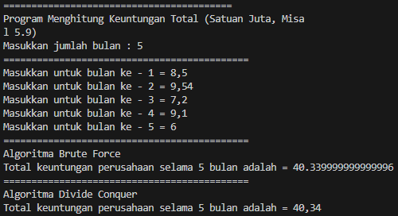

###4.2.1 Program

```java

import java.util.Scanner;

public class Faktorial13 {

    public int nilai;
 
    int faktorialBF(int n){
        int fakto = 1;
        for (int i = 1; i <= n; i++) {
            fakto = fakto * i;
        }
        return fakto;
    }

    int faktorialDC(int n) {
        if(n==1) {
            return 1;
        } else {
            int fakto = n * faktorialDC(n-1);
            return fakto;
        }
    }

```

```java

    public static void main(String[] args) {
        
        Scanner sc13 = new Scanner(System.in);
        System.out.println("----------------");
        System.out.println("Masukkan Jumlah Elemen : ");
        int iJml = sc13.nextInt();

        Faktorial13[] fk13 = new Faktorial13[10];
        for (int i = 0; i < iJml; i++) {
            fk13[i] = new Faktorial13();
            System.out.println("Masukkan nilai data ke-" + (i+1)+ ":");
            fk13[i].nilai = sc13.nextInt();
        }

        System.out.println("Hasil - Brute Force");
        for (int i = 0; i < iJml; i++) {
            System.out.println("Hasil perhitunagn faktorial menggunakan Brute Forze adalah " + fk13[i].faktorialBF(fk13[i].nilai));
        }
        System.out.println("Hasil - Divide and Conquer");
        for (int i = 0; i < iJml; i++) {
            System.out.println("Hasil perhitungan faktorial menggunakan Divide and Conquer adalah " + fk13[i].faktorialDC(fk13[i].nilai));
        }

    }
    
}

```

<br>

###4.2.2 Hasil



<br>

###4.3.1 Program

```java


public class Pangkat13 {
    
    public int nilai, pangkat;

    int pangkatBF(int a, int n) {
        int hasil = 1;
        for (int i = 0; i < n; i++) {
            hasil *= a;
        }
        return hasil;
    }

    int pangkatDC(int a, int n) {
        if(n==1) {
            return a;
        } else {
            if(n % 2 == 1) {
                return (pangkatDC(a,n/2)*pangkatDC(a,n/2)*a);
            } else {
                return (pangkatDC(a,n/2)*pangkatDC(a,n/2));
            }
        }
    }
}


```
<br>

```java


import java.util.Scanner;

public class Pangkat13_main {
        public static void main(String[] args) {
        
        Scanner sc13 = new Scanner(System.in);
        System.out.println("==================================================");
        System.out.println("Masukkan jumlah elemen yang dihitung: ");
        int elemen = sc13.nextInt();

        Pangkat13[] png = new Pangkat13[elemen];
        for(int i=0; i < elemen; i++) {
            png[i] = new Pangkat13();
            System.out.println("Masukkan nilai yang hendak dipangkatkan: ");
            png[i].nilai = sc13.nextInt();
            System.out.println("Masukkan nilai pemangkat: ");
            png[i].pangkat = sc13.nextInt();
        }

        System.out.println("Hasil Pangkat - Brute Force");
        for(int i=0; i < elemen; i++) {
            System.out.println("Hasil dari "
                + png[i].nilai+ " pangkat "
                + png[i].pangkat+ " adalah "
                + png[i].pangkatBF(png[i].nilai, png[i].pangkat)
            );
        }
        System.out.println("Hasil Pangkat - Devide And Conquer");
        for(int i=0; i < elemen; i++) {
            System.out.println("Hasil dari "
                + png[i].nilai+ " pangkat "
                + png[i].pangkat+ " adalah "
                + png[i].pangkatDC(png[i].nilai, png[i].pangkat)
            );
        }
    }

}


```


<br>


###4.4.2 Hasil

