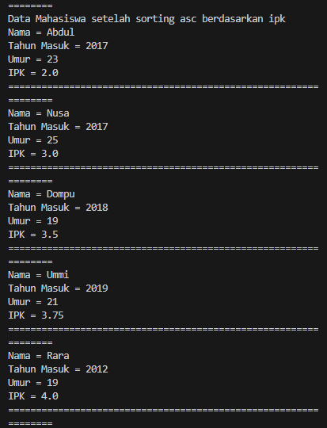
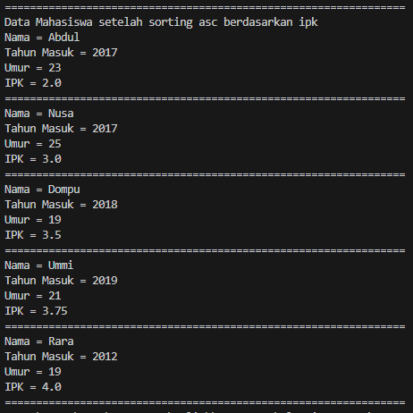

### 5.2.1 Program

```java

public class Mahasiswa13 {
    String nama;
    int thnMasuk, umur;
    double ipk;

    Mahasiswa13(String n, int t, int u, double i) {
        nama = n;
        thnMasuk = t;
        umur = u;
        ipk = i;
    }

    void tampil() {
        System.out.println("Nama = " + nama);
        System.out.println("Tahun Masuk = " + thnMasuk);
        System.out.println("Umur = " + umur);
        System.out.println("IPK = " + ipk);
    }


}


```

<br>

```java

public class DaftarMahasiswaBerprestasi13 {
    Mahasiswa13 listMhs[] = new Mahasiswa13[5];
    int idx;

    void tambah(Mahasiswa13 m) {
        if(idx<listMhs.length){
            listMhs[idx] = m;
            idx++;
        } else {
            System.out.println("Data sudah penuh!!");
        }
    }

    void tampil(){
        for(Mahasiswa13 m : listMhs){
            m.tampil();
            System.out.println("================================================================");
        }
    }

    void bubbleSort(){
        for(int i=0; i<listMhs.length-1; i++){
            for(int j=1; j<listMhs.length-i; j++){
                if(listMhs[j].ipk > listMhs[j-1].ipk){
                    Mahasiswa13 tmp = listMhs[j];
                    listMhs[j] = listMhs[j-1];
                    listMhs[j-1] = tmp;
                }
            }
        }
    }
}


```

<br>

```java

import java.util.Scanner;

public class Mahasiswa_main {
    public static void main(String[] args) {
        
        DaftarMahasiswaBerprestasi13 list = new DaftarMahasiswaBerprestasi13();
        Mahasiswa13 mhs1 = new Mahasiswa13("Nusa", 2017, 25, 3);
        Mahasiswa13 mhs2 = new Mahasiswa13("Rara", 2012, 19, 4);
        Mahasiswa13 mhs3 = new Mahasiswa13("Dompu", 2018, 19, 3.5);
        Mahasiswa13 mhs4 = new Mahasiswa13("Abdul", 2017, 23, 2);
        Mahasiswa13 mhs5 = new Mahasiswa13("Ummi", 2019, 21, 3.75);

        
        list.tambah(mhs1);
        list.tambah(mhs2);
        list.tambah(mhs3);
        list.tambah(mhs4);
        list.tambah(mhs5);

        System.out.println("Data mahasiswa sebelum sorting = ");
        list.tampil();

        System.out.println("Data mahasiswa setelah sorting desc berdasarkan IPK (BUBBLE SORT)");
        list.bubbleSort();
        list.tampil();
    }
}


```

<br>

### 5.2.2 Hasil


<br>


<br>

### 5.2.3 Pertanyaan

<br>

1. Terdapat di method apakah proses bubble sort?<br>

Jawab :

Proses bubble sort terdapat di method bubbleSort() pada kelas DaftarMahasiswaBerprestasi13.<br>

```java

    void bubbleSort() {
    for (int i = 0; i < listMhs.length - 1; i++) {
        for (int j = 1; j < listMhs.length - i; j++) {
            if (listMhs[j].ipk > listMhs[j - 1].ipk) {
                Mahasiswa tmp = listMhs[j];
                listMhs[j] = listMhs[j - 1];
                listMhs[j - 1] = tmp;
            }
        }
    }
}

```

<br>

2. Di dalam method bubbleSort(), terdapat baris program seperti di bawah ini:<br>

```java
if (listMhs[j].ipk > listMhs[j - 1].ipk) {
    Mahasiswa tmp = listMhs[j];
    listMhs[j] = listMhs[j - 1];
    listMhs[j - 1] = tmp;
}
```

<br>

Untuk apakah proses tersebut?<br>

Jawab :

Proses tersebut digunakan untuk membandingkan nilai IPK dua objek Mahasiswa13 yang bersebelahan dalam array listMhs. Jika nilai IPK objek pada indeks j lebih besar dari nilai IPK objek pada indeks j-1, maka kedua objek tersebut ditukar posisinya. Ini bertujuan untuk mengurutkan daftar mahasiswa secara descending (menurun) berdasarkan nilai IPK mereka melalui metode sorting bubble sort.

<br>

3. Perhatikan perulangan di dalam bubbleSort() di bawah ini!<br>

```java
for (int i = 0; i < listMhs.length - 1; i++>) {
    for (int j = 1; j < listMhs.length - i; j++>) {

    }
}
```
- Apakah perbedaan antara kegunaan perulangan i dan perulangan j?

Jawab : 

Perulangan i digunakan untuk mengontrol berapa kali proses sorting harus diulang melalui seluruh array, sedangkan perulangan j digunakan untuk melakukan perbandingan dan pertukaran (jika diperlukan) antar elemen yang bersebelahan dalam array selama satu iterasi sorting.

<br>

- Mengapa syarat dari perulangan i adalah i < listMhs.length - 1?

Jawab :

Hal utama yang harus dilakukan pada proses perulangan i adalah untuk mengulang-ulang proses swapping hingga menjadi terurut. Karena bubble sort hanya membandingkan kedua nilai, jadi bisa saja datanya masih tidak terurut. Maka dari itu proses swapping di bubble sort harus diulang sebanyak elemen yang dimiliki. Panjang dari elemen array dikurangi 1 karena iterasi yang terakhir sudah pasti datanya terurut. Jadi tidak perlu dilakukan iterasi lagi.

<br>

- Mengapa syarat dari perulangan j adalah j < listMhs.length - i; j++?

Jawab :

Karena pada setiap proses setelah swapping di bubble sort, data yang paling kanan dari sebuah array sudah pasti terurut. Jadi tidak perlu dilakukan proses swapping.

<br>

- Jika banyak data di dalam listMhs adalah 50, maka berapakali perulangan i akan berlangsung? Dan ada berapa tahap bubble sort yang ditempuh?

Jawab :

Iterasi pada i akan dilakukan sebanyak 49 kali dari hasil listMhs.length - 1. Sedangkan untuk jumlah tahapnya akan sesuai dengan tahapan iterasi pada j selama iterasi i berlangsung. Hasilnya adalah 1225 yang didapat dari hasil 49 + 48 + 47 + 46 + 45 + ... + 1 = 1225.

<br>

### 5.3.1 Program

```java

    void selectionSort(){
        for(int i=0; i<listMhs.length-1; i++){
            int idxMin = i;
            for(int j=i+1; j<listMhs.length; j++){
                if(listMhs[j].ipk < listMhs[idxMin].ipk){
                    idxMin = j;
                }
            }
            //swap
            Mahasiswa13 tmp = listMhs[idxMin];
            listMhs[idxMin] = listMhs[i];
            listMhs[i] = tmp;
        }
    }

```

<br>

```java

        System.out.println("Data Mahasiswa setelah sorting asc berdasarkan ipk");
        list.selectionSort();
        list.tampil();

```


### 5.3.2 Hasil


<br>



<br>


### 5.3.3 Pertanyaan

1. Di dalam method selection sort, terdapat baris program seperti di bawah ini:

```java

    int idxMin = i;
    for (int j = i +1; j < listMhs.length; j++>) {
        if (listMhs[j].ipk < listMhs[idxMin].ipk>) {
            idxMin = j;
        }
    }

```

Untuk apakah proses tersebut, jelaskan!<br>

Jawab :

Method tersebut digunakan untuk menentukan indeks pada array of object listMhs dengan nilai IPK terendah. Sehingga, program akan menentukan nilai awal dengan IPK terendah berada pada indeks ke 0 (sehingga nilai idxMin = 0). Setelah itu, dicek apakah nilai dari array of object pada indeks ke-j lebih kecil dari nilai listMhs dengan indeks sebelumnya. Jika iya, maka nilai indeks akan diupdate (ini akan mengubah nilai idxMin). Proses ini berlangsung selama nilai i tidak lebih dari panjang array of object listMhs.

<br>


### 5.4.1 Program

```java

    void insertionSort() {
        for (int i = 1; i < listMhs.length; i++) {
            Mahasiswa13 tmp = listMhs[i];
            int j = i;
            while (j > 0 && listMhs[j-1].ipk > tmp.ipk) {
                listMhs[j] = listMhs[j-1];
                j--;
            }
            listMhs[j] = tmp;
        }
    }

```
<br>

```java

        System.out.println("Data Mahasiswa setelah sorting asc berdasarkan ipk");
        list.selectionSort();
        list.tampil();

```
<br>

### 5.4.2 Hasil


<br>



<br>


### 5.4.3 Pertanyaan

1. Ubahlah fungsi pada InsertionSort sehingga fungsi ini dapat melaksanakan proses sorting 
dengan cara descending.<br>

jawab :

```java
void insertionSort() {
    for (int i = 1; i < listMhs.length; i++) {
        Mahasiswa13 tmp = listMhs[i];
        int j = i;
        // Ubah perbandingan dari tmp.ipk > listMhs[j-1].ipk menjadi tmp.ipk < listMhs[j-1].ipk
        while (j > 0 && listMhs[j-1].ipk < tmp.ipk) {
            listMhs[j] = listMhs[j-1];
            j--;
        }
        listMhs[j] = tmp;
    }
}
```


