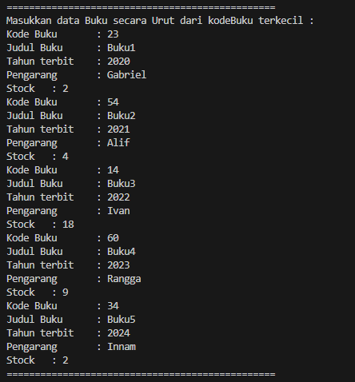
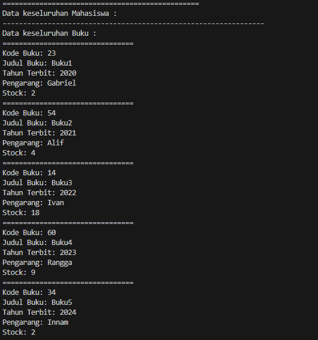
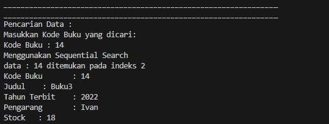

### 6.2.1 Program

```java

public class Buku13 {
    int kodeBuku;
    String judulBuku;
    int tahunTerbit;
    String pengarang;
    int stock;

    public Buku13(int kodeBuku, String judulBuku, int tahunTerbit, String pengarang, int stock) {
        this.kodeBuku = kodeBuku;
        this.judulBuku = judulBuku;
        this.tahunTerbit = tahunTerbit;
        this.pengarang = pengarang;
        this.stock = stock;
    }

    public void tampilDataBuku() {
        System.out.println("================================");
        System.out.println("Kode Buku: " + kodeBuku);
        System.out.println("Judul Buku: " +judulBuku);
        System.out.println("Tahun Terbit: " + tahunTerbit);
        System.out.println("Pengarang: " + pengarang);
        System.out.println("Stock: " + stock);
    }
}

```

<br>

```java

public class PencarianBuku13 {
    Buku13 listBk[] = new Buku13[5];
    int idx;

    void tambah(Buku13 m) {
        if (idx < listBk.length) {
            listBk[idx] = m;
            idx++;
        } else{
        System.out.println("Data sudah penuh!");
        }
    }

    void tampil() {
        for (Buku13 m : listBk) {
            m.tampilDataBuku();
        }
    }

    public int FindSeqSearch(int cari) {
        int posisi = -1;
        for (int j  = 0; j < listBk.length; j++) {
            if (listBk[j].kodeBuku == cari) {
                posisi = j;
                break;
            }
        }
        return posisi;
    }

    public void Tampilposisi(int x, int pos)
    {
        if (pos != -1) {
            System.out.println("data : " + x + " ditemukan pada indeks " + pos);
        } else {
            System.out.println("data " + x + " tidak ditemukan");
        }
    }

    public void TampilData(int x, int pos)
    {
        if (pos != -1) {
            System.out.println("Kode Buku \t: " + x );
            System.out.println("Judul \t : " + listBk[pos].judulBuku);
            System.out.println("Tahun Terbit \t: " + listBk[pos].tahunTerbit);
            System.out.println("Pengarang \t: " + listBk[pos].pengarang);
            System.out.println("Stock \t: " + listBk[pos].stock);
        } else {
            System.err.println("data " + x + "tidak ditemukan");
        }
    }
}


```

<br>

```java

import java.util.Scanner;

public class BukuMain13 {
    
    public static void main(String[] args) {
    

        Scanner s = new Scanner(System.in);
        Scanner s1 = new Scanner(System.in);

        PencarianBuku13 data = new PencarianBuku13();
        int jumBuku = 5;

        System.out.println("================================================");
        System.out.println("Masukkan data Buku secara Urut dari kodeBuku terkecil : ");
        
        for (int i = 0; i < jumBuku; i++) {
            System.out.print("Kode Buku \t: ");
            int kodeBuku = s.nextInt();
            System.out.print("Judul Buku \t: ");
            String judulBuku = s1.nextLine();
            System.out.print("Tahun terbit \t: ");
            int tahunTerbit = s.nextInt();
            System.out.print("Pengarang \t: ");
            String pengarang = s1.nextLine();
            System.out.print("Stock \t: ");
            int stock = s.nextInt();

            Buku13 m = new Buku13(kodeBuku, judulBuku, tahunTerbit, pengarang, stock);
            data.tambah(m);
        }

        System.out.println("================================================");
        System.out.println("Data keseluruhan Mahasiswa : ");

        System.out.println("----------------------------------------------------------------");
        System.out.println("Data keseluruhan Buku : ");
        data.tampil();

        System.out.println("________________________________________________________________");
        System.out.println("________________________________________________________________");
        System.out.println("Pencarian Data : ");
        System.out.println("Masukkan Kode Buku yang dicari: ");
        System.out.print("Kode Buku : ");
        int cari = s.nextInt();
        System.out.println("Menggunakan Sequential Search");
        int posisi = data.FindSeqSearch(cari);
        data.Tampilposisi(cari, posisi);

        data.TampilData(cari, posisi);
        
    }

}


```

<br>

### 6.2.2 Hasil

<br>



<br>



<br>



<br>

### 6.3.1 Program
