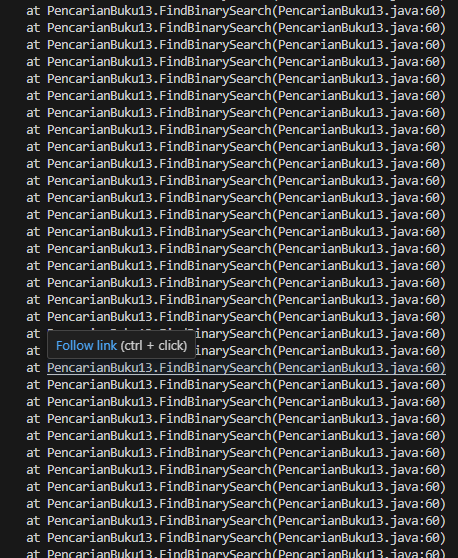
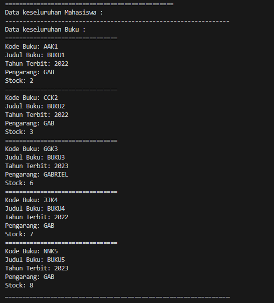
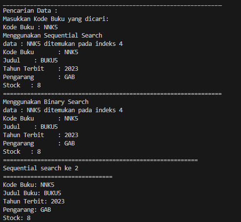

### 6.2.1 Program

```java

public class Buku13 {
    int kodeBuku;
    String judulBuku;
    int tahunTerbit;
    String pengarang;
    int stock;

    public Buku13(int kodeBuku, String judulBuku, int tahunTerbit, String pengarang, int stock) {
        this.kodeBuku = kodeBuku;
        this.judulBuku = judulBuku;
        this.tahunTerbit = tahunTerbit;
        this.pengarang = pengarang;
        this.stock = stock;
    }

    public void tampilDataBuku() {
        System.out.println("================================");
        System.out.println("Kode Buku: " + kodeBuku);
        System.out.println("Judul Buku: " +judulBuku);
        System.out.println("Tahun Terbit: " + tahunTerbit);
        System.out.println("Pengarang: " + pengarang);
        System.out.println("Stock: " + stock);
    }
}

```

<br>

```java

public class PencarianBuku13 {
    Buku13 listBk[] = new Buku13[5];
    int idx;

    void tambah(Buku13 m) {
        if (idx < listBk.length) {
            listBk[idx] = m;
            idx++;
        } else{
        System.out.println("Data sudah penuh!");
        }
    }

    void tampil() {
        for (Buku13 m : listBk) {
            m.tampilDataBuku();
        }
    }

    public int FindSeqSearch(int cari) {
        int posisi = -1;
        for (int j  = 0; j < listBk.length; j++) {
            if (listBk[j].kodeBuku == cari) {
                posisi = j;
                break;
            }
        }
        return posisi;
    }

    public void Tampilposisi(int x, int pos)
    {
        if (pos != -1) {
            System.out.println("data : " + x + " ditemukan pada indeks " + pos);
        } else {
            System.out.println("data " + x + " tidak ditemukan");
        }
    }

    public void TampilData(int x, int pos)
    {
        if (pos != -1) {
            System.out.println("Kode Buku \t: " + x );
            System.out.println("Judul \t : " + listBk[pos].judulBuku);
            System.out.println("Tahun Terbit \t: " + listBk[pos].tahunTerbit);
            System.out.println("Pengarang \t: " + listBk[pos].pengarang);
            System.out.println("Stock \t: " + listBk[pos].stock);
        } else {
            System.err.println("data " + x + "tidak ditemukan");
        }
    }
}


```

<br>

```java

import java.util.Scanner;

public class BukuMain13 {
    
    public static void main(String[] args) {
    

        Scanner s = new Scanner(System.in);
        Scanner s1 = new Scanner(System.in);

        PencarianBuku13 data = new PencarianBuku13();
        int jumBuku = 5;

        System.out.println("================================================");
        System.out.println("Masukkan data Buku secara Urut dari kodeBuku terkecil : ");
        
        for (int i = 0; i < jumBuku; i++) {
            System.out.print("Kode Buku \t: ");
            int kodeBuku = s.nextInt();
            System.out.print("Judul Buku \t: ");
            String judulBuku = s1.nextLine();
            System.out.print("Tahun terbit \t: ");
            int tahunTerbit = s.nextInt();
            System.out.print("Pengarang \t: ");
            String pengarang = s1.nextLine();
            System.out.print("Stock \t: ");
            int stock = s.nextInt();

            Buku13 m = new Buku13(kodeBuku, judulBuku, tahunTerbit, pengarang, stock);
            data.tambah(m);
        }

        System.out.println("================================================");
        System.out.println("Data keseluruhan Mahasiswa : ");

        System.out.println("----------------------------------------------------------------");
        System.out.println("Data keseluruhan Buku : ");
        data.tampil();

        System.out.println("________________________________________________________________");
        System.out.println("________________________________________________________________");
        System.out.println("Pencarian Data : ");
        System.out.println("Masukkan Kode Buku yang dicari: ");
        System.out.print("Kode Buku : ");
        int cari = s.nextInt();
        System.out.println("Menggunakan Sequential Search");
        int posisi = data.FindSeqSearch(cari);
        data.Tampilposisi(cari, posisi);

        data.TampilData(cari, posisi);
        
    }

}


```

<br>

### 6.2.2 Hasil

<br>


<br>


<br>


<br>

### 6.2.3 Pertanyaan

1. Jelaskan fungsi break yang ada pada method FindSeqSearch! <br>

Jawab : Fungsi break pada FindSeqSearch ataupun pada gerenal kode adalah untuk menghentikan perulangan, dalam hal ini digunakan untuk menghentikan perulangan pencarian ketika index dari nilai yang kita cari sudah ditemukan.

2. Jika Data Kode Buku yang dimasukkan tidak terurut dari kecil ke besar. Apakah program masih 
dapat berjalan? Apakah hasil yang dikeluarkan benar? Tunjukkan hasil screenshoot untuk bukti 
dengan kode Buku yang acak. Jelaskan Mengapa hal tersebut bisa terjadi?  <br>

Jawab : Meski data kita adalah data acak, program tetap bisa mencari data yang diinginkan. Ini adalah buktinya:


Hal ini terjadi karena proses pencarian menggunakan sequential search yang mana program akan mengecek satu persatu nilai yang ada dari setiap elemen array. Jadi, meski data yang ada acak, tidak akan berpengaruh pada proses pencarian data.

3. Buat method baru dengan nama FindBuku menggunakan konsep sequential search dengan tipe 
method dari FindBuku adalah BukuNoAbsen.  Sehingga Anda bisa memanggil method 
tersebut pada class BukuMain seperti gambar berikut : <br>

```java
Buku dataBuku = data.findBuku(cari);
dataBuku.tampilDataBuku();
```

Jawab : 

```java

    public Buku13 findBuku(int cari) {
        int posisi = -1;
        for (int i = 0; i < listBk.length; i++) {
            if (listBk[i].kodeBuku == cari) {
                posisi = i;
                break;
            }
        }
    
        return listBk[posisi];
    }

```

```java

        System.out.println(
            "=========================================================\n" +
            "Sequential search Ke 2"
        );
        Buku13 dataBuku = data.findBuku(cari);
        dataBuku.tampilDataBuku();
        

```

<br>


### 6.3.1 Program

```java

    public int FindBinarySearch(int cari, int left, int right) {
        int mid;
        if (right >= left) {
            mid = (right) / 2;
            if (cari == listBk[mid].kodeBuku) {
                return(mid);
            } else if (listBk[mid].kodeBuku > cari) {
                return FindBinarySearch(cari, left, mid);
            } else {
                return FindBinarySearch(cari, left, right);
            }
        }
        return -1;
    }


```

<br>

```java

        System.out.println("================================================================");
        System.out.println("Menggunakan Binary Search");
        posisi = data.FindBinarySearch(cari, 0, jumBuku -1);
        data.Tampilposisi(cari, posisi);
        data.TampilData(cari, posisi);       

```

### 6.3.2 Hasil

<br>


<br>


<br>

### 6.3.3 Pertanyaan

1. Tunjukkan pada kode program yang mana proses divide dijalankan! <br>

Jawab : 

```java

} else if (listBk[mid].kodeBuku > cari) {
    return findBinarySearch(cari, left, mid);
} else {
    return findBinarySearch(cari, mid, right);
}

```

<br>

2. Tunjukkan pada kode program yang mana proses conquer dijalankan! <br>

Jawab :

```java

if (cari == listBk[mid].kodeBuku)

```

<br>

3. Jika data Kode Buku yang dimasukkan tidak urut. Apakah program masih dapat berjalan? Mengapa 
demikian! Tunjukkan hasil screenshoot untuk bukti dengan kode Buku yang acak. Jelaskan 
Mengapa hal tersebut bisa terjadi?  <br>

Jawab :

Tidak, program tidak akan berfungsi dengan benar jika data Kode Buku tidak urut. Alasan utamanya adalah Binary Search memerlukan data yang sudah diurutkan untuk bisa bekerja secara efisien. Jika data tidak terurut, pembagian ruang pencarian menjadi dua bagian yang dilakukan oleh Binary Search tidak akan memberikan informasi yang berguna tentang di mana nilai yang dicari mungkin berada, karena tidak ada jaminan nilai di satu bagian akan selalu lebih kecil atau lebih besar dari bagian lainnya.



<br>

Gambar diatas adalah bukti bahwa program tidak akan berjalan jika kode buku tidak urut. Terdapat pesan error Exception in threan "main" java.lang.StackOverflowError. Itu berarti berkaitan dengan penggunaan memori yang dimiliki. Jadi memori sudah penuh dan tidak bisa melakukan proses lagi sehingga memunculkan pesan error. Ini biasanya terjadi ketika ada infinite recursion atau hal lain yang tidak ada hentinya. Kondisi infinite recursion itu bisa terjadi karena pada algoritma binary search tidak bisa mengetahui pola yang nilai yang ada. <br>

<br>

4. Jika Kode Buku yang dimasukkan dari Kode Buku terbesar ke terkecil (missal : 20215, 20214, 
20212, 20211, 20210) dan elemen yang dicari adalah 20210. Bagaimana hasil dari binary search? 
Apakah sesuai? Jika tidak sesuai maka ubahlah kode program binary seach agar hasilnya sesuai! <br>

Jawab : Hasilnya akan Error! <br>
Maka saya akan memodifikasi codenya

```java

    public int findBinarySearch(int cari, int left, int right) {
    int mid;
    if (right >= left) {
        mid = (right + left) / 2;
        if (cari == listBk[mid].kodeBuku) {
            return mid;
        } else if (listBk[mid].kodeBuku < cari) {
            return findBinarySearch(cari, left, mid - 1);
        } else {
            return findBinarySearch(cari, mid + 1, right);
        }
    }
    return -1;
}

```

<br>

### 6.4.1 Program

```java

package Tugas.P5_MergeSortTest;

public class MergeSorting13 {
    
    public void mergeSort(int[] data) {
        sort(data, 0, data.length - 1);
    }

    public void merge(int data[], int left, int middle, int right) {
        int[] temp = new int[data.length];
        for (int i = left; i <= right; i++) {
            temp[i] = data[i];
        }
        int a = left;
        int b = middle + 1;
        int c = left;

        while (a <= middle && b <= right) {
            if (temp[a] <= temp[b]) {
                data[c] = temp[a];
                a++;
            } else {
                data[c] = temp[b];
                b++;
            }
            c++;
        }
        int s = middle -a;
        for (int i = 0; i <= s; i++) {
            data[c + i] = temp[a + i];
        }
    }

    public void sort(int data[], int left, int right) {
        if (left < right) {
            int middle = (left + right) / 2;
            sort(data, left, middle);
            sort(data, middle + 1, right);
            merge(data, left, middle, right);
        }
    }

    public void printArray(int arr[]) {
        for (int i = 0; i < arr.length; i++) {
            System.out.println(arr[i] + " ");
        }
        System.out.println();
    }


}


```

<br>

```java

package Tugas.P5_MergeSortTest;

public class MergeSortMain13 {
    public static void main(String[] args) {
        int data[] = {10, 40, 30, 50, 70, 20, 100, 90};
        System.out.println("Sorting dengan merge sort: ");
        MergeSorting13 mSort = new MergeSorting13();
        System.out.println("Data awal: ");
        mSort.printArray(data);
        mSort.mergeSort(data);
        System.out.println("Setelah diurutkan: ");
        mSort.printArray(data);
    }
}


```

<br>

### 6.4.2 Hasil


<br>

<br>


### 6.5.1 Latihan

<br>

1. Modifikasi percobaan searching diatas dengan ketentuan berikut ini 
- Ubah tipe data dari kode Buku yang awalnya int menjadi String 
- Tambahkan method untuk pencarian kode Buku (bertipe data String) dengan menggunakan 
sequential search dan binary search.

Jawab : 

Jawab :

code yang diubah di Buku13 :

```java
    String kodeBuku;
    String judulBuku;
    int tahunTerbit;
    String pengarang;
    int stock;

    public Buku13(String kodeBuku, String judulBuku, int tahunTerbit, String pengarang, int stock) {
        this.kodeBuku = kodeBuku;
        this.judulBuku = judulBuku;
        this.tahunTerbit = tahunTerbit;
        this.pengarang = pengarang;
        this.stock = stock;
    }
```

<br>

code yang diubah di PencarianBuku13 :

```java

    public int FindSeqSearch(String cari) {
        int posisi = -1;
        for (int j  = 0; j < listBk.length; j++) {
            if (listBk[j].kodeBuku.equals(cari)) {
                posisi = j;
                break;
            }
        }
        return posisi;
    }

    public void Tampilposisi(String x, int pos)
    {
        if (pos != -1) {
            System.out.println("data : " + x + " ditemukan pada indeks " + pos);
        } else {
            System.out.println("data " + x + " tidak ditemukan");
        }
    }

    public void TampilData(String x, int pos)
    {
        if (pos != -1) {
            System.out.println("Kode Buku \t: " + x );
            System.out.println("Judul \t : " + listBk[pos].judulBuku);
            System.out.println("Tahun Terbit \t: " + listBk[pos].tahunTerbit);
            System.out.println("Pengarang \t: " + listBk[pos].pengarang);
            System.out.println("Stock \t: " + listBk[pos].stock);
        } else {
            System.err.println("data " + x + "tidak ditemukan");
        }
    }

    public int FindBinarySearch(String cari, int left, int right) {
        int mid;
        if (right >= left) {
            mid = (right + left) / 2;
            if (cari.equals(listBk[mid].kodeBuku)) {
                return mid;
            } else {
                int posisiKiri = FindBinarySearch(cari, left, mid - 1);
                int posisiKanan = FindBinarySearch(cari, mid + 1, right);
                if (posisiKanan != -1) {
                    return posisiKanan;
                } else if (posisiKiri != -1) {
                    return posisiKiri;
                }
            }
        }
        return -1;
    }

    public Buku13 findBuku(String cari) {
        int posisi = -1;
        for (int i = 0; i < listBk.length; i++) {
            if (listBk[i].kodeBuku.equals(cari)) {
                posisi = i;
                break;
            }
        }
    
        return listBk[posisi];
    }

```

<br>

Code yang diubah di BukuMain13 :

```java

        for (int i = 0; i < jumBuku; i++) {
            System.out.print("Kode Buku \t: ");
            String kodeBuku = s1.nextLine();
            System.out.print("Judul Buku \t: ");
            String judulBuku = s1.nextLine();
            System.out.print("Tahun terbit \t: ");
            int tahunTerbit = s.nextInt();
            System.out.print("Pengarang \t: ");
            String pengarang = s1.nextLine();
            System.out.print("Stock \t: ");
            int stock = s.nextInt();

            Buku13 m = new Buku13(kodeBuku, judulBuku, tahunTerbit, pengarang, stock);
            data.tambah(m);
        }

        System.out.println("________________________________________________________________");
        System.out.println("________________________________________________________________");
        System.out.println("Pencarian Data : ");
        System.out.println("Masukkan Kode Buku yang dicari: ");
        System.out.print("Kode Buku : ");
        String cari = s1.nextLine();

```

<br>

Contoh Output :


<br>


<br>


