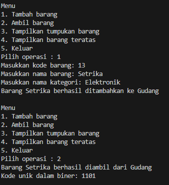
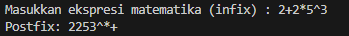
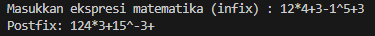

### 2.2.1 Program

```java

public class Barang13 {

    int kode;
    String nama, kategori;

    public Barang13(int kode, String nama, String kategori) {
        this.kode = kode;
        this.nama = nama;
        this.kategori = kategori;
    }
    
}

```

<br>


```java

public class Gudang13 {
    private Barang13[] tumpukan;
    private int size;
    private int top;

    public Gudang13(int kapasitas) {
        size = kapasitas;
        tumpukan = new Barang13[size];
        top = -1;
    }

    public boolean cekKosong() {
        if (top == -1) {
            return true;
        } else {
            return false;
        }
    }

    public boolean cekPenuh() {
        if (top == size - 1) {
            return true;
        } else {
            return false;
        }
    }

    public void tambahBarang(Barang13 brg) {
        if (!cekPenuh()) {
            top++;
            tumpukan[top] = brg;
            System.out.println("Barang " + brg.nama + " berhasil ditambahkan ke Gudang");
        } else {
            System.out.println("Gagal! Tumpukan barang di Gudang sudah penuh");
        }
    }

    public Barang13 ambilBarang() {
        if (!cekKosong()) {
            Barang13 delate = tumpukan[top];
            top--;
            System.out.println("Barang " + delate.nama + " berhasil diambil dari Gudang");
            return delate;
        } else {
            System.out.println("Gagal! Tumpukan barang kosong");
            return null;
        }
    }

    public Barang13 lihatBarangTeratas() {
        if (!cekKosong()) {
            Barang13 barangTeratas = tumpukan[top];
            System.out.println("Barang teratas: " + barangTeratas.nama);
            return barangTeratas;
        } else {
            System.out.println("Tumpukan barang kosong.");
            return null;
        }
    }

    public void tampilkanBarang() {
        if (!cekKosong()) {
            System.out.println("Rincian tumpukan barang di Gudang");
            //for (int i = top; i >= 0; i--) {
            for (int i = top; i >= top; i--) {
                System.out.printf("Kode %d: %s (kategori %s)\n", tumpukan[i].kode, tumpukan[i].nama,
                tumpukan[i].kategori);
            }
        } else {
            System.out.println("Tumpukan barang kosong");
        }
    }
    

}

```

<br>

```java

import java.util.Scanner;

public class Utama13 {

    public static void main(String[] args) {
        Scanner sc13 = new Scanner(System.in);
    
        Gudang13 gudang = new Gudang13(7);
    
    
        while (true) {
            System.out.println("\nMenu");
            System.out.println("1. Tambah barang");
            System.out.println("2. Ambil barang");
            System.out.println("3. Tampilkan tumpukan barang");
            System.out.println("4. Keluar");
            System.out.print("Pilih operasi : ");
            int pilihan = sc13.nextInt();
            sc13.nextLine();
    
            switch (pilihan) {
                case 1:
                    System.out.println("Masukkan kode barang: ");
                    int kode = sc13.nextInt();
                    sc13.nextLine();
                    System.out.println("Masukkan nama barang: ");
                    String nama = sc13.nextLine();
                    System.out.println("Masukkan nama kategori: ");
                    String kategori = sc13.nextLine();
                    Barang13 barangBaru = new Barang13(kode, nama, kategori);
                    gudang.tambahBarang(barangBaru);
                    break;
    
                case 2:
                    gudang.ambilBarang();
                    break;
                
                case 3:
                gudang.tampilkanBarang();
                break;
    
                case 4:
                    sc13.close(); 
                    return; // keluar dari program
                
                default :
                System.out.println("Pilihan tidak valid. Silahkan coba lagi.");
            }
        }
    
    }

}


```

### 2.2.2 Hasil


<br>


<br>

### 2.2.3 Pertanyaan

1. Lakukan perbaikan pada kode program, sehingga keluaran yang dihasilkan sama dengan verifikasi 
hasil percobaan! Bagian mana saja yang perlu diperbaiki? <br>

Jawab : Mengubah perulangan yang dilakukan di fucntion tampilkanBarang() yaitu :

```java

    public void tampilkanBarang() {
        if (!cekKosong()) {
            System.out.println("Rincian tumpukan barang di Gudang");
            //for (int i = top; i >= 0; i--) {
            for (int i = top; i >= 0; i--) {
                System.out.printf("Kode %d: %s (kategori %s)\n", tumpukan[i].kode, tumpukan[i].nama,
                tumpukan[i].kategori);
            }
        } else {
            System.out.println("Tumpukan barang kosong");
        }
    }

```

<br>

2. Berapa banyak data barang yang dapat ditampung di dalam tumpukan? Tunjukkan potongan kode 
programnya!<br>

Jawab : Kita dapat menumpuk hingga 7 barang didalam tumpukkan

```java

 Gudang13 gudang = new Gudang13(7);

```

<br>

3. Mengapa perlu pengecekan kondisi !cekKosong() pada method tampilkanBarang? Kalau kondisi 
tersebut dihapus, apa dampaknya? <br>

Jawab : tampilkanBarang() digunakan untuk memastikan bahwa ada barang dalam tumpukan sebelum mencoba menampilkannya. Jika kondisi ini dihapus, metode akan mencoba menjalankan loop for bahkan ketika tumpukan kosong (top == -1). Ini bisa menyebabkan loop for tidak berjalan dengan benar karena kondisi awal i = top akan bernilai -1, dan loop langsung berhenti tanpa masuk ke dalam loop.<br>

<br>

4. Modifikasi kode program pada class Utama sehingga pengguna juga dapat memilih operasi lihat 
barang teratas, serta dapat secara bebas menentukan kapasitas gudang! <br>

Jawab :

Kita dapat memodifikasi kode untuk menentukan kapasitas gudang berdasarkan input user dengan kode berikut :

```java

        System.out.print("Masukkan kapasitas gudang: ");
        int kapasitas = sc13.nextInt();
        Gudang13 gudang = new Gudang13(kapasitas);

```

Lalu kita bisa menambahkan Operasi lihat barang teratas di main dengan menambahkan kode berikut :

```java

            System.out.println("4. Tampilkan barang teratas");

            //kode selanjutnya dan masuk ke while

                case 4: 
                    gudang.lihatBarangTeratas();
                    break;

```

<br>

5. Commit dan push kode program ke Github 

<br>

### 2.3.1 Program

```java

    public Barang13 ambilBarang() {
        if (!cekKosong()) {
            Barang13 delate = tumpukan[top];
            top--;
            System.out.println("Barang " + delate.nama + " berhasil diambil dari Gudang");
            System.out.println("Kode unik dalam biner: " + konversiDesimalKeBiner(delate.kode));
            return delate;
        } else {
            System.out.println("Gagal! Tumpukan barang kosong");
            return null;
        }
    }

```

```java

    public String konversiDesimalKeBiner(int kode) {
        StackKonversi13 stack = new StackKonversi13();
        while (kode > 0) {
            int sisa = kode % 2;
            stack.push(sisa);
            kode = kode / 2;
        }
        String biner = new String();
        while (!stack.isEmpety()) {
            biner += stack.pop();
        }
        return biner;
    }

```

```java

public class StackKonversi13 {
    int size;
    int[] tumpukanBiner;
    int top;

    public StackKonversi13() {
        this.size = 32;
        tumpukanBiner = new int[size];
        top = -1;
    }

    public boolean isEmpety() {
        return top == -1;
    }

    public boolean isFull() {
        return top == size - 1;
    }

    public void push(int data) {
    
        if (isFull()) {
            System.out.println("Stack penuh");
        } else {
            top++;
            tumpukanBiner[top] = data;
        }
    }

    public int pop() {
        if (isEmpety()) {
            System.out.println("Stack kosong");
            return -1;
        } else {
            int data = tumpukanBiner[top];
            top--;
            return data;
        }
    }
}


```

### 2.3.2 Hasil



<br>

### 2.3.3 Pertanyaan

1. Pada method konversiDesimalKeBiner, ubah kondisi perulangan menjadi while (kode != 0), 
bagaimana hasilnya? Jelaskan alasannya! <br>

Jawab : Mengubah kondisi perulangan dalam method konversiDesimalKeBiner menjadi while (kode != 0) sebenarnya tidak akan mengubah hasilnya karena kondisi kode > 0 dan kode != 0 pada konteks ini menghasilkan alur kerja yang sama. Hal ini karena dalam konversi desimal ke biner, proses akan berlanjut selama masih ada sisa desimal yang belum dikonversi menjadi biner. Kedua kondisi tersebut memastikan perulangan terus berlangsung hingga kode menjadi 0, yang berarti semua sisa telah dikonversi.

<br>

2. Jelaskan alur kerja dari method konversiDesimalKeBiner! <br>

Jawab : Method konversiDesimalKeBiner mengikuti alur kerja berikut untuk mengkonversi bilangan desimal menjadi biner:

Inisialisasi: Sebuah objek StackKonversi13 diinisialisasi untuk menampung sisa pembagian desimal dengan 2. Ini digunakan karena konversi desimal ke biner dilakukan dengan membagi bilangan desimal dengan 2 dan menyimpan sisanya dalam urutan terbalik.
Perulangan: Selama nilai kode (bilangan desimal yang akan dikonversi) lebih dari 0, kode tersebut dibagi dengan 2, dan sisa pembagiannya (0 atau 1) ditambahkan ke dalam stack. Pembagian ini dilakukan dengan menggunakan operasi modulus (%) untuk mendapatkan sisa, dan hasil bagi yang baru diupdate dengan membagi kode dengan 2.
Konversi: Setelah semua sisa telah ditambahkan ke stack, metode menginisialisasi sebuah string biner untuk menampung representasi binernya. Kemudian, selama stack tidak kosong, elemen di pop dari stack dan di-append ke string biner. Ini menghasilkan representasi biner dari bilangan desimal karena elemen-elemen diambil dari stack dalam urutan terbalik dari bagaimana mereka ditambahkan.
Return: String biner, yang sekarang berisi representasi biner dari bilangan desimal, dikembalikan.

<br>

### 2.4.1 Program

```java

/**
 * Postfix13
 */
public class Postfix13 {
    int n, top;
    char[] stack;

    public Postfix13(int total) {
        n = total;
        top = -1;
        stack = new char[n];
        push('(');
    }
    
    public void push (char c) {
        top++;
        stack[top] = c;
    }

    public char pop() {
        char item = stack[top];
        top--;
        return item;
    }

    public boolean isOperand(char c) {
        if ((c >= 'A' && c <= 'Z') || (c >= 'a' && c <= 'z') || 
            (c >= '0' && c <= '9') || c == ' ' || c == '.') {
            return true;
        } else {
            return false;
        }
    }

    public boolean isOperator(char c) {
        if (c == '^' || c == '%' || c == '/' || c == '*' || 
            c == '-' || c == '+') {
            return true;
        } else {
            return false;
        }
    }

    public int derajat(char c) {
        switch (c) {
            case '^':
                return 3;
            case '%':
                return 2;
            case '/':
                return 2;
            case '*':
                return 2;
            case '-':
                return 1;
            case '+':
                return 1;
            default:
                return 0;
        }
    }

    public String konversi(String Q) {
        String P = "";
        char c;

        for (int i = 0; i < n; i++) {
            c = Q.charAt(i);
            if (isOperand(c)) {
                P += c;
            }

            if (c == '(') {
                push(c);
            }

            if (c == ')') {
                while (stack[top] != '(') {
                    P += pop();
                }
                pop();
            }

            if (isOperator(c)) {
                while (derajat(stack[top]) >= derajat(c)) {
                    P += pop();
                }
                push(c);
            }
        }
        return P;
    }

}

```

<br>

```java

import java.util.Scanner;

public class PostfixMain13 {
    
    public static void main(String[] args) {
        Scanner sc13 = new Scanner(System.in);
        
        String P, Q;

        System.out.print("Masukkan ekspresi matematika (infix) : ");
        Q = sc13.nextLine();
        Q = Q.trim();
        Q = Q + ")";

        int total = Q.length();

        Postfix13 post = new Postfix13(total);
        P = post.konversi(Q);
        System.out.println("Postfix: " + P);
    }

}


```

### 2.4.2 Hasil

Contoh 1:



<br>

Contoh 2:



<br>

### 2.4.3 Pertanyaan

1. Pada method derajat, mengapa return value beberapa case bernilai sama? Apabila return 
value diubah dengan nilai berbeda-beda setiap case-nya, apa yang terjadi? <br>

Jawab : Pada method derajat, nilai return beberapa case sama karena operator %, /, *, -, dan + memiliki prioritas operasi yang sama. Jika nilai ini diubah sehingga berbeda untuk setiap operator, urutan operasi dalam konversi ke postfix akan terpengaruh, menyebabkan hasil yang tidak sesuai dengan aturan matematika standar.<br>

2. Jelaskan alur kerja method konversi! <br> 

Jawab : Method konversi mengubah ekspresi infix menjadi postfix. Ini dilakukan dengan iterasi karakter ekspresi, memproses operand langsung ke hasil, mendorong ( ke stack, pop dari stack ke hasil hingga ( ketika menemukan ), dan mendorong operator ke stack setelah pop operator dengan prioritas lebih tinggi atau sama. <br>

3. Pada method konversi, apa fungsi dari potongan kode berikut?

```java
    c = Q.charAt(i);
```
<br>

Jawab : Potongan kode c = Q.charAt(i); berfungsi untuk mengambil karakter ke-i dari string Q dan menyimpannya dalam c, memungkinkan iterasi dan evaluasi setiap karakter dalam ekspresi matematika untuk konversi ke postfix. <br>


### 2.5 Latihan Praktikum
Perhatikan dan gunakan kembali kode program pada Percobaan 1. Tambahkan dua method berikut 
pada class Gudang: 
• Method lihatBarangTerbawah digunakan untuk mengecek barang pada tumpukan terbawah 
• Method cariBarang digunakan untuk mencari ada atau tidaknya barang berdasarkan kode 
barangnya atau nama barangnya

Jawab :

```java

    public Barang13 lihatBarangTerbawah() {
        if (!cekKosong()) {
            Barang13 barangTerbawah = tumpukan[0];
            System.out.println("Barang terbawah: " + barangTerbawah.nama);
            return barangTerbawah;
        } else {
            System.out.println("Tumpukan barang kosong.");
            return null;
        }
    }

    public void cariBarang(String kataKunci) {
        boolean ditemukan = false;
        if (!cekKosong()) {
            for (int i = 0; i <= top; i++) {
                if (tumpukan[i].nama.equalsIgnoreCase(kataKunci) || String.valueOf(tumpukan[i].kode).equals(kataKunci)) {
                    System.out.println("Barang ditemukan:");
                    System.out.printf("Kode: %d, Nama: %s, Kategori: %s\n", 
                                        tumpukan[i].kode, 
                                        tumpukan[i].nama,
                                        tumpukan[i].kategori);
                    ditemukan = true;
                    break;
                }
            }
        }
        if (!ditemukan) {
            System.out.println("Barang tidak ditemukan");
        }
    }

```

<br>

```java

                case 5:
                    gudang.lihatBarangTerbawah();
                    break;
                
                case 6:
                    System.out.println("Masukkan kata kunci:");
                    String kataKunci = sc13.nextLine(); 
                    gudang.cariBarang(kataKunci);
                    break;

```

Hasil :

