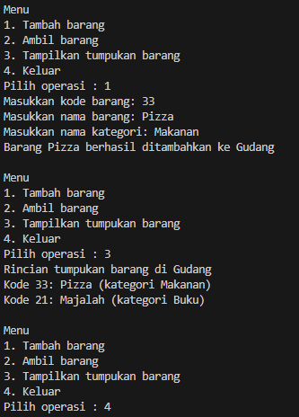

### 2.2.1 Program

```java

public class Barang13 {

    int kode;
    String nama, kategori;

    public Barang13(int kode, String nama, String kategori) {
        this.kode = kode;
        this.nama = nama;
        this.kategori = kategori;
    }
    
}

```

<br>


```java

public class Gudang13 {
    private Barang13[] tumpukan;
    private int size;
    private int top;

    public Gudang13(int kapasitas) {
        size = kapasitas;
        tumpukan = new Barang13[size];
        top = -1;
    }

    public boolean cekKosong() {
        if (top == -1) {
            return true;
        } else {
            return false;
        }
    }

    public boolean cekPenuh() {
        if (top == size - 1) {
            return true;
        } else {
            return false;
        }
    }

    public void tambahBarang(Barang13 brg) {
        if (!cekPenuh()) {
            top++;
            tumpukan[top] = brg;
            System.out.println("Barang " + brg.nama + " berhasil ditambahkan ke Gudang");
        } else {
            System.out.println("Gagal! Tumpukan barang di Gudang sudah penuh");
        }
    }

    public Barang13 ambilBarang() {
        if (!cekKosong()) {
            Barang13 delate = tumpukan[top];
            top--;
            System.out.println("Barang " + delate.nama + " berhasil diambil dari Gudang");
            return delate;
        } else {
            System.out.println("Gagal! Tumpukan barang kosong");
            return null;
        }
    }

    public Barang13 lihatBarangTeratas() {
        if (!cekKosong()) {
            Barang13 barangTeratas = tumpukan[top];
            System.out.println("Barang teratas: " + barangTeratas.nama);
            return barangTeratas;
        } else {
            System.out.println("Tumpukan barang kosong.");
            return null;
        }
    }

    public void tampilkanBarang() {
        if (!cekKosong()) {
            System.out.println("Rincian tumpukan barang di Gudang");
            //for (int i = top; i >= 0; i--) {
            for (int i = top; i >= top; i--) {
                System.out.printf("Kode %d: %s (kategori %s)\n", tumpukan[i].kode, tumpukan[i].nama,
                tumpukan[i].kategori);
            }
        } else {
            System.out.println("Tumpukan barang kosong");
        }
    }
    

}

```

<br>

```java

import java.util.Scanner;

public class Utama13 {

    public static void main(String[] args) {
        Scanner sc13 = new Scanner(System.in);
    
        Gudang13 gudang = new Gudang13(7);
    
    
        while (true) {
            System.out.println("\nMenu");
            System.out.println("1. Tambah barang");
            System.out.println("2. Ambil barang");
            System.out.println("3. Tampilkan tumpukan barang");
            System.out.println("4. Keluar");
            System.out.print("Pilih operasi : ");
            int pilihan = sc13.nextInt();
            sc13.nextLine();
    
            switch (pilihan) {
                case 1:
                    System.out.println("Masukkan kode barang: ");
                    int kode = sc13.nextInt();
                    sc13.nextLine();
                    System.out.println("Masukkan nama barang: ");
                    String nama = sc13.nextLine();
                    System.out.println("Masukkan nama kategori: ");
                    String kategori = sc13.nextLine();
                    Barang13 barangBaru = new Barang13(kode, nama, kategori);
                    gudang.tambahBarang(barangBaru);
                    break;
    
                case 2:
                    gudang.ambilBarang();
                    break;
                
                case 3:
                gudang.tampilkanBarang();
                break;
    
                case 4:
                    sc13.close(); 
                    return; // keluar dari program
                
                default :
                System.out.println("Pilihan tidak valid. Silahkan coba lagi.");
            }
        }
    
    }

}


```

### 2.2.2 Hasil


<br>



<br>