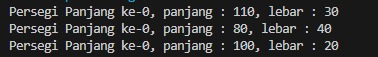
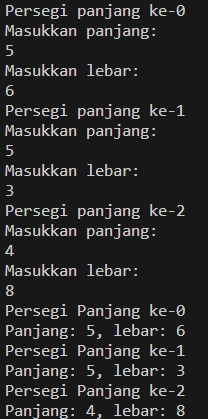
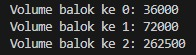

<p align="center">LAPORAN PRAKTIKUM 3</p>
<p align="center">Algoritma dan Struktur Data</p>

<p align="center">  </p>


<p align="center"> Nama : Gabriel Batavia Xaverius </p>
<p align="center"> NIM : 2341720184  </p>
<p align="center">Kelas : TI-1B  </p>
<p align="center">Absen : 13  </p>

<br>

### 3.2.1 : Percobaan 1

```java

package pertemuanke3.praktikum;

public class persegiPanjang13 {
    public int panjang;
    public int lebar;

    public static void main(String[] args) {
        
        persegiPanjang13[] ppArray = new persegiPanjang13[3];

        ppArray[0] = new persegiPanjang13();
        ppArray[0].panjang = 110;
        ppArray [0].lebar = 30;

        ppArray [1] = new persegiPanjang13();
        ppArray [1].panjang = 80;
        ppArray [1].lebar = 40;

        ppArray [2] = new persegiPanjang13();
        ppArray [2].panjang = 100;
        ppArray [2].lebar = 20;

        System.out.println("Persegi Panjang ke-0, panjang : " + ppArray[0].panjang + ", lebar : " + ppArray[0].lebar);
        System.out.println("Persegi Panjang ke-0, panjang : " + ppArray[1].panjang + ", lebar : " + ppArray[1].lebar);
        System.out.println("Persegi Panjang ke-0, panjang : " + ppArray[2].panjang + ", lebar : " + ppArray[2].lebar);


    }
}


```

<br>

### 3.2.2 : Verifikasi Hasil Percobaan 

Output :<br>



<br>

### 3.2.3 : Pertanyaan

1. Berdasarkan uji coba 3.2, apakah class yang akan dibuat array of object harus selalu memiliki 
atribut dan sekaligus method?Jelaskan!<br> 
2. Apakah class PersegiPanjang memiliki konstruktor?Jika tidak, kenapa dilakukan pemanggilan konstruktur pada baris program berikut : <br>
```java
ppArray[1] = new PersegiPanjang();
```
3. Apa yang dimaksud dengan kode berikut ini:<br>
```java
PersegiPanjang[] ppArray = new PersegiPanjang[3];
```
4. Apa yang dimaksud dengan kode berikut ini: <br>
```java
ppArray[1] = new PersegiPanjang();
ppArray[1].panjang = 80;
ppArray[1].lebar = 40;
```
5. Mengapa class main dan juga class PersegiPanjang dipisahkan pada uji coba 3.2? <br>

Jawaban :

1. Dalam pembuatan array of object, kita tidak harus selalu memiliki atribut dan method seacra bersamaan didalam class. Karena Array of object menggunakan class sebagai struktur yang menampung informasi sedangkan metode dan atribut hanyalah perilaku yang bisa disimpan class. <b3>

2. Konstruktor dalam Class PersegiPanjang: Meskipun tidak ada konstruktor yang eksplisit didefinisikan dalam class PersegiPanjang13, Java menyediakan konstruktor default yang memungkinkan pembuatan objek baru dengan new PersegiPanjang13(). <br>

3. Deklarasi Array of Object: Kode PersegiPanjang[] ppArray = new PersegiPanjang[3]; mendefinisikan array yang dapat menampung tiga objek PersegiPanjang, mengalokasikan ruang untuk referensi objek tanpa menginisialisasi objek tersebut. <br>

4. Inisialisasi dan Pengisian Array of Object: Kode ppArray[1] = new PersegiPanjang(); ppArray[1].panjang = 80; ppArray[1].lebar = 40; menginisialisasi objek PersegiPanjang pada indeks 1 array, dan mengatur nilai atribut panjang dan lebar. <br>

5. Pemisahan Class main dan Class PersegiPanjang: Pemisahan ini dilakukan untuk modularitas dan pengorganisasian kode yang lebih baik. Class PersegiPanjang mendefinisikan struktur data, sementara class dengan main method bertanggung jawab untuk eksekusi aplikasi dan manipulasi objek, memudahkan pengembangan dan pemeliharaan. <br>

<br>


### 3.3.1 : Percobaan 2

```java

package pertemuanke3.praktikum;

import java.util.Scanner;

public class persegiPanjang13 {
    public int panjang;
    public int lebar;

    public static void main(String[] args) {
        
        persegiPanjang13[] ppArray = new persegiPanjang13[3];

        Scanner sc13 = new Scanner(System.in);

        for(int i = 0; i < 3; i++) {
    
            ppArray[i] = new persegiPanjang13();
            System.out.println("Persegi panjang ke-" + i);
            System.out.println("Masukkan panjang: ");
            ppArray[i].panjang = sc13.nextInt();
            System.out.println("Masukkan lebar: ");
            ppArray[i].lebar = sc13.nextInt();
    
        }


        for (int i = 0; i < 3; i++) {
            System.out.println("Persegi Panjang ke-" + i);
            System.out.println("Panjang: " + ppArray[i].panjang + ", lebar: " + ppArray[i].lebar);
        }

    }
}


```
<br>

### 3.3.2 : : Verifikasi Hasil Percobaan 


Output : <br>



<br>


### 3.3.3 : Pertanyaan

1. Apakah array of object dapat diimplementasikan pada array 2 Dimensi?<br>
2. Jika jawaban soal no satu iya, berikan contohnya! Jika tidak, jelaskan!<br>
3. Jika diketahui terdapat class Persegi yang memiliki atribut sisi bertipe integer, maka kode 
dibawah ini akan memunculkan error saat dijalankan. Mengapa? <br>

```java
Persegi[] pgArray = new Persegi[100];
pgArray[5].sisi = 20;

```

4. Modifikasi kode program pada praktikum 3.3 agar length array menjadi inputan dengan Scanner! <br>
5. Apakah boleh Jika terjadi duplikasi instansiasi array of objek, misalkan saja instansiasi dilakukan 
pada ppArray[i] sekaligus ppArray[0]?Jelaskan ! <br>


Jawaban : <br>

1.  Ya, bisa. Array of object dapat diorganisir dalam struktur 2 dimensi, memungkinkan pengelompokan objek dalam format yang mirip tabel.<br>

2. Contoh Array of Object 2 Dimensi:<br>

```java
class PersegiPanjang {
    int panjang, lebar;
}

PersegiPanjang[][] ppArray = new PersegiPanjang[2][3]; // Deklarasi array 2D

```
Dalam contoh ini, setiap elemen array bisa diinstansiasi dan diakses menggunakan dua indeks, i dan j.<br>

3. Error pada Kode Persegi[] pgArray = new Persegi[100];: Kode ini error karena objek Persegi pada indeks ke-5 belum diinstansiasi. Mengakses pgArray[5].sisi sebelum instansiasi menyebabkan NullPointerException.<br>

4. Modifikasi untuk input Length Array menggunakan : <br>

```java

1. Array of Object pada Array 2 Dimensi: Ya, bisa. Array of object dapat diorganisir dalam struktur 2 dimensi, memungkinkan pengelompokan objek dalam format yang mirip tabel.

2. Contoh Array of Object 2 Dimensi:

java
Copy code
class PersegiPanjang {
    int panjang, lebar;
}

PersegiPanjang[][] ppArray = new PersegiPanjang[2][3]; // Deklarasi array 2D
Dalam contoh ini, setiap elemen array bisa diinstansiasi dan diakses menggunakan dua indeks, i dan j.

3. Error pada Kode Persegi[] pgArray = new Persegi[100];: Kode ini error karena objek Persegi pada indeks ke-5 belum diinstansiasi. Mengakses pgArray[5].sisi sebelum instansiasi menyebabkan NullPointerException.

4. Modifikasi untuk Input Length Array:

```java

package pertemuanke3.praktikum;
import java.util.Scanner;

public class persegiPanjang13 {
    public int panjang;
    public int lebar;

    public static void main(String[] args) {
        Scanner sc13 = new Scanner(System.in);
        System.out.print("Masukkan jumlah persegi panjang: ");
        int jumlah = sc13.nextInt();

        persegiPanjang13[] ppArray = new persegiPanjang13[jumlah];

        for(int i = 0; i < jumlah; i++) {
            ppArray[i] = new persegiPanjang13();
            System.out.println("Persegi panjang ke-" + i);
            System.out.print("Masukkan panjang: ");
            ppArray[i].panjang = sc13.nextInt();
            System.out.print("Masukkan lebar: ");
            ppArray[i].lebar = sc13.nextInt();
        }

        System.out.println("Hasil persegi panjang:");
        for (int i = 0; i < jumlah; i++) {
            System.out.println("Persegi Panjang ke-" + i + ", Panjang: " + ppArray[i].panjang + ", lebar: " + ppArray[i].lebar);
        }

        sc13.close();
    }
}


```


###3.4

```java

public class Balok13 {
    
    public int panjang;
    public int lebar;
    public int tinggi;

    public Balok13(int p, int l, int t) {
        panjang = p;
        lebar = l;
        tinggi = t;
    }

    public int hitungVolume() {
        return panjang * lebar * tinggi;
    }

    public static void main(String[] args) {
        Balok13[] blArray = new Balok13[3];

        blArray[0] = new Balok13(100, 30, 12);
        blArray[1] = new Balok13(120, 40, 15);
        blArray[2] = new Balok13(210, 50, 25);

        for (int i = 0; i < 3; i++) {
            System.out.println("Volume balok ke " + i + ": " + blArray[i].hitungVolume());
        }

    }

    
}


```

Output :

